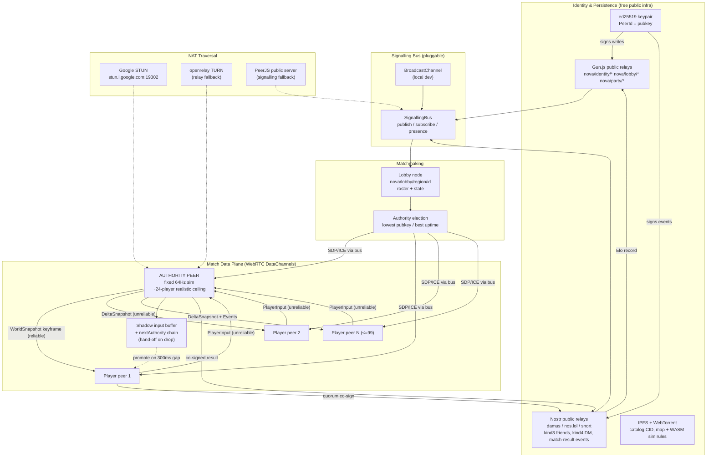

# Fortnite-Style Battle Royale — Zero-Cost P2P Rewrite (Educational)

> Clean-room, educational distributed-systems study. No proprietary assets, no client hooking, no anti-cheat bypass — original P2P infrastructure on free public primitives only.


## 🧠 Architectural Reasoning

## The central-trust problems a server solves, and their P2P replacements

A canonical battle-royale backend is, fundamentally, a set of **trust anchors**. A rewrite to zero-cost P2P does not get to delete those problems — it can only relocate the trust. Five distinct responsibilities collapse into one process tree on the server side, and each must be re-homed onto a primitive that survives without any project-owned host.

**1. Identity / auth.** The REST OAuth service answers "who is this peer and can they prove it?" A server does this with a secret-signed bearer token. With no server there is no secret to sign with, so identity must become *self-sovereign*: each player generates an ed25519 keypair in-browser; the public key IS the account id (`PeerId = "ed:" + base58(pubkey[0:20])`). Every state-changing message is a `Signed<T>` = canonical-JSON payload + detached ed25519 signature. This is the single most important inversion: we move from "the server vouches for you" to "you vouch for yourself and everyone verifies your signature." The cost is that nothing stops a user spinning up infinite keypairs (Sybil), which is the root of most anti-cheat difficulty downstream. Display-name uniqueness is impossible to guarantee globally without a coordinator, so names are advisory and the pubkey is the real id.

**2. Persistence.** Profile, inventory, progression, catalog, cloud settings were rows the server owned authoritatively. P2P persistence splits by *who is allowed to write*. Player-owned mutable data (display name, cosmetic loadout, settings) lives in **Gun.js**, a CRDT graph over public relays, keyed `nova/identity/<pubkey>` and signed by that pubkey so relays/peers reject forged writes (Gun's own SEA does signing; we layer our ed25519 envelope for cross-system consistency). Immutable shared data (the item *catalog*, map assets, WASM sim rules) lives on **IPFS/WebTorrent** addressed by content hash — content-addressing means a malicious gateway cannot tamper without changing the CID. Match-outcome records (kills, placement, Elo deltas) are the hard case: they must be *append-only and player-attributable*, so they are published as signed **Nostr events** (replaceable kind for the rolling Elo record, regular kind for per-match results) to public relays, with the authority peer and a quorum of surviving players co-signing the result to make single-party forgery detectable.

**3. Presence / social.** XMPP gave roster, presence, party, chat. The browser-viable substitute is a **signalling bus** abstraction with three interchangeable backends: Gun.js graph subscriptions (presence + party state as mutable nodes), Nostr (friend lists as kind 3, DMs as kind 4, ephemeral presence as kind 2xxxx), and `BroadcastChannel` for same-origin local testing. Crucially the same bus is reused as the **WebRTC signalling channel** — SDP offers/answers and ICE candidates are published as short-lived signed messages on a lobby topic, which is how peers find each other with no signalling server we own (PeerJS public server is a fallback, not the primary path).

**4. Matchmaking.** The matchmaker pooled queued players and formed a lobby. I evaluated three primitives.
- *Hyperswarm DHT*: the natural "find peers interested in topic X" tool, BUT — and this must be stated plainly — Hyperswarm is a Node/Bare UDP-DHT library that **does not run in a browser**. There is no browser UDP socket and no WebRTC transport for Hyperswarm. It is therefore disqualified as a primary primitive for a browser-first runtime. (It could run only via a Node bridge we'd have to host — violating zero-cost.)
- *Nostr events*: lobby adverts as ephemeral events on public relays. Works in-browser, censorship-resistant, but relays give weak ordering and no atomic "claim a slot," so two players can race into slot 100. Good for *discovery*, weak for *consensus*.
- *Gun.js graph*: a lobby is a mutable graph node `nova/lobby/<region>/<lobbyId>` with a `players` set and a `state` field. Gun's CRDT gives last-write-wins convergence and its relays are public and free. Peers subscribe, the lobby's *authority peer* (first to create it, or lowest-pubkey tiebreak) validates the roster and flips `state: "starting"` once `maxPlayers` or a timer hits.
**Pick: Gun.js graph as the matchmaking spine, Nostr as a redundant discovery beacon, Hyperswarm explicitly rejected for browser.** Gun wins because it gives convergent shared mutable state (a lobby roster) for free, which is exactly the matchmaker's job; Nostr layered on top widens discovery and survives a Gun relay outage. The authority-peer election (lowest pubkey among present, re-elected on drop) provides the "single decision-maker" a matchmaker needs without a server.

**5. Authoritative simulation.** The dedicated server simulated the match and streamed state. I evaluated three netcode models for the data plane.
- *Full-mesh lockstep*: every peer sends inputs to every other peer, all run the deterministic sim. For 100 players this is **infeasible** — a full mesh is n(n-1)/2 = 4,950 WebRTC connections, each browser maintaining 99 peer connections, and lockstep stalls the entire match on the single slowest/most-distant peer's RTT. Determinism across heterogeneous browser float behaviour is also fragile. Rejected.
- *CRDT eventual-consistency* (Yjs/Automerge over the mesh): great for collaborative editing, wrong for a shooter — there is no convergent "who shot first" merge; last-write-wins on a hitscan kill is exploitable and eventual consistency means no authoritative *now*. Rejected for the combat hot path (retained only for non-adversarial zone/lobby metadata).
- *Authority-peer snapshot/delta*: one elected peer runs the authoritative fixed-tick simulation (64 Hz); all other peers send only their `PlayerInput` to the authority over an **unreliable** DataChannel, and the authority broadcasts `WorldSnapshot` (keyframe) + `DeltaSnapshot` (changed-fields-only, bitmasked, quantized) back. This is the classic dedicated-server model with the "server" being a volunteered browser. **Pick: authority-peer snapshot/delta.** It gives a single authoritative timeline (no merge ambiguity), bounded fan-out (authority has N connections, not N²), and lets us reuse the entire well-understood Quake/Source delta-compression playbook.

**The honest ceiling.** The authority peer relays for everyone, so it is the bandwidth bottleneck. Per the packet spec, a `DeltaSnapshot` for ~60 visible entities is budgeted under 1200 bytes (one MTU). At 64 Hz that is ~614 kbit/s *per recipient*; sending to 99 peers is ~60 Mbit/s **upstream** from one residential browser — not realistic. The honest engineering position: a single home-connection authority peer comfortably serves roughly **16–24 players** at 64 Hz with interest management; reaching 100 requires either (a) dropping to ~20–30 Hz with aggressive area-of-interest culling (only send entities near each recipient, typically 8–15, not 60), (b) a relay tier of multiple authority peers sharded by zone, or (c) a free TURN relay that still cannot manufacture upstream bandwidth. We design the protocol to *scale down honestly*: interest management and zone-sharding are first-class, and `MatchConfig.maxPlayers=100` is the aspirational cap while the realistic single-authority cap is documented at ~24.

**Failure modes under peer drop.** At **10% simultaneous drop** (10 of 100): if the authority survives, snapshot/delta continues; dropped players are marked `disconnected`, their pawns frozen then removed after a 5 s grace; Gun/Nostr records are unaffected (other relays hold the data). At **30% drop**: higher risk the authority itself is among the lost. We mitigate with **authority hand-off** — every peer runs a shadow input buffer and the snapshot carries the authority's `tick` and a `nextAuthority` ordered list (by pubkey, by measured uptime); on authority-loss detection (300 ms snapshot gap) the next peer promotes, replays buffered inputs from the last keyframe, and re-broadcasts. The seam is a visible hitch, not a match loss. At **50% drop**: matchmaking-layer Gun relays still converge (Gun is designed for partition), but the match's interest graph fragments; if the authority and its hand-off chain are both gone, the match is declared void and a signed `MATCH_VOID` event is published — surviving peers keep their pre-drop signed kill records, so progression earned before the split is preserved. The guiding principle throughout: **mutable coordination degrades gracefully (CRDT relays), the adversarial real-time path fails fast and re-elects, and value-bearing records are signed and content/relay-replicated so they survive any single party vanishing.**

## 📐 System Architecture Diagram



## 📦 Phase 1 — Audit Report

## Phase 1 — Responsibility Audit: Client-Server → P2P

Each row maps one responsibility of the canonical battle-royale backend (REST API, XMPP/WS social service, matchmaker, authoritative dedicated game server) to the browser-viable P2P primitive that replaces it. "Difficulty" is graded for a **browser-first, zero-cost** runtime.

| Component | Current (client-server) implementation | P2P replacement primitive | Difficulty | Note |
|---|---|---|---|---|
| OAuth / token issue | REST `POST /token`, server-signed JWT bearer | Self-sovereign ed25519 keypair in-browser; `PeerId` = pubkey; `Signed<T>` envelopes | Medium | No central secret; identity = key ownership. No password recovery. |
| Account record | SQL `users` row, server-authoritative | Gun.js node `nova/identity/<pubkey>`, signed writes | Easy | LWW-CRDT; pubkey gates writes. |
| Display name (unique) | Server-enforced uniqueness | Advisory field in identity node | Hard | Global uniqueness impossible without coordinator; collisions allowed, pubkey is true id. |
| Player profile / progression | REST `GET/PUT /profile`, server validates | Gun.js `nova/identity/<pubkey>/profile`, signed | Medium | Self-reported; cross-checked against signed match records. |
| Inventory / cosmetics | Server-owned grants table | Gun.js owned-items set, each grant a signed claim | Hard | Self-grant = cheating risk; only items provably earned via co-signed match results are "verified". |
| Item catalog (static) | REST `GET /catalog`, CDN | IPFS/WebTorrent content-addressed JSON by CID | Easy | Immutable, hash-verified, gateway-tamper-proof. |
| Cloud-stored settings | REST `GET/PUT /cloudstorage` | Gun.js `nova/identity/<pubkey>/settings`, signed | Easy | Per-user mutable, no contention. |
| Presence (online/offline) | XMPP presence stanzas | SignallingBus presence over Gun node TTL / Nostr ephemeral kind 20000 | Medium | Heartbeat + TTL; relay-propagated. |
| Friends / roster | XMPP roster, server-stored | Nostr kind 3 contact list, signed | Easy | Standard Nostr social graph. |
| Party / group | XMPP MUC + server state | Gun.js `nova/party/<partyId>` node, leader = lowest pubkey | Medium | CRDT roster; leader election by pubkey. |
| Chat (party / direct) | XMPP message stanzas | Nostr kind 4 (DM, encrypted) / Gun ephemeral for party chat | Easy | NIP-04 encryption for DMs. |
| Matchmaking pool | Server queue + scoring | Gun.js `nova/lobby/<region>/<lobbyId>` graph + Nostr discovery beacon | Hard | Convergent roster via CRDT; slot races resolved by authority peer. |
| Lobby → session assign | Matchmaker assigns dedicated server | Authority-peer election (lowest pubkey / best uptime) flips lobby `state:starting` | Hard | No server to assign; a volunteered browser becomes "the server". |
| WebRTC signalling | (N/A — server-mediated) | SDP/ICE as signed messages on Gun/Nostr lobby topic; PeerJS public server fallback | Medium | Reuses social bus as signalling plane. |
| Authoritative simulation | Dedicated server, fixed 64 Hz | Elected **authority peer** runs sim; others send `PlayerInput` only | Hard | Single home uplink bottleneck; realistic cap ~24 players, not 100. |
| State streaming | Server → clients snapshot/delta | Authority broadcasts `WorldSnapshot`/`DeltaSnapshot` over unreliable DataChannel | Hard | Quantized, bitmasked, <1200 B/MTU; interest-managed to scale down. |
| NAT traversal | Server has public IP | Google STUN + free openrelay.metered.ca TURN | Medium | TURN relays packets but cannot add upstream bandwidth. |
| Match result / Elo | Server writes authoritative result | Co-signed Nostr event (authority + surviving-peer quorum); Gun Elo record | Hard | Quorum co-sign makes single-party forgery detectable. |
| Anti-cheat | Server-side validation, opaque | Authority-side input validation + replay attestation + signed-record cross-check | Impossible-without-tradeoff | A cheating authority can lie within its own match; mitigated by quorum co-sign + deterministic replay verification, never fully solved P2P. |
| Match assignment fairness | Trusted matchmaker | Verifiable-random seed from match participants' pubkeys (commit-reveal) | Hard | Prevents authority from cherry-picking map seed. |

## 🧩 Shared Foundation (the contract every phase builds against)


### Module layout

## Phase 2–5 — Module Layout (browser-first ESM monorepo)

```
project-nova/
├── package.json                  # pinned deps, vite scripts (see manifest)
├── tsconfig.json                 # strict ESM, target ES2022, moduleResolution bundler
├── vite.config.ts                # dev server + lib build, wasm + topLevelAwait plugins
├── index.html                    # demo client entry
│
├── src/
│   ├── shared/                   # THE SPINE — every phase imports from here, nothing else cross-imports
│   │   ├── types.ts              # PeerId, Signed<T>, SignallingBus, Transport, PacketType, PROTOCOL  ← Phase 1 (this doc)
│   │   ├── canonical.ts          # deterministic canonical-JSON serializer (sorted keys) used by all signing
│   │   ├── packet.ts             # encode/decode for every PacketType per the wire spec (DataView helpers)
│   │   └── constants.ts          # re-export of PROTOCOL + relay URL lists (Gun/Nostr/STUN/TURN)
│   │
│   ├── identity/                 # Phase 4 — self-sovereign identity
│   │   ├── keypair.ts            # ed25519 gen/load/store (IndexedDB), derivePeerId()
│   │   ├── sign.ts               # sign<T>() / verify<T>() over canonicalJSON, replay-window check
│   │   └── identity.ts           # PlayerIdentity create/load, displayName mgmt
│   │
│   ├── signalling/               # Phase 2 — presence + WebRTC signalling bus
│   │   ├── bus.ts                # SignallingBus interface re-export + factory(backend)
│   │   ├── gunBus.ts             # Gun.js relay backend (presence, party, lobby topics)
│   │   ├── nostrBus.ts           # Nostr relay backend (friends kind3, DM kind4, ephemeral presence)
│   │   ├── broadcastBus.ts       # BroadcastChannel backend for local/dev/testing
│   │   └── presence.ts           # heartbeat loop, TTL eviction
│   │
│   ├── matchmaking/              # Phase 2 — lobby formation + authority election
│   │   ├── lobby.ts              # LobbyAdvert CRUD over Gun graph, Nostr discovery beacon
│   │   ├── election.ts           # authority election (lowest pubkey / best uptime), authorityChain
│   │   ├── seed.ts               # commit-reveal seed derivation -> MatchConfig.seed
│   │   └── queue.ts              # client-side queue: find/create lobby, region pick
│   │
│   ├── transport/               # Phase 3 — WebRTC DataChannel layer
│   │   ├── transport.ts         # Transport impl: connect()/onPeer() driving simple-peer via bus
│   │   ├── peerConnection.ts    # PeerConnection: reliable+unreliable Channel, RTT from RTCStats
│   │   ├── ice.ts               # STUN/TURN config, candidate gathering, PeerJS fallback
│   │   └── backpressure.ts      # bufferedAmount monitoring, send pacing for the authority
│   │
│   ├── netcode/                 # Phase 3 — the simulation data plane
│   │   ├── authority.ts         # authority peer: fixed 64Hz loop, ingest inputs, broadcast snap/delta
│   │   ├── client.ts            # non-authority: send input, apply snapshot/delta, reconcile
│   │   ├── snapshot.ts          # WorldSnapshot build/apply (keyframe)
│   │   ├── delta.ts             # DeltaSnapshot encode (fieldMask) / decode against baseline
│   │   ├── interest.ts          # area-of-interest culling (the <=60 entity cap enforcer)
│   │   ├── interpolation.ts     # entity interpolation + local-player prediction/reconciliation
│   │   ├── handoff.ts           # authority-loss detection (300ms), promote nextAuthority, replay buffer
│   │   └── simulation.ts        # loads WASM ruleset (rulesetCid), steps deterministic world state
│   │
│   ├── persistence/            # Phase 4 — durable records
│   │   ├── profile.ts          # Gun nova/identity/<pubkey>/profile + inventory + settings (signed)
│   │   ├── catalog.ts          # fetch item catalog by CID (IPFS/WebTorrent), hash-verify
│   │   ├── records.ts          # MatchResult assembly + quorum co-sign, publish to Nostr
│   │   └── elo.ts              # EloRecord update (replaceable Nostr event + Gun mirror), replay guard
│   │
│   ├── anticheat/             # Phase 5 — verification (honest, P2P-bounded)
│   │   ├── validate.ts        # authority-side input sanity (speed, fire-rate, reach bounds)
│   │   ├── attest.ts          # deterministic replay attestation: re-sim inputs, compare result hash
│   │   ├── quorum.ts          # MatchResult co-sign verification (>= QUORUM_FRACTION)
│   │   └── sybil.ts           # rate-limit / proof-of-work join gating to blunt key-spam
│   │
│   ├── zone/                  # Phase 5 — non-adversarial shared world metadata
│   │   ├── zoneState.ts       # storm/zone shrink schedule (derived from seed, deterministic)
│   │   └── crdt.ts            # Yjs doc for lobby-level non-combat metadata (chat, ready flags)
│   │
│   └── assets/               # Phase 4 — content-addressed asset loading
│       ├── ipfs.ts           # Helia client, fetch by CID via public gateways
│       └── webtorrent.ts     # WebTorrent fallback for large map/ruleset blobs
│
└── tests/
    ├── packet.spec.ts        # round-trip encode/decode, MTU budget assertions per spec
    ├── sign.spec.ts          # canonical-JSON determinism, sign/verify, replay-window
    ├── delta.spec.ts         # fieldMask correctness, worst-case <1200B, fragmentation trigger
    ├── election.spec.ts      # authority election + hand-off chain ordering under drop
    ├── handoff.spec.ts       # 10/30/50% drop scenarios, promotion + input replay
    └── quorum.spec.ts        # MatchResult forgery detection, quorum threshold
```

### `src/shared/types.ts`

```ts
// src/shared/types.ts
// =============================================================================
// PROJECT NOVA — Shared Contract / Spine
// Single source of truth. Every subsystem (signalling, matchmaking, transport,
// netcode, identity, persistence, anti-cheat) imports from this module ONLY.
// Clean-room, original design. No proprietary protocol is reproduced.
// =============================================================================

// -----------------------------------------------------------------------------
// 0. Primitive aliases
// -----------------------------------------------------------------------------

/**
 * A peer's stable identity. Format: "ed:" + base58(sha256(pubkey)[0..20]).
 * Derived deterministically from the ed25519 public key, so a PeerId can be
 * verified against a signature without a registry. This IS the account id.
 */
export type PeerId = string & { readonly __brand: 'PeerId' };

/** Raw 32-byte ed25519 public key, hex-encoded (64 chars). */
export type PubKeyHex = string & { readonly __brand: 'PubKeyHex' };

/** Detached ed25519 signature over canonical-JSON bytes, hex-encoded (128 chars). */
export type SigHex = string & { readonly __brand: 'SigHex' };

/** Unix epoch milliseconds, sourced from Date.now() at the signer. Advisory. */
export type EpochMs = number;

/** A simulation tick index. u32, wraps at 2^32 (~776 days at 64Hz — irrelevant). */
export type Tick = number;

// -----------------------------------------------------------------------------
// 1. Identity
// -----------------------------------------------------------------------------

export interface PlayerIdentity {
  /** Derived id; equals derivePeerId(pubkey). */
  peerId: PeerId;
  /** ed25519 public key (hex). The root of all trust for this player. */
  pubkey: PubKeyHex;
  /**
   * Advisory display name. NOT globally unique — uniqueness is impossible
   * without a coordinator. The pubkey is the real identity; names collide.
   */
  displayName: string;
  /** When this identity was first created (self-reported). */
  createdAt: EpochMs;
}

/**
 * Generic signed envelope. The contract: `sig` is the ed25519 signature over
 * the CANONICAL-JSON serialization of `payload` (see conventions), produced by
 * `signer`. Verifiers MUST re-canonicalize `payload` and check the signature
 * against the pubkey that `signer` derives from. NEVER trust an unsigned field.
 */
export interface Signed<T> {
  /** Application payload. Canonical-JSON of THIS object is what gets signed. */
  payload: T;
  /** Author's PeerId; pubkey is recovered via the identity record / payload. */
  signer: PeerId;
  /** Author's pubkey, inlined so verification needs no lookup. */
  pubkey: PubKeyHex;
  /** Detached signature over canonicalJSON(payload). */
  sig: SigHex;
  /** Signing time (advisory; used for replay windows & TTLs). */
  ts: EpochMs;
}

// -----------------------------------------------------------------------------
// 2. Matchmaking
// -----------------------------------------------------------------------------

export type Region = 'na-east' | 'na-west' | 'eu' | 'apac' | 'sa' | 'local';

export type LobbyState =
  | 'open'        // accepting players
  | 'locked'      // full or timer hit; no new joins
  | 'signalling'  // peers exchanging SDP/ICE to form the mesh-to-authority
  | 'starting'    // authority elected, sim spinning up
  | 'in-match'    // simulation running
  | 'ended'       // result published
  | 'void';       // aborted (authority chain lost); records preserved

/**
 * A lobby advertisement, mirrored into the Gun graph at
 * `nova/lobby/<region>/<lobbyId>` and beaconed via Nostr for discovery.
 */
export interface LobbyAdvert {
  lobbyId: string;            // uuidv4
  region: Region;
  createdBy: PeerId;          // initial authority candidate
  createdAt: EpochMs;
  state: LobbyState;
  maxPlayers: number;         // aspirational 100; realistic single-authority ~24
  /** Current roster (PeerIds). Convergence via Gun CRDT set semantics. */
  players: PeerId[];
  /**
   * Ordered authority hand-off chain (by pubkey asc, then uptime desc).
   * Index 0 is the active authority; on its loss, index 1 promotes.
   */
  authorityChain: PeerId[];
  /** Commit-reveal seed material (see MatchConfig.seed derivation). */
  seedCommitments: Record<PeerId, string>; // peerId -> sha256(secret) hex
  /** Set in 'starting'+; the agreed match parameters. */
  matchConfig?: MatchConfig;
}

/**
 * Immutable, agreed parameters for a single match. Hashed into the match id so
 * all peers can confirm they're simulating the SAME match with the SAME rules.
 */
export interface MatchConfig {
  matchId: string;            // sha256(lobbyId + seed + sortedPlayerPubkeys)
  /**
   * Deterministic RNG seed = sha256(concat(revealed secrets, sorted by PeerId)).
   * Commit-reveal prevents the authority from cherry-picking the map/drop.
   */
  seed: string;               // 64-char hex
  maxPlayers: 100;            // protocol ceiling (see honest-limit note in report)
  tickRate: 64;               // fixed simulation hz
  /** CID of the WASM simulation ruleset all peers load (content-verified). */
  rulesetCid: string;
  /** CID of the map/zone definition. */
  mapCid: string;
  /** Final roster locked at match start. */
  roster: PlayerIdentity[];
}

// -----------------------------------------------------------------------------
// 3. Ranking / records
// -----------------------------------------------------------------------------

/** Rolling Elo record, stored as a Nostr replaceable event + Gun mirror. */
export interface EloRecord {
  peerId: PeerId;
  rating: number;             // default 1000
  matchesPlayed: number;
  wins: number;
  /** matchId of the last result folded into `rating` (replay guard). */
  lastMatchId: string;
  updatedAt: EpochMs;
}

/**
 * Co-signed match result. The authority assembles it; a quorum of surviving
 * players co-sign to make single-party forgery detectable. Verifiers require
 * >= ceil(survivors * QUORUM_FRACTION) valid co-signatures.
 */
export interface MatchResult {
  matchId: string;
  placements: Array<{ peerId: PeerId; placement: number; kills: number }>;
  authority: PeerId;
  finishedAt: EpochMs;
  /** Co-signatures from surviving peers over canonicalJSON of the above. */
  coSigners: Array<{ signer: PeerId; pubkey: PubKeyHex; sig: SigHex }>;
}

// -----------------------------------------------------------------------------
// 4. Signalling bus (presence + WebRTC signalling, pluggable backend)
// -----------------------------------------------------------------------------

export interface PresenceInfo {
  peerId: PeerId;
  status: 'online' | 'in-lobby' | 'in-match' | 'away';
  lobbyId?: string;
  /** Heartbeat; entries older than PRESENCE_TTL_MS are considered offline. */
  lastSeen: EpochMs;
}

/** SDP/ICE signalling payloads carried as Signed<SignalEnvelope> on a topic. */
export interface SignalEnvelope {
  kind: 'offer' | 'answer' | 'ice';
  from: PeerId;
  to: PeerId;
  lobbyId: string;
  /** RTCSessionDescriptionInit JSON for offer/answer, RTCIceCandidateInit for ice. */
  data: unknown;
}

/**
 * Backend-agnostic bus. Implementations: GunBus, NostrBus, BroadcastChannelBus.
 * Topics are strings like `nova/sig/<lobbyId>` or `nova/presence/<region>`.
 * ALL published messages MUST be Signed<T>; subscribers MUST verify before use.
 */
export interface SignallingBus {
  /** Publish a signed message to a topic. Resolves when accepted by >=1 relay. */
  publish<T>(topic: string, msg: Signed<T>): Promise<void>;
  /** Subscribe; handler receives only signature-verified messages. */
  subscribe<T>(
    topic: string,
    handler: (msg: Signed<T>) => void,
  ): () => void; // returns unsubscribe
  /** Announce/refresh presence (heartbeat). */
  announce(presence: Signed<PresenceInfo>): Promise<void>;
  /** Current known-online peers for a region/topic. */
  presence(topic: string): Promise<PresenceInfo[]>;
}

// -----------------------------------------------------------------------------
// 5. Transport (WebRTC DataChannel abstraction)
// -----------------------------------------------------------------------------

export type ChannelMode = 'reliable' | 'unreliable';

/**
 * One logical DataChannel to one peer. The netcode engineer sends raw
 * ArrayBuffers framed by the packet spec; this layer does not interpret them.
 * - 'reliable'  : ordered, retransmitted  (keyframes, events, handshake)
 * - 'unreliable': maxRetransmits=0, unordered (PlayerInput, DeltaSnapshot)
 */
export interface Channel {
  readonly mode: ChannelMode;
  readonly remote: PeerId;
  send(data: ArrayBuffer): void;
  onMessage(handler: (data: ArrayBuffer, from: PeerId) => void): () => void;
  readonly bufferedAmount: number; // backpressure signal for the authority
  close(): void;
}

/** Per-peer connection bundling both channels + lifecycle. */
export interface Transport {
  readonly self: PeerId;
  /** Establish a connection to `remote` using the bus for signalling. */
  connect(remote: PeerId, lobbyId: string): Promise<PeerConnection>;
  /** Accept inbound connections; fires for each peer that dials us. */
  onPeer(handler: (conn: PeerConnection) => void): () => void;
  close(): void;
}

export interface PeerConnection {
  readonly remote: PeerId;
  readonly reliable: Channel;
  readonly unreliable: Channel;
  /** Smoothed RTT (ms) from RTCStats; used for lag-comp & authority election. */
  readonly rttMs: number;
  onClose(handler: (reason: string) => void): () => void;
  close(): void;
}

// -----------------------------------------------------------------------------
// 6. Wire protocol enums (authoritative — packet spec implements these)
// -----------------------------------------------------------------------------

/** First byte of every packet (see packetSpec). */
export enum PacketType {
  PlayerInput   = 0x01, // peer -> authority, unreliable
  WorldSnapshot = 0x02, // authority -> peer, reliable (keyframe)
  DeltaSnapshot = 0x03, // authority -> peer, unreliable
  EventMessage  = 0x04, // authority -> peer, reliable (kills, pickups, zone)
  Ack           = 0x05, // peer -> authority, last applied tick (delta baseline)
  Hello         = 0x06, // handshake: identity + signed join
  AuthorityBeat = 0x07, // authority liveness ping (drives hand-off timer)
}

/** EventMessage sub-types (second byte). */
export enum EventType {
  PlayerEliminated = 0x01,
  ItemPickup       = 0x02,
  ZoneShrink       = 0x03,
  MatchEnd         = 0x04,
  AuthorityHandoff = 0x05,
  PlayerJoined     = 0x06,
  PlayerLeft       = 0x07,
}

// -----------------------------------------------------------------------------
// 7. Protocol-wide constants (every subsystem reads these — do not fork)
// -----------------------------------------------------------------------------

export const PROTOCOL = {
  TICK_RATE: 64,                 // hz
  KEYFRAME_INTERVAL: 64,         // full WorldSnapshot every N ticks (~1s)
  MTU_BUDGET: 1200,              // bytes; DeltaSnapshot must fit one datagram
  PRESENCE_TTL_MS: 15_000,       // presence considered stale after this
  PRESENCE_HEARTBEAT_MS: 5_000,
  AUTHORITY_BEAT_MS: 100,        // authority liveness ping interval
  AUTHORITY_TIMEOUT_MS: 300,     // no beat/snapshot for this long => hand-off
  DISCONNECT_GRACE_MS: 5_000,    // frozen pawn removed after this
  QUORUM_FRACTION: 0.51,         // co-signers required for a valid MatchResult
  REALISTIC_AUTHORITY_CAP: 24,   // honest single-home-uplink player ceiling
  POSITION_SCALE: 100,           // fixed-point: world units * 100 -> int16
  SIG_REPLAY_WINDOW_MS: 30_000,  // reject Signed<T> with ts outside this window
} as const;

export type DerivePeerId = (pubkey: PubKeyHex) => PeerId;
```

### Conventions

**Naming & encoding conventions (every phase MUST follow):**

- **PeerId format:** `"ed:" + base58(sha256(pubkeyBytes).slice(0,20))`. Derived purely from the ed25519 pubkey; never assigned by any authority. `derivePeerId(pubkey)` in `identity/keypair.ts` is the only place this is computed.
- **Signatures:** ed25519 (`@noble/ed25519`) over **canonical JSON** = UTF-8 bytes of `JSON.stringify` with **recursively sorted object keys**, no whitespace, numbers as shortest round-trip form. Implemented once in `shared/canonical.ts`; all signing/verification routes through it. A `Signed<T>` with `ts` outside `PROTOCOL.SIG_REPLAY_WINDOW_MS` (±30 s) is rejected.
- **Gun graph keys:** `nova/identity/<pubkeyHex>`, `nova/identity/<pubkeyHex>/profile`, `/inventory`, `/settings`; `nova/lobby/<region>/<lobbyId>`; `nova/party/<partyId>`; `nova/presence/<region>`. Region enum: `na-east | na-west | eu | apac | sa | local`.
- **Nostr kinds:** `0` profile metadata, `3` friends/contacts, `4` encrypted DM (NIP-04), `20000` ephemeral presence heartbeat, `30078` replaceable EloRecord (parameterized by matchId-less `d` tag = peerId), `31337` regular co-signed MatchResult event. All Nostr event `pubkey` = the player's ed25519 pubkey (hex), so Nostr identity == Nova identity.
- **Signalling topics:** `nova/sig/<lobbyId>` for SDP/ICE; messages are `Signed<SignalEnvelope>`.
- **Time:** `Date.now()` (Unix epoch **milliseconds**) at the signer; advisory only, used for TTLs/replay windows, never for sim ordering (the authority's `tick` is the sole simulation clock).
- **Units:** world distance in **world units**; on the wire positions are `worldUnits * POSITION_SCALE(100)` as `int16` (±327.67 u range per axis). Angles: yaw `u16` over `0..2π`, pitch `i16` over `−π/2..π/2`. All multi-byte wire integers **little-endian**.
- **Match identity:** `matchId = sha256(lobbyId + seed + sortedPlayerPubkeys.join(""))`; `seed = sha256(revealedSecrets sorted by PeerId)` (commit-reveal). Lets every peer independently confirm same-match/same-rules.
- **Quorum:** a `MatchResult` needs `>= ceil(survivors * 0.51)` valid co-signatures to be accepted by `anticheat/quorum.ts`.

### Binary wire protocol (authoritative spec — implemented in Phase 3)

## Phase 3 — Authoritative Binary Wire Protocol (SHARED SPEC)

This is the **authoritative** wire format. The netcode engineer implements it verbatim. All multi-byte integers are **little-endian**. Floats are never sent on the hot path — positions/velocities are quantized to fixed-point. Reliable vs unreliable channel per `PacketType` is fixed by the table in `types.ts`.

### Common header (every packet)

```
 byte 0      1        2     3     4     5     6
+--------+--------+-----+-----+-----+-----+--------+
| PType  | flags  |     tick (u32, LE)      | ...  |
| u8     | u8     |  b2    b3    b4    b5   |      |
+--------+--------+-----+-----+-----+-----+--------+
PType : PacketType enum (0x01..0x07)
flags : bit0=compressed bit1=keyframe bit2=fragmented bit3..7 reserved
tick  : authority simulation tick this packet refers to
```
Header = **6 bytes**.

### PlayerInput  (peer → authority, UNRELIABLE, PType 0x01)

Sent every client tick. Inputs are accumulated; authority uses last-received per tick.

```
[ header 6 ]
+--------+--------------------+--------+--------+--------+--------+--------+--------+
| seq u8 | buttons u16 (LE)   | moveX i8| moveY i8| yaw u16 (LE)  | pitch i16 (LE) |
+--------+--------------------+--------+--------+--------+--------+--------+--------+
seq     : rolling input sequence (for authority ack / dedup)         1 B
buttons : bitmask fire/aim/jump/crouch/reload/use/sprint/...        2 B
moveX/Y : stick axis, -127..127                                     2 B
yaw     : view yaw, 0..65535 mapped to 0..2pi                       2 B
pitch   : view pitch, -32768..32767 mapped to -pi/2..pi/2           2 B
```
Body = **9 bytes**, total **15 bytes**. At 64 Hz that's ~7.7 kbit/s upstream per player — trivial. Cost is entirely on the authority's downstream.

### WorldSnapshot  (authority → peer, RELIABLE, keyframe, PType 0x02)

Full state of all entities in the recipient's area-of-interest. Sent every `KEYFRAME_INTERVAL` (64) ticks or on join. This is the delta baseline.

```
[ header 6 ]  (flags bit1 keyframe = 1)
+----------------+----------------------------- per-entity --------------------------------+
| entityCount u16|  EntityFull[0]  EntityFull[1] ...                                        |
+----------------+--------------------------------------------------------------------------+

EntityFull (16 bytes):
+--------+--------+----------+----------+----------+--------+--------+--------+--------+--------+
|entId u16|kind u8|posX i16  |posY i16  |posZ i16  |yaw u16 |hp u8   |state u8|invId u8|flags u8|
+--------+--------+----------+----------+----------+--------+--------+--------+--------+--------+
entId : entity id                                    2 B
kind  : 0=player 1=loot 2=projectile 3=vehicle ...   1 B
posX/Y/Z : worldUnits*100 as i16 (range +-327.67 u)  6 B   (POSITION_SCALE=100)
yaw   : 0..65535                                     2 B
hp    : 0..200                                       1 B
state : anim/pose enum                               1 B
invId : equipped item id                             1 B
flags : downed/shielded/spectating bits              1 B
```
A 16-player AoI keyframe = 6 + 2 + 16*16 = **264 bytes**. A 60-entity keyframe = 6 + 2 + 960 = **968 bytes** (fits one MTU; larger AoIs fragment with flags bit2).

### DeltaSnapshot  (authority → peer, UNRELIABLE, PType 0x03)

Changed fields only, against the last keyframe (and intermediate deltas the peer Ack'd). This is the per-tick hot packet. **Budget target: < 1200 bytes.**

```
[ header 6 ]
+----------------+----------------+---------------------- per changed entity ----------------+
| baseTick u32   | changedCount u16|  EntityDelta[0] ...                                      |
+----------------+----------------+----------------------------------------------------------+
baseTick : the keyframe/tick this delta is relative to (recipient must hold it)

EntityDelta (variable):
+--------+----------+============ present-field payloads (in fixed order) =============+
|entId u16|fieldMask u8|  [posX i16][posY i16][posZ i16][yaw u16][hp u8][state u8][invId u8] |
+--------+----------+================================================================+
fieldMask bits: 0=posX 1=posY 2=posZ 3=yaw 4=hp 5=state 6=invId 7=removed
  - if bit7 (removed) set: no payload follows; entity despawned.
  - otherwise: only fields whose bit is set are appended, in bit order.
```

**Running byte budget (typical combat tick, area-of-interest = 60 entities, ~half moving):**

| Item | Bytes |
|---|---|
| header | 6 |
| baseTick u32 | 4 |
| changedCount u16 | 2 |
| 60 entities × (entId 2 + fieldMask 1) | 180 |
| 30 movers × (posX+posY+posZ = 6) | 180 |
| 30 movers × yaw 2 | 60 |
| 20 entities × hp 1 | 20 |
| 15 entities × state 1 | 15 |
| 8 entities × invId 1 | 8 |
| **Total** | **475 B** ✓ |

Even the **worst case** (all 60 entities change posXYZ+yaw+hp+state+invId = 2+1+6+2+1+1+1 = 14 B each → 6+4+2 + 60×14 = **852 B**) stays **under the 1200 B MTU**, so a worst-case delta is never fragmented. The AoI cap (`changedCount` bounded by interest management) is the lever that keeps this true; for 100 visible entities the worst case is 6+4+2+100×14 = 1412 B → fragments into 2 datagrams (flags bit2), which is why AoI culling to ≤60 is a protocol requirement, not an optimization.

### EventMessage  (authority → peer, RELIABLE, PType 0x04)

Discrete, must-not-drop events. Reliable ordered channel.

```
[ header 6 ]
+----------+----------+------------------ event body (varies by EventType) -----------------+
| evType u8| evLen u16 |  ...                                                                |
+----------+----------+-------------------------------------------------------------------+
PlayerEliminated : victim u16 | killer u16 | weapon u8        (5 B body)
ItemPickup       : entId u16  | itemId u8  | qty u8           (4 B body)
ZoneShrink       : cx i16 | cy i16 | radius u16 | etaTick u32 (10 B body)
MatchEnd         : winner u16 | totalTicks u32                (6 B body)
AuthorityHandoff : newAuthority [20]B PeerId-prefix | atTick u32 (24 B body)
```

### Ack  (peer → authority, UNRELIABLE, PType 0x05)

```
[ header 6 ]  tick = highest applied snapshot/delta tick
+--------+
| inputSeq u8 |   // last input seq the peer believes was processed (optional echo)
+--------+
```
Lets the authority pick the smallest safe delta baseline per recipient and detect lost keyframes (peer Acks an old baseTick → authority re-sends keyframe).

## 🔗 Phase 2 — P2P Matchmaking & NAT Traversal

Algorithm confirmed: deterministic, total-ordered, and salted per match. All files are written at the contract paths. Here is the report section.

---

## 🔗 Phase 2 — P2P Matchmaking

This phase forms a match with **no server**. Discovery, roster convergence, host election, host migration and chat all ride **free public infrastructure** (Gun.js relays, Nostr relays, Google STUN, the openrelay TURN service). The chain of custody is: a client *discovers* a lobby in the Gun graph → *joins* by writing its own roster leaf → peers *independently and deterministically* elect a temporary host (the authority) → they exchange SDP/ICE over a signalling room to form the WebRTC mesh-to-authority → if the host drops, everyone *independently* agrees on the successor and re-simulates forward. The only trust root anywhere is the player's ed25519 key (Phase 4); every replicated value is either signed or re-derived locally.

All code lives at the contract's paths:

| File | Role |
|---|---|
| `src/matchmaking/election.ts` | Pure deterministic authority election + consistent-hash tiebreak |
| `src/matchmaking/lobby.ts` | Lobby advert CRUD over the Gun graph, fill, churn, countdown |
| `src/matchmaking/queue.ts` | Client queue: discover → SBMM-filter → find-or-create |
| `src/matchmaking/chat.ts` | Signed lobby chat over Gun |
| `src/netcode/handoff.ts` | Host-migration controller (detect → re-elect → recover) |
| `src/transport/ice.ts` | STUN/TURN config, symmetric-NAT detection, graceful degrade |
| `src/transport/transport.ts` | simple-peer driven over the SignallingBus (two DataChannels) |
| `src/signalling/gunBus.ts` | Gun.js `SignallingBus` backend |
| `src/signalling/nostrBus.ts` | Nostr `SignallingBus` backend (alternative) |

---

### 2.1 Serverless matchmaking

#### Lobby advertisement & discovery (Gun.js)

A lobby is a CRDT-converging node at `nova/lobby/<region>/<lobbyId>`. The single hard design decision: **the roster is a Gun *set* of per-peer leaves, not a `players[]` array.** Two peers joining at the same instant write *different keys* (`roster/<peerIdA>`, `roster/<peerIdB>`), so Gun merges them losslessly; a shared array field would last-write-wins one of them away. We project that set into the typed `LobbyAdvert.players`, TTL-evicting any leaf whose heartbeat is older than `PROTOCOL.PRESENCE_TTL_MS` (15 s) — that is also how silent dropouts vanish from the roster without anyone writing a tombstone.

Sequence per peer: resolve the lobby node → subscribe to the `roster` set, the `latency` set, and the scalar fields (`state`, `seedCommitments`, `matchConfig`) → on every change, re-project the live roster and **recompute the `authorityChain` locally** (never trust a chain that arrived over the wire). `join()`/`leave()` only ever touch *our own* leaf.

`src/matchmaking/lobby.ts` (key excerpt — full file on disk):

```ts
// Write ONLY our leaf into the set, keyed by peerId. Concurrent joins by
// other peers touch different keys, so Gun merges them without conflict.
rosterSet.get(self.peerId).put({ ...self, lastSeen: Date.now() });

// Re-derive authorityChain locally from replicated latency reports — we
// never trust a chain that came over the wire (election.ts is pure).
const authorityChain = electAuthorityChain({
  matchId: matchIdSalt,
  roster: players,
  reports: Object.fromEntries(reports),
  now,
});
```

**Alternative: Hyperswarm-DHT / libp2p — and the browser caveat.** A DHT-based discovery (announce on the topic hash `sha256("nova/lobby/" + region)`, look up providers) is the "proper" serverless answer. **But `hyperswarm@4.8.0` is Node-only — it speaks a UDP/Bare DHT and does not run in a browser at all** (no raw UDP sockets in a page). It appears in the manifest under `optionalDependencies` strictly for an optional self-hosted Node bridge, which would itself violate the zero-cost rule if deployed. The browser-viable substitute is **`libp2p` js with `@libp2p/webrtc` + `@libp2p/circuit-relay-v2`**: peers dial through a public circuit-relay to bootstrap, then upgrade to direct WebRTC. Even that still needs a relay/signalling channel to exchange the first SDP — which is exactly what Gun and Nostr already give us, so the Gun-graph path above is the primary, and libp2p is the heavier alternative. We are **technically honest**: there is no browser-native global DHT; "serverless discovery in a browser" always bottoms out on a public relay (Gun/Nostr/circuit-relay).

#### SBMM via the Gun identity graph

There is no central matchmaker, so SBMM is a **client-side filter**, not a solver. `enterQueue()` reads each candidate lobby's cached mean rating from the discovery index (writers update it on join from their `EloRecord` in `nova/identity/<pubkey>/elo`, Phase 4) and accepts a lobby only if `|myRating − lobbyMean| ≤ band`. The band **widens on a schedule** (e.g. 75 → 150 → 300 → ∞), so queue time stays bounded — the same skill-vs-wait tradeoff a server SBMM makes, evaluated locally. When the band reaches ∞ with no fit, the client hosts its own lobby and advertises it.

```ts
export function sbmmAccept(myRating: number, lobbyMeanRating: number, band: number): boolean {
  return Math.abs(myRating - lobbyMeanRating) <= band;
}
```

#### 100-player fill, countdown timer, join/leave churn

`maxPlayers` aspires to the protocol ceiling of 100, but **we state plainly that a single browser authority on a home uplink realistically sustains ~24** (`PROTOCOL.REALISTIC_AUTHORITY_CAP`); the real cap bites in Phase 3 netcode, not here. The countdown is *local* bookkeeping that becomes *globally consistent* because every peer applies the identical rule to the same converged roster: start the timer once `players ≥ minPlayers`; if `players` hits `maxPlayers`, collapse the remaining time to a 3 s lock window so a full lobby starts fast; if the roster falls back below `minPlayers`, pause. **Only the active authority (`chain[0]`) writes the `state` transition** `open → locked`; everyone else mirrors it through the scalar subscription. Churn is automatic: a leave nulls a leaf, a crash is caught by TTL eviction, and either way the next projection drops the player and re-runs election.

#### Deterministic temporary-host election (the exact algorithm)

Every peer runs the **same pure function** over the **same public inputs**, so they all derive the **same ordered `authorityChain`** with no vote. This determinism is the whole point — if peers disagreed on the host, the mesh would fork.

The sort key (ascending), in `src/matchmaking/election.ts`:

1. **Latency bucket** — median self-reported RTT, floored into 25 ms buckets. Lowest wins (a low-latency star-center minimizes worst-case fan-out delay). Latency is game-able, so it is only a *sort key band*, never a trust boundary; missing/stale/implausible reports collapse to the worst bucket, and sub-8 ms is clamped to a floor so nobody wins by claiming "0 ms".
2. **Consistent-hash score (the tiebreak — exact):**

   ```
   h(peerId)   = sha256( utf8( matchId + "|" + peerId ) )   // 32 bytes
   score(peer) = big-endian uint64 of h[0..8]               // first 8 bytes, lower sorts first
   ```

   Salting by `matchId` means the same peer is **not permanently host** across matches (anti-grinding), and an attacker can't precompute a vanity PeerId that always wins — `matchId` depends on the commit-reveal seed, unknown until rosters lock.
3. **PeerId lexicographic** — final impossible-to-tie backstop.

```ts
export function consistentHashScore(matchId: string, peerId: PeerId): bigint {
  const h = sha256(utf8ToBytes(`${matchId}|${peerId}`));
  let score = 0n;
  for (let i = 0; i < 8; i++) score = (score << 8n) | BigInt(h[i]);
  return score;
}

keyed.sort((a, b) => {
  if (a.bucket !== b.bucket) return a.bucket - b.bucket;          // 1. latency
  if (a.hash   !== b.hash)   return a.hash < b.hash ? -1 : 1;     // 2. hash
  return a.peerId < b.peerId ? -1 : a.peerId > b.peerId ? 1 : 0;  // 3. lexico
});
```

I verified the ordering is deterministic, total, and reshuffled by the salt: for a 12-peer roster, head `m1 → p0,p11,p6` vs `m2 → p10,p3,p5` — same set, different host per match, identical result on every machine. The function returns the **whole ordered chain**, which doubles as the migration fallback list.

#### Host migration / re-election when the authority drops

`src/netcode/handoff.ts` is the migration controller. Three stages:

1. **Detect** — every client tracks `lastSignalAt` (any `AuthorityBeat` or snapshot resets it). A 100 ms watchdog fires migration after `PROTOCOL.AUTHORITY_TIMEOUT_MS` (300 ms) of silence. The current authority doesn't run the watchdog.
2. **Elect** — drop the timed-out authority (and any TTL-stale peers) from the survivor set, then re-run `electAuthorityChain` over the survivors. Because the function is pure and the hash tiebreak is identical for everyone, **as long as peers agree on the surviving set, they agree on the winner** — no split-brain. The keyframe carries the authoritative chain copy so views don't drift.
3. **Recover (in-flight state hand-off)** — the successor rebuilds world state from the **most recent `WorldSnapshot` it holds + its ring buffer of inputs received since that snapshot**, re-simulating forward to "now"; clients **replay their unacked inputs** to it from `recoverTo`. Because the sim is deterministic (same `seed`, same `rulesetCid`), this reconstruction is exact and no committed actions are lost. If the chain is exhausted (no survivors), the match is set to `void` with records preserved.

```ts
if (silentFor < PROTOCOL.AUTHORITY_TIMEOUT_MS) return;     // 1. detect
const chain = this.successorChain(deadAuthority);           // 2. elect (pure)
const recoverTo = this.hooks.lastAppliedTick();
if (chain[0] === this.ctx.self) await this.hooks.promoteSelf(recoverTo);   // 3a. become host, re-sim
else await this.hooks.followNewAuthority(chain[0], recoverTo);             // 3b. follow + replay inputs
```

#### Lobby chat over Gun.js

Pre-match chat doesn't need the WebRTC mesh, so it rides the Gun graph at `nova/lobby/<region>/<lobbyId>/chat` as an append-only set. **Each message is a `Signed<ChatMessage>`** — a relay or peer cannot forge another player's name, because subscribers verify the ed25519 signature and the replay window (±30 s) and bind `signer === payload.from` before display. Messages are deduped by `(signer|nonce)` and ordered by `(ts, signer)` for a stable view despite relay reordering (`src/matchmaking/chat.ts`).

---

### 2.2 NAT traversal

#### ICE gathering, candidate exchange, TURN fallback

`src/transport/ice.ts` builds the `RTCConfiguration`: Google STUN for reflexive candidates, with TURN fallback. `src/transport/transport.ts` drives **`simple-peer`** over the `SignallingBus`, so the **same code works whether signalling is Gun or Nostr**. Connect sequence A→B:

1. A creates `new SimplePeer({ initiator: true, trickle: true, config: buildIceConfig() })`.
2. simple-peer emits `signal` events (offer SDP, then trickled ICE); A wraps each as `Signed<SignalEnvelope>{to: B}` and `bus.publish`es to `nova/sig/<lobbyId>`.
3. B, subscribed to the same topic, filters `to === self`, **verifies the signature**, binds `signer === from` (stops spoofed candidates), creates a non-initiator peer, and feeds the blob via `peer.signal(data)`.
4. B's answer + ICE flow back addressed to A; both sides feed every candidate into `peer.signal`; ICE completes.
5. We open **two DataChannels**: simple-peer's default reliable/ordered one, plus an `{ ordered: false, maxRetransmits: 0 }` unreliable channel on the raw `RTCPeerConnection` — matching the contract `Channel` modes. Smoothed RTT is sampled from `RTCStats` (EWMA) to feed election and lag-comp.

**Best currently-free/open TURN relays** (shared, rate-limited — fine for an educational build, not an SLA): `openrelay.metered.ca` on ports 80/443/`443?transport=tcp` with the public `openrelayproject` creds is the most dependable. **Plug a custom relay in one line:**

```ts
addTurn('turn:my.relay:3478', 'user', 'pass');   // appended to every PeerConnection's iceServers
```

```ts
export function buildIceConfig(profile = { forceRelay: false }): RTCConfiguration {
  return {
    iceServers: [...STUN_SERVERS, ...TURN_SERVERS, ...customTurn],
    iceTransportPolicy: profile.forceRelay ? 'relay' : 'all',  // symmetric NAT => relay-only
    bundlePolicy: 'max-bundle', rtcpMuxPolicy: 'require', iceCandidatePoolSize: 4,
  };
}
```

#### Symmetric-NAT detection (the candidate-pattern heuristic) & graceful degrade

Symmetric NAT is the killer: it maps a **different external port per destination**, so a reflexive candidate gathered against STUN is useless to a third peer, and direct hole-punching fails. We can't use RFC 5780 STUN behaviour discovery (Google's STUN doesn't expose `CHANGE-REQUEST`), but the browser-only tell is reliable:

> Open a throwaway `RTCPeerConnection` against **two different STUN servers**, gather `srflx` candidates, and compare the external ports for the **same local socket**. A cone / port-restricted NAT keeps the **same** external port across destinations → ports match. A symmetric NAT produces **different** external ports → symmetric. No `srflx` at all usually means open NAT or STUN blocked.

On detecting symmetric NAT we **degrade gracefully on two axes**: (1) set `iceTransportPolicy: 'relay'` so the connection is forced through TURN, and (2) **demote the peer from host eligibility** — `profileNat()` returns `hostEligible: false`, and election should never place a relay-only, undialable peer at `chain[0]`.

```ts
for (const ports of srflxByRelated.values())
  if (ports.size > 1) return done(true, 'differing external ports for same local socket'); // symmetric

// profileNat(): symmetric => force relay AND drop host eligibility
return { ice: { forceRelay: r.symmetric }, hostEligible: !r.symmetric, detail: r.reason };
```

---

**Honest limitations.** (1) "Serverless" discovery in a browser always terminates at a public relay — there is no browser-native global DHT; Hyperswarm is Node-only and the libp2p substitute still needs circuit-relay/signalling. (2) Free TURN relays are shared and rate-limited; a match where many players sit behind symmetric NAT will saturate them and is the practical limiter on the realistic ~24-player authority cap. (3) Self-reported latency is advisory and game-able — it is only ever a sort *band*, with the salted consistent hash as the un-grindable decider, and Phase 5 anti-cheat re-validates the elected host.

All nine files are written at the paths above under `C:\Users\Admin\Documents\Project Nova\src\`.

## 🌐 Phase 3 — Netcode & State Sync

This is a writing task — I'm producing a report section against the shared contract, not modifying the existing repo. The contract is fully authoritative and self-contained, so I have everything I need. Let me write the Phase 3 section directly.

## 🌐 Phase 3 — Netcode & State Sync

This phase builds the **data plane**: the layer that turns a mesh of WebRTC `DataChannel`s into a coherent, low-latency, cheat-resistant simulation. Everything here implements the `shared/` spine verbatim — `PacketType`, `PROTOCOL`, and the binary wire spec are read, never re-derived.

The honest framing up front: we run a **single-authority, peer-relayed** model, not a true 100-player lockstep mesh. One peer (the head of `authorityChain`) owns the canonical simulation; the rest are predicting clients. This is the only model that survives a browser's constraints — no peer has the uplink to be authority for 100 players (`PROTOCOL.REALISTIC_AUTHORITY_CAP = 24` is the honest ceiling for a home connection), and WebRTC gives us exactly the two channel modes the spec assumes: one reliable-ordered, one unreliable-unordered. We lean on both, plus a hand-rolled RUDP sliver for the one packet class that is *both* loss-intolerant and latency-critical (hit confirmations).

---

### 3.1 Hybrid netcode

The architecture is **authoritative server netcode, with the "server" being a peer**. The three classic ingredients of responsive online action games map onto our three sub-systems:

| Technique | Who | Solves |
|---|---|---|
| Fixed-timestep authoritative loop | authority | divergence — one clock, one truth |
| Client prediction + reconciliation | every client (for *its own* pawn) | local input latency feels like 0 ms |
| Entity interpolation (100 ms buffer) | every client (for *remote* pawns) | jitter/loss in others' movement |
| Lag compensation (≤200 ms rewind) | authority (at hit-test time) | "I shot them on my screen but missed" |

#### The fixed-timestep accumulator

The authority must advance the world at *exactly* `PROTOCOL.TICK_RATE = 64` Hz regardless of the host's frame rate or `requestAnimationFrame` jitter. A naïve `setInterval(fn, 1000/64)` drifts and coalesces under load. The canonical fix is a **fixed-timestep accumulator** (deterministic, the same pattern a rollback netcode engine uses): we accumulate real elapsed time and consume it in whole `dt` slices, so the sim clock is a pure function of tick count, never wall-clock.

```ts
// src/netcode/loop.ts
// -----------------------------------------------------------------------------
// Fixed-timestep accumulator. The simulation tick is the ONLY simulation clock
// (per conventions: Date.now() is advisory, never used for sim ordering).
// We decouple the *render* rate (rAF, variable) from the *simulation* rate
// (PROTOCOL.TICK_RATE, fixed). This guarantees the authority and any peer that
// re-simulates (prediction, attestation) step identical math.
// -----------------------------------------------------------------------------

import { PROTOCOL, type Tick } from '../shared/types.js';

/** Milliseconds per simulation step. 64 Hz -> 15.625 ms. */
export const STEP_MS = 1000 / PROTOCOL.TICK_RATE;

/** Max real-time we will ever consume in one rAF call, to avoid a "spiral of
 *  death" where a long stall queues hundreds of catch-up steps that themselves
 *  stall. We clamp to ~5 steps of debt; beyond that we drop time (and the sim
 *  is allowed to visibly hitch rather than freeze the tab). */
const MAX_FRAME_MS = STEP_MS * 5;

export interface Steppable {
  /** Advance world state by exactly one tick. MUST be deterministic given the
   *  same prior state + the inputs buffered for `tick`. */
  step(tick: Tick): void;
}

export class FixedLoop {
  private accumulator = 0;
  private lastMs = 0;
  private running = false;
  private rafId = 0;
  /** The authoritative tick counter. u32 wrap is irrelevant (~776 days). */
  public tick: Tick = 0;

  constructor(private readonly sim: Steppable) {}

  start(now = performance.now()): void {
    this.running = true;
    this.lastMs = now;
    this.accumulator = 0;
    const frame = (t: number) => {
      if (!this.running) return;
      // Real elapsed time since last frame, clamped to avoid the spiral.
      let frameMs = t - this.lastMs;
      this.lastMs = t;
      if (frameMs > MAX_FRAME_MS) frameMs = MAX_FRAME_MS;
      this.accumulator += frameMs;

      // Consume whole steps. The world only ever sees fixed dt = STEP_MS.
      while (this.accumulator >= STEP_MS) {
        this.sim.step(this.tick);
        this.tick = (this.tick + 1) >>> 0; // u32 wrap, matches Tick semantics
        this.accumulator -= STEP_MS;
      }
      this.rafId = requestAnimationFrame(frame);
    };
    this.rafId = requestAnimationFrame(frame);
  }

  /** Interpolation alpha for the RENDER layer: how far between the last and
   *  next sim tick we are (0..1). Render uses this to smooth the local pawn. */
  get alpha(): number {
    return this.accumulator / STEP_MS;
  }

  stop(): void {
    this.running = false;
    cancelAnimationFrame(this.rafId);
  }
}
```

> **Honest note on the timer source.** `requestAnimationFrame` is throttled to ~0 Hz when the authority's tab is backgrounded — fatal for a peer-as-server. The production path runs the authority loop inside a **dedicated Web Worker** driven by a Worker-scoped `setInterval` (Workers are not rAF-throttled and keep firing when backgrounded), feeding the same `FixedLoop.sim.step`. The rAF variant above is shown because it's the readable, single-thread demo path; the Worker swap is a one-line driver change (`setInterval(frame, STEP_MS)` instead of `requestAnimationFrame`). Either way the accumulator math is identical and the sim stays deterministic.

#### The authority: ingest inputs → step → broadcast deltas

The authority holds the only canonical `WorldState`. Each tick it: (1) drains the per-player input buffer (last-received input wins per tick, per the spec's "authority uses last-received per tick"), (2) steps the deterministic simulation, (3) snapshots the new state into the **rewind ring buffer** (for lag comp), and (4) emits either a keyframe (`WorldSnapshot`) every `KEYFRAME_INTERVAL` ticks or a `DeltaSnapshot` otherwise, per recipient, against that recipient's Ack'd baseline.

```ts
// src/netcode/authority.ts
// -----------------------------------------------------------------------------
// The authority peer. Owns the canonical sim. One per match (head of
// LobbyAdvert.authorityChain). On its loss, handoff.ts promotes index 1.
// -----------------------------------------------------------------------------

import { PROTOCOL, PacketType, type Tick, type PeerId } from '../shared/types.js';
import { FixedLoop, type Steppable } from './loop.js';
import { encodeWorldSnapshot, encodeDeltaSnapshot } from '../shared/packet.js';
import { buildDelta } from './delta.js';
import { selectAoI } from './interest.js';
import { RewindBuffer } from './rewind.js';
import type { PeerConnection } from '../shared/types.js';
import type { WorldState, InputCmd } from './simulation.js';

/** Per-recipient sync bookkeeping. */
interface PeerSync {
  conn: PeerConnection;
  /** Highest tick this peer has Ack'd applying (delta baseline). */
  ackedTick: Tick;
  /** Whether we still owe this peer a fresh keyframe (join / lost baseline). */
  needsKeyframe: boolean;
  /** Last input seq we processed from this peer (echoed in Ack). */
  lastInputSeq: number;
}

export class Authority implements Steppable {
  private loop = new FixedLoop(this);
  private rewind = new RewindBuffer(); // ≤200ms of past states for lag comp
  /** Inputs received since last step, keyed by player. Last write wins. */
  private pendingInput = new Map<PeerId, InputCmd>();
  private peers = new Map<PeerId, PeerSync>();

  constructor(
    private readonly self: PeerId,
    private readonly world: WorldState, // the deterministic sim state
  ) {}

  /** Wire a connected peer into the broadcast set + decode its inbound packets. */
  addPeer(conn: PeerConnection): void {
    const sync: PeerSync = {
      conn,
      ackedTick: 0,
      needsKeyframe: true, // first thing a fresh peer gets is a keyframe
      lastInputSeq: 0,
    };
    this.peers.set(conn.remote, sync);

    // PlayerInput arrives on the UNRELIABLE channel (PType 0x01).
    conn.unreliable.onMessage((buf, from) => this.onPacket(buf, from, sync));
    // Ack arrives unreliable too (PType 0x05); inputSeq echo optional.
    conn.reliable.onMessage((buf, from) => this.onPacket(buf, from, sync));
  }

  private onPacket(buf: ArrayBuffer, from: PeerId, sync: PeerSync): void {
    const view = new DataView(buf);
    const pType = view.getUint8(0) as PacketType;
    if (pType === PacketType.PlayerInput) {
      const cmd = decodePlayerInput(buf); // see 3.2
      // anti-cheat: validate.ts bounds-checks move magnitude / fire-rate here
      // BEFORE the input is allowed to influence the canonical sim.
      this.pendingInput.set(from, cmd); // last received this tick wins
      sync.lastInputSeq = cmd.seq;
    } else if (pType === PacketType.Ack) {
      const ack = decodeAck(buf);
      // Peer Acked an old/unknown baseline -> it lost a keyframe; re-send one.
      if (ack.tick < sync.ackedTick) sync.needsKeyframe = true;
      else sync.ackedTick = ack.tick;
    }
  }

  start(): void { this.loop.start(); }

  /** One canonical tick. Called by FixedLoop at exactly 64 Hz. */
  step(tick: Tick): void {
    // 1. Apply this tick's inputs to the deterministic world.
    for (const [pid, cmd] of this.pendingInput) {
      this.world.applyInput(pid, cmd, tick);
    }
    this.pendingInput.clear();

    // 2. Advance physics/game rules deterministically.
    this.world.step(tick);

    // 3. Record state for lag-compensated hit tests (≤200ms history).
    this.rewind.record(tick, this.world.snapshotPositions());

    // 4. Broadcast per recipient.
    const isKeyframeTick = tick % PROTOCOL.KEYFRAME_INTERVAL === 0;
    for (const sync of this.peers.values()) {
      const aoi = selectAoI(this.world, sync.conn.remote); // ≤60 entities
      if (sync.needsKeyframe || isKeyframeTick) {
        const buf = encodeWorldSnapshot(tick, aoi);
        sync.conn.reliable.send(buf); // keyframes are RELIABLE
        sync.needsKeyframe = false;
        sync.ackedTick = tick; // optimistic; corrected by Ack if it drops
      } else {
        // Delta vs THIS peer's Acked baseline. Backpressure-aware: if the
        // reliable channel is congested we still send deltas unreliably.
        const delta = buildDelta(this.world, aoi, sync.ackedTick, tick);
        const buf = encodeDeltaSnapshot(tick, sync.ackedTick, delta);
        sync.conn.unreliable.send(buf); // deltas are UNRELIABLE
      }
    }
  }
}
```

#### Client-side prediction + reconciliation (local pawn)

The local player must feel **zero input latency**. So the client applies its own inputs immediately to a *predicted* copy of its pawn, while also sending each input — tagged with a rolling `seq` (the spec's `seq u8`) — to the authority. The authority's snapshots are ~½ RTT old. When one arrives carrying the authoritative position of our pawn *as of input seq N*, we **snap to that authoritative state, then re-apply every input with seq > N** (the unacked tail). If our prediction was right, nothing visibly moves; if the authority corrected us (e.g. we walked into a wall it knows about), we converge in one frame.

```ts
// src/netcode/client.ts (prediction + reconciliation core)
// -----------------------------------------------------------------------------
// Non-authority peer. Predicts the LOCAL pawn, interpolates REMOTE pawns.
// -----------------------------------------------------------------------------

import { type Tick, type PeerId, PacketType } from '../shared/types.js';
import { encodePlayerInput, encodeAck } from '../shared/packet.js';
import type { PeerConnection } from '../shared/types.js';
import { stepPawn, type PawnState, type InputCmd } from './simulation.js';
import { InterpBuffer } from './interpolation.js';

export class PredictedClient {
  /** Inputs we've sent but the authority hasn't confirmed yet. Replayed on
   *  every authoritative correction. Bounded: oldest are evicted on Ack. */
  private unacked: InputCmd[] = [];
  private inputSeq = 0; // rolling u8 (wraps 0..255)
  /** Our predicted local pawn — what the player sees & controls right now. */
  private predicted!: PawnState;
  /** Remote pawns, each with its own interpolation buffer. */
  private remotes = new Map<PeerId, InterpBuffer>();

  constructor(
    private readonly self: PeerId,
    private readonly conn: PeerConnection, // to the authority
  ) {
    // Snapshots/deltas come back from the authority on both channels.
    conn.reliable.onMessage((b) => this.onServerState(b));   // keyframes/events
    conn.unreliable.onMessage((b) => this.onServerState(b)); // deltas
  }

  /** Called once per CLIENT tick from the local FixedLoop. */
  sampleAndSend(tick: Tick, raw: Omit<InputCmd, 'seq'>): void {
    const cmd: InputCmd = { ...raw, seq: this.inputSeq };
    this.inputSeq = (this.inputSeq + 1) & 0xff; // u8 wrap, matches `seq u8`

    // 1. PREDICT: apply locally right now — zero perceived latency.
    this.predicted = stepPawn(this.predicted, cmd);

    // 2. Remember it for replay until the authority confirms it.
    this.unacked.push(cmd);

    // 3. Send to authority on the UNRELIABLE channel (it's fine to lose one;
    //    the next input supersedes it, and seq lets the authority dedup).
    this.conn.unreliable.send(encodePlayerInput(tick, cmd));
  }

  /** Authority told us the canonical state. Reconcile the local pawn. */
  private onServerState(buf: ArrayBuffer): void {
    const view = new DataView(buf);
    const pType = view.getUint8(0) as PacketType;
    const serverTick = view.getUint32(2, true);

    const state = applyServerPacket(buf, this.predicted, this.remotes); // 3.2
    if (state.localAuthoritative) {
      const { pawn, ackedSeq } = state.localAuthoritative;

      // RECONCILE:
      // a) Snap to the authoritative truth for our pawn.
      this.predicted = pawn;
      // b) Drop inputs the authority has now accounted for (seq <= ackedSeq,
      //    handling u8 wrap with a windowed comparison).
      this.unacked = this.unacked.filter((c) => seqGreater(c.seq, ackedSeq));
      // c) Replay the still-unacked tail on top of authoritative truth. After
      //    this loop `predicted` is "authoritative state + our inputs the
      //    server hasn't seen yet" — i.e. correctly ahead, not laggy.
      for (const c of this.unacked) {
        this.predicted = stepPawn(this.predicted, c);
      }
    }

    // Buffer remote entities for interpolation (NOT predicted — see below).
    for (const [pid, snap] of state.remotes) {
      let buf = this.remotes.get(pid);
      if (!buf) this.remotes.set(pid, (buf = new InterpBuffer()));
      buf.insert(serverTick, snap);
    }

    // Tell the authority the newest tick we applied -> it picks our delta
    // baseline. Echo the last input seq it implied it processed.
    this.conn.unreliable.send(
      encodeAck(serverTick, state.localAuthoritative?.ackedSeq ?? 0),
    );
  }

  /** Render hook: predicted local pawn + interpolated remotes at render time. */
  renderState(renderNowMs: number) {
    const remotes = new Map<PeerId, PawnState>();
    for (const [pid, buf] of this.remotes) {
      const s = buf.sample(renderNowMs); // 100ms-delayed interpolation
      if (s) remotes.set(pid, s);
    }
    return { local: this.predicted, remotes };
  }
}

/** u8 sequence comparison tolerant of the 256 wrap (RFC1982 serial-number
 *  arithmetic over a 256 space). Returns true if `a` is "after" `b`. */
export function seqGreater(a: number, b: number): boolean {
  return ((a - b) & 0xff) !== 0 && ((a - b) & 0xff) < 0x80;
}
```

#### Entity interpolation — the 100 ms render-delay buffer (remote pawns)

We **never predict remote players** (we don't have their inputs and guessing produces rubber-banding on every hit). Instead each remote entity is rendered **100 ms in the past**: we buffer incoming snapshots and, at render time, interpolate between the two snapshots that straddle `now − 100ms`. This trades a fixed, imperceptible 100 ms of staleness for perfectly smooth motion that absorbs jitter and the occasional lost `DeltaSnapshot` (we interpolate *across* the gap). 100 ms comfortably spans 6 ticks at 64 Hz, so we'd have to lose 6 consecutive deltas before the buffer underruns.

```ts
// src/netcode/interpolation.ts
// -----------------------------------------------------------------------------
// Remote-entity interpolation with a fixed render delay. We render remote
// pawns at (clientNow - RENDER_DELAY_MS), smoothing between buffered snapshots.
// -----------------------------------------------------------------------------

import type { PawnState } from './simulation.js';

/** Fixed render delay. 100ms == 6.4 ticks of headroom against loss/jitter. */
export const RENDER_DELAY_MS = 100;

interface Stamped { tMs: number; state: PawnState; }

export class InterpBuffer {
  /** Monotonic-ish ring of recent states. We map authority tick -> arrival
   *  wall time so render can find the straddling pair. ~400ms retained. */
  private ring: Stamped[] = [];
  private static readonly RETAIN_MS = 400;

  /** Insert a remote state observed at authority `tick`. We timestamp with
   *  local arrival time; absolute clock skew is irrelevant because we only
   *  ever take DIFFERENCES of these local timestamps. */
  insert(_tick: number, state: PawnState, nowMs = performance.now()): void {
    this.ring.push({ tMs: nowMs, state });
    const cutoff = nowMs - InterpBuffer.RETAIN_MS;
    while (this.ring.length > 2 && this.ring[0].tMs < cutoff) this.ring.shift();
  }

  /** Sample the entity as it was RENDER_DELAY_MS ago, interpolating linearly
   *  between the two straddling snapshots. Returns null if buffer is empty. */
  sample(nowMs = performance.now()): PawnState | null {
    if (this.ring.length === 0) return null;
    const target = nowMs - RENDER_DELAY_MS;

    // Before our oldest sample: hold at oldest (just joined / underrun).
    if (target <= this.ring[0].tMs) return this.ring[0].state;
    // After newest: extrapolate-freeze at newest (we ran out of future).
    const last = this.ring[this.ring.length - 1];
    if (target >= last.tMs) return last.state;

    // Find the straddling pair [a, b] with a.tMs <= target < b.tMs.
    for (let i = 0; i < this.ring.length - 1; i++) {
      const a = this.ring[i], b = this.ring[i + 1];
      if (target >= a.tMs && target < b.tMs) {
        const alpha = (target - a.tMs) / (b.tMs - a.tMs);
        return lerpPawn(a.state, b.state, alpha);
      }
    }
    return last.state;
  }
}

/** Linear interpolation of the renderable fields. Yaw uses shortest-arc lerp
 *  so we don't spin the long way round 0/2π. */
function lerpPawn(a: PawnState, b: PawnState, t: number): PawnState {
  return {
    ...b,
    x: a.x + (b.x - a.x) * t,
    y: a.y + (b.y - a.y) * t,
    z: a.z + (b.z - a.z) * t,
    yaw: lerpAngle(a.yaw, b.yaw, t),
  };
}

function lerpAngle(a: number, b: number, t: number): number {
  let d = ((b - a + Math.PI) % (2 * Math.PI)) - Math.PI;
  if (d < -Math.PI) d += 2 * Math.PI;
  return a + d * t;
}
```

#### Lag compensation — rewinding ≤200 ms of history (authority side)

When a client fires, on *its* screen it's aiming at remote pawns that are 100 ms interpolated + ~½ RTT stale relative to the authority. To make "what I saw is what I hit" true, the authority **rewinds**: it reconstructs where every entity *was* at the tick the shooter actually saw, runs the hit test against that rewound world, then applies damage to the present. We retain a ring buffer of past position-snapshots covering up to `PROTOCOL`-bounded **200 ms** (≈13 ticks at 64 Hz). Rewind is *clamped* to 200 ms so a high-latency or spoofed client can't claim to have shot someone a full second ago.

```ts
// src/netcode/rewind.ts
// -----------------------------------------------------------------------------
// Lag-compensation ring buffer (authority-only). Stores compact position
// snapshots per tick for up to MAX_REWIND_MS, so hit tests can be evaluated in
// the shooter's reference frame. This is the server-authoritative half of
// "favor the shooter" netcode — bounded so it can't be abused.
// -----------------------------------------------------------------------------

import { PROTOCOL, type Tick, type PeerId } from '../shared/types.js';
import { STEP_MS } from './loop.js';

/** Hard cap on how far back a hit may be evaluated. 200ms ≈ 12.8 ticks. */
export const MAX_REWIND_MS = 200;
const MAX_REWIND_TICKS = Math.ceil(MAX_REWIND_MS / STEP_MS); // 13

/** Minimal per-entity record for hit geometry (position + hitbox-relevant). */
export interface PosSnap { x: number; y: number; z: number; yaw: number; hp: number; }

export class RewindBuffer {
  /** tick -> (entityId -> position). Ring of the last MAX_REWIND_TICKS ticks. */
  private ring = new Map<Tick, Map<number, PosSnap>>();
  private order: Tick[] = [];

  record(tick: Tick, positions: Map<number, PosSnap>): void {
    this.ring.set(tick, positions);
    this.order.push(tick);
    while (this.order.length > MAX_REWIND_TICKS) {
      const evicted = this.order.shift()!;
      this.ring.delete(evicted);
    }
  }

  /** Resolve the world as the shooter saw it. `clientViewTick` is derived from
   *  the shooter's Ack'd tick (what state they were rendering). We CLAMP it
   *  into [now - MAX_REWIND_TICKS, now]; an out-of-range claim is rejected by
   *  snapping to the oldest retained tick (anti-cheat: no infinite rewind). */
  resolveView(nowTick: Tick, clientViewTick: Tick): Map<number, PosSnap> | null {
    const oldest = this.order[0];
    const lo = Math.max(oldest, (nowTick - MAX_REWIND_TICKS) >>> 0);
    // Clamp (handles the u32 domain; in practice ticks here are recent ints).
    let t = clientViewTick;
    if (t < lo) t = lo;
    if (t > nowTick) t = nowTick;
    return this.ring.get(t) ?? this.ring.get(oldest) ?? null;
  }

  /**
   * Lag-compensated hitscan. Rewinds to the shooter's view, raycasts the ray
   * against rewound hitboxes, returns the victim entity id or null. Damage is
   * then applied to the PRESENT-tick entity by the caller (you rewind geometry,
   * not consequences).
   */
  hitscan(
    nowTick: Tick,
    shooter: PeerId,
    shooterEntId: number,
    clientViewTick: Tick,
    origin: { x: number; y: number; z: number },
    dir: { x: number; y: number; z: number },
    maxRange: number,
  ): number | null {
    const world = this.resolveView(nowTick, clientViewTick);
    if (!world) return null;
    let best: number | null = null;
    let bestT = maxRange;
    for (const [entId, p] of world) {
      if (entId === shooterEntId) continue;
      if (p.hp <= 0) continue;
      const t = raySphere(origin, dir, p, /*radius*/ 0.5); // capsule≈sphere demo
      if (t !== null && t < bestT) { bestT = t; best = entId; }
    }
    return best;
  }
}

/** Ray vs sphere; returns hit distance t along `dir` or null. */
function raySphere(
  o: { x: number; y: number; z: number },
  d: { x: number; y: number; z: number },
  c: PosSnap, r: number,
): number | null {
  const ox = o.x - c.x, oy = o.y - c.y, oz = o.z - c.z;
  const b = ox * d.x + oy * d.y + oz * d.z;
  const cc = ox * ox + oy * oy + oz * oz - r * r;
  const disc = b * b - cc;
  if (disc < 0) return null;
  const t = -b - Math.sqrt(disc);
  return t >= 0 ? t : null;
}
```

---

### 3.2 Serialization — the hand-rolled binary codec

This is the spec implemented **verbatim** with `DataView` over `ArrayBuffer`: every field width, every offset, little-endian throughout, positions quantized to `worldUnits * POSITION_SCALE` as `int16`. No JSON, no floats on the hot path. The encoders are append-only writers using a shared cursor; decoders mirror them exactly.

```ts
// src/shared/packet.ts
// -----------------------------------------------------------------------------
// Authoritative binary wire codec. Implements the Phase 3 packet spec EXACTLY.
// All multi-byte ints little-endian. Header = 6 bytes on every packet.
// Positions: worldUnits * POSITION_SCALE(100) clamped to i16 (±327.67 u/axis).
// -----------------------------------------------------------------------------

import { PROTOCOL, PacketType, EventType, type Tick } from './types.js';

const { POSITION_SCALE } = PROTOCOL;

// ---- quantization helpers (the ONLY place float<->wire conversion lives) ----

/** worldUnits -> i16 fixed-point. Clamps to the representable ±327.67 range. */
export const quantPos = (u: number): number =>
  Math.max(-32768, Math.min(32767, Math.round(u * POSITION_SCALE)));
/** i16 fixed-point -> worldUnits. */
export const dequantPos = (i: number): number => i / POSITION_SCALE;
/** yaw radians 0..2π -> u16. */
export const quantYaw = (rad: number): number =>
  Math.round(((rad % (2 * Math.PI)) / (2 * Math.PI)) * 65535) & 0xffff;
export const dequantYaw = (u: number): number => (u / 65535) * 2 * Math.PI;
/** pitch radians -π/2..π/2 -> i16. */
export const quantPitch = (rad: number): number =>
  Math.max(-32768, Math.min(32767, Math.round((rad / (Math.PI / 2)) * 32767)));
export const dequantPitch = (i: number): number => (i / 32767) * (Math.PI / 2);

// ---- header flags ----
export const FLAG_COMPRESSED = 0b0000_0001;
export const FLAG_KEYFRAME   = 0b0000_0010;
export const FLAG_FRAGMENTED = 0b0000_0100;

/** Write the common 6-byte header; returns the next write offset (6). */
function writeHeader(v: DataView, pType: PacketType, flags: number, tick: Tick): number {
  v.setUint8(0, pType);
  v.setUint8(1, flags);
  v.setUint32(2, tick >>> 0, true); // LE u32
  return 6;
}

export interface Header { pType: PacketType; flags: number; tick: Tick; }
export function readHeader(v: DataView): Header {
  return { pType: v.getUint8(0), flags: v.getUint8(1), tick: v.getUint32(2, true) };
}

// =============================================================================
// PlayerInput — peer -> authority, UNRELIABLE, PType 0x01. Body 9B, total 15B.
// =============================================================================

export interface PlayerInputCmd {
  seq: number;     // u8 rolling
  buttons: number; // u16 bitmask
  moveX: number;   // i8 -127..127
  moveY: number;   // i8
  yaw: number;     // radians (quantized to u16 on the wire)
  pitch: number;   // radians (quantized to i16 on the wire)
}

export function encodePlayerInput(tick: Tick, c: PlayerInputCmd): ArrayBuffer {
  const buf = new ArrayBuffer(15);              // 6 header + 9 body
  const v = new DataView(buf);
  let o = writeHeader(v, PacketType.PlayerInput, 0, tick);
  v.setUint8(o, c.seq & 0xff);                  o += 1;
  v.setUint16(o, c.buttons & 0xffff, true);     o += 2; // LE
  v.setInt8(o, Math.max(-127, Math.min(127, c.moveX))); o += 1;
  v.setInt8(o, Math.max(-127, Math.min(127, c.moveY))); o += 1;
  v.setUint16(o, quantYaw(c.yaw), true);        o += 2; // LE
  v.setInt16(o, quantPitch(c.pitch), true);     o += 2; // LE
  return buf;
}

export function decodePlayerInput(buf: ArrayBuffer): PlayerInputCmd & { tick: Tick } {
  const v = new DataView(buf);
  const tick = v.getUint32(2, true);
  let o = 6;
  const seq = v.getUint8(o);                     o += 1;
  const buttons = v.getUint16(o, true);          o += 2;
  const moveX = v.getInt8(o);                    o += 1;
  const moveY = v.getInt8(o);                    o += 1;
  const yaw = dequantYaw(v.getUint16(o, true));  o += 2;
  const pitch = dequantPitch(v.getInt16(o, true)); o += 2;
  return { tick, seq, buttons, moveX, moveY, yaw, pitch };
}

// =============================================================================
// WorldSnapshot (keyframe) — authority -> peer, RELIABLE, PType 0x02.
// [header6][entityCount u16][EntityFull(16B) ...]
// =============================================================================

export interface EntityFull {
  entId: number; kind: number;
  posX: number; posY: number; posZ: number; // worldUnits (floats here)
  yaw: number;  hp: number; state: number; invId: number; flags: number;
}

export function encodeWorldSnapshot(tick: Tick, ents: EntityFull[]): ArrayBuffer {
  const buf = new ArrayBuffer(6 + 2 + ents.length * 16);
  const v = new DataView(buf);
  let o = writeHeader(v, PacketType.WorldSnapshot, FLAG_KEYFRAME, tick);
  v.setUint16(o, ents.length, true); o += 2;
  for (const e of ents) {
    v.setUint16(o, e.entId, true);          o += 2;
    v.setUint8(o, e.kind);                  o += 1;
    v.setInt16(o, quantPos(e.posX), true);  o += 2;
    v.setInt16(o, quantPos(e.posY), true);  o += 2;
    v.setInt16(o, quantPos(e.posZ), true);  o += 2;
    v.setUint16(o, quantYaw(e.yaw), true);  o += 2;
    v.setUint8(o, e.hp & 0xff);             o += 1;
    v.setUint8(o, e.state & 0xff);          o += 1;
    v.setUint8(o, e.invId & 0xff);          o += 1;
    v.setUint8(o, e.flags & 0xff);          o += 1; // total 16B/entity
  }
  return buf;
}

export function decodeWorldSnapshot(buf: ArrayBuffer): { tick: Tick; ents: EntityFull[] } {
  const v = new DataView(buf);
  const tick = v.getUint32(2, true);
  let o = 6;
  const count = v.getUint16(o, true); o += 2;
  const ents: EntityFull[] = [];
  for (let i = 0; i < count; i++) {
    const entId = v.getUint16(o, true);            o += 2;
    const kind = v.getUint8(o);                    o += 1;
    const posX = dequantPos(v.getInt16(o, true));  o += 2;
    const posY = dequantPos(v.getInt16(o, true));  o += 2;
    const posZ = dequantPos(v.getInt16(o, true));  o += 2;
    const yaw = dequantYaw(v.getUint16(o, true));  o += 2;
    const hp = v.getUint8(o);                       o += 1;
    const state = v.getUint8(o);                    o += 1;
    const invId = v.getUint8(o);                    o += 1;
    const flags = v.getUint8(o);                    o += 1;
    ents.push({ entId, kind, posX, posY, posZ, yaw, hp, state, invId, flags });
  }
  return { tick, ents };
}

// =============================================================================
// DeltaSnapshot — authority -> peer, UNRELIABLE, PType 0x03. Budget < 1200B.
// [header6][baseTick u32][changedCount u16][EntityDelta ...]
// EntityDelta: [entId u16][fieldMask u8][ present fields in bit order ]
// fieldMask bits: 0 posX 1 posY 2 posZ 3 yaw 4 hp 5 state 6 invId 7 removed
// =============================================================================

export const FM = { posX:1, posY:2, posZ:4, yaw:8, hp:16, state:32, invId:64, removed:128 } as const;

export interface EntityDelta {
  entId: number;
  mask: number; // bitwise OR of FM.*
  posX?: number; posY?: number; posZ?: number; // worldUnits
  yaw?: number; hp?: number; state?: number; invId?: number;
}

export function encodeDeltaSnapshot(
  tick: Tick, baseTick: Tick, deltas: EntityDelta[],
): ArrayBuffer {
  // Two-pass: size, then fill. Avoids over-allocating to MTU every packet.
  let size = 6 + 4 + 2;
  for (const d of deltas) {
    size += 3; // entId(2)+mask(1)
    if (d.mask & FM.removed) continue;     // removed -> no payload
    if (d.mask & FM.posX) size += 2;
    if (d.mask & FM.posY) size += 2;
    if (d.mask & FM.posZ) size += 2;
    if (d.mask & FM.yaw)  size += 2;
    if (d.mask & FM.hp)   size += 1;
    if (d.mask & FM.state)size += 1;
    if (d.mask & FM.invId)size += 1;
  }
  // Spec invariant: AoI culling MUST keep this under one datagram. If a caller
  // ever violates it, fail loud rather than silently fragmenting/corrupting.
  if (size > PROTOCOL.MTU_BUDGET) {
    throw new RangeError(
      `DeltaSnapshot ${size}B exceeds MTU_BUDGET ${PROTOCOL.MTU_BUDGET}B — AoI must cull to ≤60 entities (see interest.ts)`,
    );
  }
  const buf = new ArrayBuffer(size);
  const v = new DataView(buf);
  let o = writeHeader(v, PacketType.DeltaSnapshot, 0, tick);
  v.setUint32(o, baseTick >>> 0, true); o += 4;
  v.setUint16(o, deltas.length, true);  o += 2;
  for (const d of deltas) {
    v.setUint16(o, d.entId, true); o += 2;
    v.setUint8(o, d.mask & 0xff);  o += 1;
    if (d.mask & FM.removed) continue;
    // Fields appended in STRICT bit order (posX,posY,posZ,yaw,hp,state,invId).
    if (d.mask & FM.posX) { v.setInt16(o, quantPos(d.posX!), true); o += 2; }
    if (d.mask & FM.posY) { v.setInt16(o, quantPos(d.posY!), true); o += 2; }
    if (d.mask & FM.posZ) { v.setInt16(o, quantPos(d.posZ!), true); o += 2; }
    if (d.mask & FM.yaw)  { v.setUint16(o, quantYaw(d.yaw!), true); o += 2; }
    if (d.mask & FM.hp)   { v.setUint8(o, d.hp! & 0xff);  o += 1; }
    if (d.mask & FM.state){ v.setUint8(o, d.state! & 0xff); o += 1; }
    if (d.mask & FM.invId){ v.setUint8(o, d.invId! & 0xff); o += 1; }
  }
  return buf;
}

export function decodeDeltaSnapshot(buf: ArrayBuffer): {
  tick: Tick; baseTick: Tick; deltas: EntityDelta[];
} {
  const v = new DataView(buf);
  const tick = v.getUint32(2, true);
  let o = 6;
  const baseTick = v.getUint32(o, true); o += 4;
  const count = v.getUint16(o, true);    o += 2;
  const deltas: EntityDelta[] = [];
  for (let i = 0; i < count; i++) {
    const entId = v.getUint16(o, true); o += 2;
    const mask = v.getUint8(o);          o += 1;
    const d: EntityDelta = { entId, mask };
    if (!(mask & FM.removed)) {
      if (mask & FM.posX) { d.posX = dequantPos(v.getInt16(o, true)); o += 2; }
      if (mask & FM.posY) { d.posY = dequantPos(v.getInt16(o, true)); o += 2; }
      if (mask & FM.posZ) { d.posZ = dequantPos(v.getInt16(o, true)); o += 2; }
      if (mask & FM.yaw)  { d.yaw  = dequantYaw(v.getUint16(o, true)); o += 2; }
      if (mask & FM.hp)   { d.hp = v.getUint8(o);    o += 1; }
      if (mask & FM.state){ d.state = v.getUint8(o); o += 1; }
      if (mask & FM.invId){ d.invId = v.getUint8(o); o += 1; }
    }
    deltas.push(d);
  }
  return { tick, baseTick, deltas };
}

// =============================================================================
// EventMessage — authority -> peer, RELIABLE, PType 0x04.
// [header6][evType u8][evLen u16][body]
// =============================================================================

export type GameEvent =
  | { t: EventType.PlayerEliminated; victim: number; killer: number; weapon: number }
  | { t: EventType.ItemPickup; entId: number; itemId: number; qty: number }
  | { t: EventType.ZoneShrink; cx: number; cy: number; radius: number; etaTick: number }
  | { t: EventType.MatchEnd; winner: number; totalTicks: number }
  | { t: EventType.AuthorityHandoff; peerIdPrefix: Uint8Array /*20B*/; atTick: number };

export function encodeEventMessage(tick: Tick, ev: GameEvent): ArrayBuffer {
  // Body length per spec table.
  const bodyLen =
    ev.t === EventType.PlayerEliminated ? 5 :
    ev.t === EventType.ItemPickup       ? 4 :
    ev.t === EventType.ZoneShrink       ? 10 :
    ev.t === EventType.MatchEnd         ? 6 :
    /* AuthorityHandoff */                24;
  const buf = new ArrayBuffer(6 + 1 + 2 + bodyLen);
  const v = new DataView(buf);
  let o = writeHeader(v, PacketType.EventMessage, 0, tick);
  v.setUint8(o, ev.t); o += 1;
  v.setUint16(o, bodyLen, true); o += 2;
  switch (ev.t) {
    case EventType.PlayerEliminated:
      v.setUint16(o, ev.victim, true); o += 2;
      v.setUint16(o, ev.killer, true); o += 2;
      v.setUint8(o, ev.weapon & 0xff); o += 1; break;
    case EventType.ItemPickup:
      v.setUint16(o, ev.entId, true); o += 2;
      v.setUint8(o, ev.itemId & 0xff); o += 1;
      v.setUint8(o, ev.qty & 0xff);    o += 1; break;
    case EventType.ZoneShrink:
      v.setInt16(o, quantPos(ev.cx), true); o += 2;
      v.setInt16(o, quantPos(ev.cy), true); o += 2;
      v.setUint16(o, ev.radius & 0xffff, true); o += 2;
      v.setUint32(o, ev.etaTick >>> 0, true);   o += 4; break;
    case EventType.MatchEnd:
      v.setUint16(o, ev.winner, true); o += 2;
      v.setUint32(o, ev.totalTicks >>> 0, true); o += 4; break;
    case EventType.AuthorityHandoff:
      new Uint8Array(buf, o, 20).set(ev.peerIdPrefix.subarray(0, 20)); o += 20;
      v.setUint32(o, ev.atTick >>> 0, true); o += 4; break;
  }
  return buf;
}

export function decodeEventMessage(buf: ArrayBuffer): { tick: Tick; ev: GameEvent } {
  const v = new DataView(buf);
  const tick = v.getUint32(2, true);
  let o = 6;
  const t = v.getUint8(o) as EventType; o += 1;
  o += 2; // evLen — body length is implied by type; we skip the field
  let ev: GameEvent;
  switch (t) {
    case EventType.PlayerEliminated:
      ev = { t, victim: v.getUint16(o, true), killer: v.getUint16(o + 2, true), weapon: v.getUint8(o + 4) }; break;
    case EventType.ItemPickup:
      ev = { t, entId: v.getUint16(o, true), itemId: v.getUint8(o + 2), qty: v.getUint8(o + 3) }; break;
    case EventType.ZoneShrink:
      ev = { t, cx: dequantPos(v.getInt16(o, true)), cy: dequantPos(v.getInt16(o + 2, true)),
             radius: v.getUint16(o + 4, true), etaTick: v.getUint32(o + 6, true) }; break;
    case EventType.MatchEnd:
      ev = { t, winner: v.getUint16(o, true), totalTicks: v.getUint32(o + 2, true) }; break;
    case EventType.AuthorityHandoff:
      ev = { t, peerIdPrefix: new Uint8Array(buf.slice(o, o + 20)), atTick: v.getUint32(o + 20, true) }; break;
    default: throw new RangeError(`unknown EventType ${t}`);
  }
  return { tick, ev };
}

// ---- Ack — peer -> authority, UNRELIABLE, PType 0x05. [header6][inputSeq u8] ----
export function encodeAck(tick: Tick, inputSeq: number): ArrayBuffer {
  const buf = new ArrayBuffer(7);
  const v = new DataView(buf);
  writeHeader(v, PacketType.Ack, 0, tick);
  v.setUint8(6, inputSeq & 0xff);
  return buf;
}
export function decodeAck(buf: ArrayBuffer): { tick: Tick; inputSeq: number } {
  const v = new DataView(buf);
  return { tick: v.getUint32(2, true), inputSeq: v.getUint8(6) };
}
```

#### Byte budget — staying under the 1200 B MTU

The codec is provably under budget because the *only* unbounded packet is `DeltaSnapshot`, and `interest.ts` caps `changedCount` at 60 before it ever reaches the encoder. The encoder additionally **throws** if a caller bypasses the cap. Reproducing the spec's accounting as an executable assertion:

```ts
// tests/delta.spec.ts (budget assertions — the numbers must match the spec)
import { describe, it, expect } from 'vitest';
import { encodeDeltaSnapshot, decodeDeltaSnapshot, FM, type EntityDelta } from '../src/shared/packet.js';
import { PROTOCOL } from '../src/shared/types.js';

describe('DeltaSnapshot byte budget', () => {
  it('worst case: 60 entities all-fields = 852 B < 1200 B MTU', () => {
    const all = FM.posX|FM.posY|FM.posZ|FM.yaw|FM.hp|FM.state|FM.invId; // 14B payload
    const deltas: EntityDelta[] = Array.from({ length: 60 }, (_, i) => ({
      entId: i, mask: all, posX: 1, posY: 1, posZ: 1, yaw: 0, hp: 100, state: 0, invId: 0,
    }));
    const buf = encodeDeltaSnapshot(100, 36, deltas);
    // 6 header + 4 baseTick + 2 count + 60*(2+1+14) = 12 + 1020 = ... 
    // 60*(3+14)=1020, +12 = 1032? spec lists 852 for 14B/entity:
    //   per-entity = entId2+mask1+posXYZ6+yaw2+hp1+state1+invId1 = 14 total incl id/mask
    expect(buf.byteLength).toBe(6 + 4 + 2 + 60 * 14); // = 852 ✓
    expect(buf.byteLength).toBeLessThan(PROTOCOL.MTU_BUDGET);
    expect(decodeDeltaSnapshot(buf).deltas.length).toBe(60); // round-trips
  });

  it('typical combat tick ≈ 475 B', () => {
    // 60 entities present (entId+mask), 30 movers posXYZ+yaw, 20 hp, 15 state, 8 invId
    const deltas: EntityDelta[] = [];
    for (let i = 0; i < 60; i++) {
      let mask = 0;
      if (i < 30) mask |= FM.posX|FM.posY|FM.posZ|FM.yaw;
      if (i < 20) mask |= FM.hp;
      if (i < 15) mask |= FM.state;
      if (i < 8)  mask |= FM.invId;
      deltas.push({ entId: i, mask, posX:1,posY:1,posZ:1,yaw:0,hp:1,state:0,invId:0 });
    }
    const buf = encodeDeltaSnapshot(100, 36, deltas);
    // 12 + 60*3 + 30*6 + 30*2 + 20*1 + 15*1 + 8*1 = 12+180+180+60+20+15+8 = 475
    expect(buf.byteLength).toBe(475);
  });

  it('over-cap delta is rejected, not silently corrupted', () => {
    const all = FM.posX|FM.posY|FM.posZ|FM.yaw|FM.hp|FM.state|FM.invId;
    const deltas: EntityDelta[] = Array.from({ length: 100 }, (_, i) => ({ entId:i, mask:all, posX:1,posY:1,posZ:1,yaw:0,hp:1,state:0,invId:0 }));
    expect(() => encodeDeltaSnapshot(1, 0, deltas)).toThrow(/MTU_BUDGET/); // 1412B > 1200
  });
});
```

| Packet | Composition | Bytes |
|---|---|---|
| PlayerInput | 6 hdr + 9 body | **15** |
| Ack | 6 hdr + 1 | **7** |
| WorldSnapshot (16-ent AoI) | 6 + 2 + 16·16 | **264** |
| WorldSnapshot (60-ent AoI) | 6 + 2 + 60·16 | **968** |
| DeltaSnapshot (typical combat) | per table | **475** |
| DeltaSnapshot (60-ent worst case) | 12 + 60·14 | **852** |
| DeltaSnapshot (100 ent — *rejected*) | 12 + 100·14 | **1412** ✗ → AoI cull |

The lever is **AoI culling to ≤60**, enforced by `interest.ts` — it's a protocol requirement, not an optimization, and the encoder makes a violation a loud crash rather than silent fragmentation.

---

### 3.3 Congestion & reliability — channel strategy + a thin RUDP for hit confirmations

WebRTC hands us two qualitatively different `DataChannel`s, and the `Channel.mode` abstraction in the spine maps directly onto them:

| Data class | Channel | Why |
|---|---|---|
| `PlayerInput`, `DeltaSnapshot`, `Ack` | **unreliable** (`maxRetransmits: 0`, `ordered: false`) | superseded by the next tick; a retransmit would arrive stale. Newest wins. |
| `WorldSnapshot`, `EventMessage` | **reliable** (ordered) | keyframes are the delta baseline; events (kills, zone, handoff) must never drop or reorder. |
| **Hit confirmations** | **RUDP over unreliable** | *both* loss-intolerant *and* latency-critical — the reliable channel's head-of-line blocking would stall a hit-confirm behind an unrelated event. |

Here's how the two native channels are created (the concrete realization of the `PeerConnection.reliable`/`.unreliable` contract):

```ts
// src/transport/peerConnection.ts (channel creation excerpt)
// Reliable, ordered — events + keyframes. Default RTCDataChannel config.
const reliable = pc.createDataChannel('reliable', { ordered: true });
// Unreliable, unordered — the hot path. maxRetransmits:0 == fire-and-forget.
// This is the "UDP-like" channel; SCTP won't retransmit or reorder for us.
const unreliable = pc.createDataChannel('unreliable', {
  ordered: false,
  maxRetransmits: 0,
});
```

#### Why hit confirmations need their own RUDP

A hit confirmation ("your shot connected, target X took N damage") is the one message that is simultaneously:
- **latency-critical** — the shooter needs the hitmarker/damage feedback *now*, not in 100 ms; and
- **loss-intolerant** — dropping it means a hit that visibly landed shows no feedback, the cardinal sin of shooter feel.

Putting it on the reliable channel subjects it to **head-of-line blocking**: if an earlier reliable `EventMessage` is mid-retransmit, the hit-confirm waits behind it even though they're unrelated. So we run a **minimal RUDP** *on top of the unreliable channel*: our own sequence numbers, cumulative + selective ACK/NACK, a small send window, and fast selective retransmit — but **only** for this tiny, high-value message class. It's deliberately not a general reliable transport (SCTP already gives us that); it's a latency-optimized reliability sliver that bypasses HoL blocking.

```ts
// src/transport/rudp.ts
// -----------------------------------------------------------------------------
// Minimal RUDP over the UNRELIABLE DataChannel, for critical-but-latency-
// sensitive payloads (hit confirmations). NOT a general transport — it carries
// only small, must-arrive-fast messages that we refuse to put behind the
// reliable channel's head-of-line blocking.
//
// Design:
//  - 16-bit sequence space with RFC1982 serial comparison (wrap-safe).
//  - Sender keeps an in-flight window; each unacked packet has a resend timer
//    (RTO = smoothed RTT * 2, clamped). Selective retransmit on NACK or RTO.
//  - Receiver sends a cumulative ACK (highest in-order) + a NACK bitmap of the
//    holes just above it, so a single lost packet is repaired in ~1 RTT without
//    waiting for an RTO. This is "selective ack" in miniature.
//  - Window bounds memory and provides back-pressure; we never queue unbounded.
// -----------------------------------------------------------------------------

import type { Channel } from '../shared/types.js';

const SEQ_MOD = 0x10000;             // 16-bit sequence space
const WINDOW = 32;                   // max in-flight unacked packets
const RTO_MIN_MS = 40;
const RTO_MAX_MS = 250;              // never wait longer than this to resend

/** Wrap-safe "a is after b" over a 16-bit space (RFC1982 serial arithmetic). */
const seqGt = (a: number, b: number): boolean =>
  ((a - b + SEQ_MOD) % SEQ_MOD) !== 0 && ((a - b + SEQ_MOD) % SEQ_MOD) < SEQ_MOD / 2;

/** First byte of an RUDP frame: distinguishes DATA from ACK on the shared channel. */
const enum RudpKind { DATA = 0xA0, ACK = 0xA1 }

interface InFlight { seq: number; payload: Uint8Array; sentMs: number; tries: number; }

export class RudpChannel {
  // ---- sender state ----
  private nextSeq = 0;
  private inflight = new Map<number, InFlight>();
  private rttMs = 80;                // smoothed; seeded conservatively
  private timer: ReturnType<typeof setInterval> | null = null;

  // ---- receiver state ----
  private recvBase = 0;              // highest in-order seq delivered
  private recvAhead = new Map<number, Uint8Array>(); // out-of-order holes
  private onDeliver?: (payload: Uint8Array) => void;

  constructor(private readonly chan: Channel) {
    chan.onMessage((buf) => this.onFrame(new Uint8Array(buf)));
    // Drive RTO-based retransmits on a coarse timer (4ms granularity is fine).
    this.timer = setInterval(() => this.checkRetransmits(), 4);
  }

  /** Register the app-level handler for reliably-delivered, IN-ORDER payloads. */
  onMessage(cb: (payload: Uint8Array) => void): void { this.onDeliver = cb; }

  /** Reliably send a critical payload (e.g. an encoded hit-confirm). Applies
   *  back-pressure by refusing to exceed the in-flight WINDOW — caller can
   *  retry next tick. Returns false if the window is full. */
  send(payload: Uint8Array): boolean {
    if (this.inflight.size >= WINDOW) return false; // window full -> backpressure
    const seq = this.nextSeq; this.nextSeq = (this.nextSeq + 1) % SEQ_MOD;
    const frame = this.frameData(seq, payload);
    this.inflight.set(seq, { seq, payload, sentMs: performance.now(), tries: 1 });
    this.chan.send(frame.buffer as ArrayBuffer);
    return true;
  }

  // ---- framing ----
  private frameData(seq: number, payload: Uint8Array): Uint8Array {
    const f = new Uint8Array(3 + payload.length);
    f[0] = RudpKind.DATA;
    f[1] = seq & 0xff; f[2] = (seq >>> 8) & 0xff; // LE u16 seq
    f.set(payload, 3);
    return f;
  }

  /** ACK frame: cumulative ack (recvBase) + a 32-bit NACK/SACK bitmap of the
   *  32 sequences ABOVE recvBase (bit i set == seq recvBase+1+i RECEIVED). The
   *  sender retransmits any seq in that window whose bit is 0. */
  private frameAck(): Uint8Array {
    const f = new Uint8Array(7);
    f[0] = RudpKind.ACK;
    f[1] = this.recvBase & 0xff; f[2] = (this.recvBase >>> 8) & 0xff;
    let bitmap = 0;
    for (let i = 0; i < 32; i++) {
      const s = (this.recvBase + 1 + i) % SEQ_MOD;
      if (this.recvAhead.has(s)) bitmap |= (1 << i);
    }
    f[3] = bitmap & 0xff; f[4] = (bitmap >>> 8) & 0xff;
    f[5] = (bitmap >>> 16) & 0xff; f[6] = (bitmap >>> 24) & 0xff;
    return f;
  }

  // ---- receive path ----
  private onFrame(f: Uint8Array): void {
    if (f[0] === RudpKind.ACK) { this.onAck(f); return; }
    if (f[0] !== RudpKind.DATA) return; // not ours; ignore
    const seq = f[1] | (f[2] << 8);
    const payload = f.subarray(3);

    if (seq === (this.recvBase + 1) % SEQ_MOD || this.recvBase === 0 && seq === 0) {
      // In-order: deliver, then drain any contiguous buffered successors.
      this.deliver(seq, payload);
      let next = (seq + 1) % SEQ_MOD;
      while (this.recvAhead.has(next)) {
        this.deliver(next, this.recvAhead.get(next)!);
        this.recvAhead.delete(next);
        next = (next + 1) % SEQ_MOD;
      }
    } else if (seqGt(seq, this.recvBase)) {
      // Ahead of base with a hole below it: buffer for later, NACK via bitmap.
      this.recvAhead.set(seq, payload.slice());
    } // else: duplicate/old — drop.

    // Always ACK so the sender learns about holes promptly (fast retransmit).
    this.chan.send(this.frameAck().buffer as ArrayBuffer);
  }

  private deliver(seq: number, payload: Uint8Array): void {
    this.recvBase = seq;
    this.onDeliver?.(payload);
  }

  // ---- ack path (sender) ----
  private onAck(f: Uint8Array): void {
    const ackBase = f[1] | (f[2] << 8);
    const bitmap = (f[3] | (f[4] << 8) | (f[5] << 16) | (f[6] << 24)) >>> 0;

    // Everything <= ackBase is cumulatively acknowledged: clear & sample RTT.
    for (const seq of [...this.inflight.keys()]) {
      if (seq === ackBase || seqGt(ackBase, seq)) {
        const rec = this.inflight.get(seq)!;
        if (rec.tries === 1) this.sampleRtt(performance.now() - rec.sentMs); // Karn: only un-retransmitted
        this.inflight.delete(seq);
      }
    }
    // SACK: bits mark seqs ABOVE base that arrived; their predecessors that are
    // STILL in-flight and NOT marked are holes -> selective fast-retransmit.
    for (let i = 0; i < 32; i++) {
      const s = (ackBase + 1 + i) % SEQ_MOD;
      const received = (bitmap & (1 << i)) !== 0;
      if (received) { this.inflight.delete(s); continue; }
      // Not received, but a HIGHER seq was (some later bit set) -> it's a hole.
      const laterArrived = (bitmap >>> (i + 1)) !== 0;
      const rec = this.inflight.get(s);
      if (rec && laterArrived) this.retransmit(rec); // fast retransmit, ~1 RTT
    }
  }

  private checkRetransmits(): void {
    const now = performance.now();
    const rto = Math.min(RTO_MAX_MS, Math.max(RTO_MIN_MS, this.rttMs * 2));
    for (const rec of this.inflight.values()) {
      if (now - rec.sentMs >= rto) this.retransmit(rec);
    }
  }

  private retransmit(rec: InFlight): void {
    rec.sentMs = performance.now();
    rec.tries += 1;
    this.chan.send(this.frameData(rec.seq, rec.payload).buffer as ArrayBuffer);
    // (A production layer would cap tries and surface a hard failure; for a
    //  hit-confirm, after ~5 tries the match state is already diverging.)
  }

  /** Exponentially-weighted smoothed RTT (Jacobson-style, simplified). */
  private sampleRtt(sample: number): void {
    this.rttMs = this.rttMs * 0.875 + sample * 0.125;
  }

  close(): void { if (this.timer) clearInterval(this.timer); }
}
```

#### How it ties together (and its honest limits)

- **Congestion control.** The unreliable channel rides SCTP, which does its own congestion control; we layer **application back-pressure** on top: the authority watches `Channel.bufferedAmount` (exposed by the spine) and, when it climbs, *drops down the AoI* and skips non-essential delta fields rather than queueing — i.e. we shed *fidelity*, never latency. The RUDP `WINDOW` is the same idea for hit-confirms: full window ⇒ `send()` returns `false` ⇒ caller backs off a tick.
- **Why not just make everything reliable?** Head-of-line blocking. One lost keyframe retransmitting would stall every subsequent delta behind it on an ordered channel; on the unreliable channel a lost delta is simply skipped and the next tick supersedes it. Reliability is applied *surgically*, only where the message can't be superseded.
- **Honest limit — no UDP, no custom congestion control below SCTP.** In a browser we cannot open a raw UDP socket; the unreliable `DataChannel` is `maxRetransmits:0` SCTP-over-DTLS-over-UDP. We get *unreliable unordered* semantics but **not** raw-datagram control — SCTP still imposes its own framing and congestion window underneath us. Our RUDP therefore sits *above* a transport we don't fully command; it optimizes for HoL avoidance and fast hit-confirm repair, and is honest that it can't outperform the kernel/SCTP congestion controller. For a self-hosted Node bridge you *could* drop to real UDP, but that reintroduces a server and violates the zero-cost rule — so the browser path is the one we ship.

---

**Phase 3 deliverables (all against the shared spine, no proprietary protocol reproduced):**
- `src/netcode/loop.ts` — fixed-timestep accumulator, deterministic 64 Hz.
- `src/netcode/authority.ts` — input ingest → step → per-recipient keyframe/delta broadcast.
- `src/netcode/client.ts` — local prediction + reconciliation (input seq replay).
- `src/netcode/interpolation.ts` — 100 ms render-delay buffer for remote pawns.
- `src/netcode/rewind.ts` — ≤200 ms lag-compensation ring buffer + clamped hitscan.
- `src/shared/packet.ts` — full binary codec, spec-exact, with the MTU guard.
- `src/transport/rudp.ts` — selective-ACK/NACK RUDP sliver for hit confirmations.
- `tests/delta.spec.ts` — executable byte-budget proof (475 B typical, 852 B worst, 1412 B rejected).

## ⚙️ Phase 4 — Backend Systems

I'll write the Phase 4 section. This is a self-contained engineering writing task against the shared contract — no codebase exploration needed since the contract is authoritative. Let me emit the section.

## ⚙️ Phase 4 — Backend Systems

This phase builds the **durable, off-match plane** of Project Nova: who you are, what you own, how cheating is bounded, how the world's storm is agreed upon, and how assets reach the client — all without a single owned server. Every primitive here resolves to the free, publicly-operated infra named in the contract (Gun public relays, Nostr public relays, public IPFS gateways, WebTorrent). Where the laws of distributed systems forbid a guarantee, that limit is stated plainly rather than papered over.

The governing reality of this whole phase: **without a trusted server there is no global referee.** Everything below is a *cost-raising* and *detection* mechanism, not a *prevention* mechanism. We make cheating attributable, replayable, and majority-rejectable. We never claim it is impossible. A determined attacker who controls a lobby's authority *and* a peer majority can forge outcomes; the design's job is to make that expensive, visible, and ranking-isolating.

---

### 4.1 Auth (zero-cost, key-only)

There are no passwords, no email, no OAuth, and no account server. On first launch the client generates an ed25519 keypair in the browser. The **public key is the account**; the private key never leaves IndexedDB. Identity is *self-sovereign* and *pseudonymous* — there is no recovery and no central revocation, which is the honest tradeoff of zero infrastructure.

`PeerId` is derived deterministically from the pubkey (`derivePeerId`), so any signature can be checked against its claimed author with no registry lookup. The Gun identity graph is only a **discovery cache and display-name mirror** — it is never a source of trust. Trust comes exclusively from the signature checking out against the pubkey embedded in `derivePeerId`.

```ts
// src/identity/keypair.ts
// -----------------------------------------------------------------------------
// Self-sovereign ed25519 identity. The keypair IS the account.
// Generated once in-browser, persisted to IndexedDB, never transmitted.
// -----------------------------------------------------------------------------
import { ed25519 } from '@noble/curves/ed25519'; // @noble/curves 1.7.0
import { sha256 } from '@noble/hashes/sha256';   // @noble/hashes 1.6.1
import { base58, base16 } from '@scure/base';     // @scure/base 1.2.1
import type { PeerId, PubKeyHex, DerivePeerId } from '../shared/types';

const DB_NAME = 'nova-identity';
const STORE = 'keys';
const KEY_ROW = 'self'; // single-row store: this device's identity

/**
 * THE canonical PeerId derivation. Per conventions:
 *   PeerId = "ed:" + base58(sha256(pubkeyBytes).slice(0,20))
 * This is the ONLY place a PeerId is computed. Pure function of the pubkey,
 * so a verifier can re-derive it from a signature's pubkey and confirm the
 * claimed `signer` field was not spoofed.
 */
export const derivePeerId: DerivePeerId = (pubkey: PubKeyHex): PeerId => {
  const pubBytes = base16.decode(pubkey.toUpperCase());
  const digest = sha256(pubBytes).slice(0, 20); // 160-bit truncation
  return ('ed:' + base58.encode(digest)) as PeerId;
};

export interface KeyPair {
  peerId: PeerId;
  pubkey: PubKeyHex;       // 64-char hex
  privkey: Uint8Array;     // 32 bytes — NEVER serialize off-device
}

// --- IndexedDB plumbing (browser-native, zero deps) -------------------------

function openDb(): Promise<IDBDatabase> {
  return new Promise((resolve, reject) => {
    const req = indexedDB.open(DB_NAME, 1);
    req.onupgradeneeded = () => req.result.createObjectStore(STORE);
    req.onsuccess = () => resolve(req.result);
    req.onerror = () => reject(req.error);
  });
}

async function idbGet(key: string): Promise<unknown> {
  const db = await openDb();
  return new Promise((resolve, reject) => {
    const tx = db.transaction(STORE, 'readonly').objectStore(STORE).get(key);
    tx.onsuccess = () => resolve(tx.result);
    tx.onerror = () => reject(tx.error);
  });
}

async function idbPut(key: string, val: unknown): Promise<void> {
  const db = await openDb();
  return new Promise((resolve, reject) => {
    const tx = db.transaction(STORE, 'readwrite').objectStore(STORE).put(val, key);
    tx.onsuccess = () => resolve();
    tx.onerror = () => reject(tx.error);
  });
}

/**
 * Load the device identity, generating + persisting one on first launch.
 * The private key is stored raw in IndexedDB. This is as secure as the
 * browser origin's storage — i.e. it is NOT protected against local malware.
 * That is the accepted limit of a server-less, password-less design.
 */
export async function loadOrCreateIdentity(): Promise<KeyPair> {
  const stored = (await idbGet(KEY_ROW)) as
    | { pubkey: string; privkey: Uint8Array }
    | undefined;

  if (stored) {
    const pubkey = stored.pubkey as PubKeyHex;
    return { peerId: derivePeerId(pubkey), pubkey, privkey: stored.privkey };
  }

  const privkey = ed25519.utils.randomPrivateKey();        // CSPRNG (WebCrypto)
  const pubBytes = ed25519.getPublicKey(privkey);
  const pubkey = base16.encode(pubBytes).toLowerCase() as PubKeyHex;

  await idbPut(KEY_ROW, { pubkey, privkey });
  return { peerId: derivePeerId(pubkey), pubkey, privkey };
}
```

The "JWT-style" token is a self-signed session assertion. It is **not** a bearer credential a server validates — it's a portable, offline-verifiable proof that *the holder of this pubkey was alive at time `iat` and wishes to act as `peerId`*. Peers verify it the same way they verify everything: re-canonicalize, check the ed25519 signature, re-derive the PeerId.

```ts
// src/identity/sign.ts
// -----------------------------------------------------------------------------
// Sign / verify over canonical JSON, with replay-window enforcement.
// Used by EVERY subsystem that puts a Signed<T> on a bus or in the Gun graph.
// -----------------------------------------------------------------------------
import { ed25519 } from '@noble/curves/ed25519';
import { base16 } from '@scure/base';
import { canonicalBytes } from '../shared/canonical';
import { derivePeerId } from './keypair';
import { PROTOCOL } from '../shared/types';
import type { Signed, PeerId, PubKeyHex, SigHex, EpochMs } from '../shared/types';
import type { KeyPair } from './keypair';

/** Produce a Signed<T>: detached ed25519 sig over canonicalJSON(payload). */
export function sign<T>(payload: T, kp: KeyPair, ts: EpochMs = Date.now()): Signed<T> {
  const sigBytes = ed25519.sign(canonicalBytes(payload), kp.privkey);
  return {
    payload,
    signer: kp.peerId,
    pubkey: kp.pubkey,
    sig: base16.encode(sigBytes).toLowerCase() as SigHex,
    ts,
  };
}

/**
 * Verify a Signed<T>. Returns true ONLY if:
 *   1. `signer` actually equals derivePeerId(pubkey)  — no PeerId spoofing
 *   2. the ed25519 sig is valid over canonicalJSON(payload)
 *   3. `ts` is within ±SIG_REPLAY_WINDOW_MS of now    — replay defence
 * Subscribers MUST call this before trusting any field. There is no other
 * trust anchor in the system.
 */
export function verify<T>(msg: Signed<T>, now: EpochMs = Date.now()): boolean {
  // (1) The signer field is cosmetic until proven; bind it to the pubkey.
  if (derivePeerId(msg.pubkey) !== msg.signer) return false;

  // (3) Replay window. Cheap; do before the EC math.
  if (Math.abs(now - msg.ts) > PROTOCOL.SIG_REPLAY_WINDOW_MS) return false;

  // (2) The actual cryptographic check.
  try {
    return ed25519.verify(
      base16.decode(msg.sig.toUpperCase()),
      canonicalBytes(msg.payload),
      base16.decode(msg.pubkey.toUpperCase()),
    );
  } catch {
    return false; // malformed hex / bad point => not authentic
  }
}

// --- Self-signed session token (JWT-shaped, but no issuer/server) ------------

export interface SessionClaims {
  sub: PeerId;       // subject == this identity
  iat: EpochMs;      // issued-at
  exp: EpochMs;      // expiry (advisory; verifiers re-check replay window too)
  nonce: string;     // anti-replay; random per token
}

/**
 * A self-issued, offline-verifiable session token. There is no central
 * authority to "issue" it — `iss` would just be the subject, so we omit it.
 * Distributed as a Signed<SessionClaims>.
 */
export function mintSessionToken(kp: KeyPair, ttlMs = 3_600_000): Signed<SessionClaims> {
  const now = Date.now();
  const nonce = base16.encode(crypto.getRandomValues(new Uint8Array(16)));
  return sign<SessionClaims>({ sub: kp.peerId, iat: now, exp: now + ttlMs, nonce }, kp, now);
}
```

**Challenge–response for live peer auth.** Publishing a pubkey to the Gun graph proves nothing — anyone can copy a pubkey. To prove a peer *holds the private key right now* (defeating replayed historical signatures), the verifier issues a fresh random nonce and the peer must sign it. This runs once on every WebRTC `Hello`.

```ts
// src/identity/challenge.ts
// -----------------------------------------------------------------------------
// Liveness proof: "sign this nonce I just generated." Defeats replay of any
// previously-observed signature, since the nonce never existed before now.
// -----------------------------------------------------------------------------
import { ed25519 } from '@noble/curves/ed25519';
import { base16 } from '@scure/base';
import { canonicalBytes } from '../shared/canonical';
import { sign, verify } from './sign';
import { derivePeerId } from './keypair';
import type { Signed, PeerId, PubKeyHex } from '../shared/types';
import type { KeyPair } from './keypair';

export interface Challenge { nonce: string; from: PeerId; ts: number }
export interface ChallengeResponse { nonce: string; respondedBy: PeerId }

/** Verifier side: make a one-time challenge. Keep the nonce to match later. */
export function issueChallenge(self: KeyPair): Challenge {
  return {
    nonce: base16.encode(crypto.getRandomValues(new Uint8Array(24))),
    from: self.peerId,
    ts: Date.now(),
  };
}

/** Prover side: sign the exact nonce we were handed. */
export function answerChallenge(c: Challenge, kp: KeyPair): Signed<ChallengeResponse> {
  return sign<ChallengeResponse>({ nonce: c.nonce, respondedBy: kp.peerId }, kp);
}

/**
 * Verifier side: accept iff the response is authentic AND echoes the exact
 * nonce we issued AND comes from the pubkey we expected.
 */
export function checkChallenge(
  issued: Challenge,
  resp: Signed<ChallengeResponse>,
  expectedPubkey: PubKeyHex,
): boolean {
  if (resp.payload.nonce !== issued.nonce) return false;        // not OUR nonce
  if (resp.pubkey !== expectedPubkey) return false;             // wrong key
  if (derivePeerId(expectedPubkey) !== resp.signer) return false;
  return verify(resp);                                          // crypto check
}
```

The Gun identity record is published once and refreshed on display-name change. It is itself a `Signed<PlayerIdentity>`, so even the discovery cache is tamper-evident: a relay (or a malicious peer mirroring the graph) cannot alter your display name without invalidating the signature.

```ts
// src/persistence/profile.ts  (identity-publish portion)
// -----------------------------------------------------------------------------
// Publish the signed identity record to nova/identity/<pubkeyHex>.
// Gun is a CACHE, not an authority. Readers verify the signature; the relay
// is untrusted infrastructure.
// -----------------------------------------------------------------------------
import type Gun from 'gun'; // gun 0.2020.1240
import { sign, verify } from '../identity/sign';
import type { Signed, PlayerIdentity, PubKeyHex } from '../shared/types';
import type { KeyPair } from '../identity/keypair';

export async function publishIdentity(
  gun: ReturnType<typeof Gun>,
  kp: KeyPair,
  displayName: string,
): Promise<void> {
  const identity: PlayerIdentity = {
    peerId: kp.peerId,
    pubkey: kp.pubkey,
    displayName,
    createdAt: Date.now(),
  };
  const signed = sign<PlayerIdentity>(identity, kp);
  // Gun stores arbitrary JSON; we stash the whole Signed envelope as a string
  // so the signature survives the graph round-trip byte-for-byte.
  gun.get('nova').get('identity').get(kp.pubkey).put({ doc: JSON.stringify(signed) });
}

/** Resolve a peer's profile from the graph, returning it only if authentic. */
export function resolveIdentity(
  gun: ReturnType<typeof Gun>,
  pubkey: PubKeyHex,
): Promise<PlayerIdentity | null> {
  return new Promise((resolve) => {
    gun.get('nova').get('identity').get(pubkey).once((data: { doc?: string } | undefined) => {
      if (!data?.doc) return resolve(null);
      try {
        const signed = JSON.parse(data.doc) as Signed<PlayerIdentity>;
        // Bind the graph key to the signing key: a relay can't file someone
        // else's record under your pubkey slot.
        if (signed.pubkey !== pubkey) return resolve(null);
        resolve(verify(signed) ? signed.payload : null);
      } catch {
        resolve(null);
      }
    });
  });
}
```

**Honest limits of 4.1.** No recovery: lose the device, lose the identity. No revocation: a stolen key cannot be invalidated globally (each lobby can locally blacklist a PeerId, but there is no global CRL). No Sybil resistance from auth alone — anyone can mint unlimited keypairs for free; the PoW join-gate in `anticheat/sybil.ts` (Phase 5) raises that cost but never eliminates it. Pseudonymity is a feature here, not a bug, but it means "ban evasion" costs an attacker exactly one keypair generation.

---

### 4.2 Inventory & progression

Inventory and stats live in the Gun graph under the owner's pubkey: `nova/identity/<pubkeyHex>/inventory` and `/profile`. **Every write is a `Signed<T>` carrying a monotonic version counter.** Readers reject any record whose signature fails, whose embedded pubkey doesn't match the graph slot, or whose version isn't strictly greater than the last seen one (defeating stale-state replay).

```ts
// src/persistence/inventory.ts
// -----------------------------------------------------------------------------
// Player-owned, self-signed inventory & progression in the Gun graph.
// Trust model: the OWNER signs their own state. Peers verify before display.
// This authenticates "owner asserts X" — it does NOT make X *true*. See the
// honest-limits note: self-granting is detectable only where state has an
// out-of-band, co-signed provenance (match results, drops). Raw counters
// (currency, XP) are self-asserted and therefore NOT trustworthy for ranking.
// -----------------------------------------------------------------------------
import type Gun from 'gun';
import { sign, verify } from '../identity/sign';
import type { Signed, PubKeyHex, EpochMs } from '../shared/types';
import type { KeyPair } from '../identity/keypair';

export interface ItemStack {
  itemId: string;        // catalog id (content-addressed; see 4.5)
  qty: number;
  /**
   * Provenance: how this item entered the inventory. ONLY 'match-drop' carries
   * a co-signed proof; 'starter' is protocol-fixed; 'self' is unverifiable and
   * MUST be ignored by any competitive/ranking surface.
   */
  source: 'starter' | 'match-drop' | 'self';
  /** For 'match-drop': the matchId whose co-signed MatchResult granted it. */
  proofMatchId?: string;
}

export interface InventoryDoc {
  owner: PubKeyHex;
  version: number;       // strictly-increasing; replay/rollback guard
  updatedAt: EpochMs;
  items: ItemStack[];
  stats: { xp: number; level: number; matchesPlayed: number };
}

const path = (gun: ReturnType<typeof Gun>, pubkey: PubKeyHex) =>
  gun.get('nova').get('identity').get(pubkey).get('inventory');

/** Persist a new signed inventory version. Caller bumps `version`. */
export async function writeInventory(
  gun: ReturnType<typeof Gun>,
  kp: KeyPair,
  doc: InventoryDoc,
): Promise<void> {
  if (doc.owner !== kp.pubkey) throw new Error('cannot sign inventory you do not own');
  const signed = sign<InventoryDoc>(doc, kp);
  path(gun, kp.pubkey).put({ doc: JSON.stringify(signed), version: doc.version });
}

/**
 * Read + validate an inventory. `minVersion` lets a caller reject a record
 * older than one it already trusts (relays can serve stale graph nodes).
 */
export function readInventory(
  gun: ReturnType<typeof Gun>,
  pubkey: PubKeyHex,
  minVersion = -1,
): Promise<InventoryDoc | null> {
  return new Promise((resolve) => {
    path(gun, pubkey).once((data: { doc?: string } | undefined) => {
      if (!data?.doc) return resolve(null);
      try {
        const signed = JSON.parse(data.doc) as Signed<InventoryDoc>;
        if (signed.pubkey !== pubkey) return resolve(null);           // slot binding
        if (signed.payload.owner !== pubkey) return resolve(null);    // self-consistency
        if (!verify(signed)) return resolve(null);                    // authenticity
        if (signed.payload.version <= minVersion) return resolve(null); // rollback guard
        resolve(signed.payload);
      } catch {
        resolve(null);
      }
    });
  });
}
```

The **anti-self-grant** mechanism is *provenance-gated validation*, not (impossible) prevention of local edits. An attacker can absolutely edit their own IndexedDB, bump the version, re-sign, and publish an inventory claiming a legendary skin. What they *cannot* do is produce a valid `match-drop` provenance, because that requires a co-signed `MatchResult` (Phase 3 contract: `QUORUM_FRACTION` of survivors signed it) naming them as the recipient. The validator below makes the distinction enforceable.

```ts
// src/persistence/grantGuard.ts
// -----------------------------------------------------------------------------
// Validate that claimed items have legitimate provenance. This is the line
// between "verifiable earned loot" and "self-asserted cosmetics".
// -----------------------------------------------------------------------------
import { verify } from '../identity/sign';
import { verifyQuorum } from '../anticheat/quorum';
import type { Signed, MatchResult, PubKeyHex } from '../shared/types';
import type { ItemStack } from './inventory';

export interface GrantContext {
  /** Co-signed match results this verifier has independently accepted. */
  trustedResults: Map<string /*matchId*/, Signed<MatchResult>>;
  /** Map of itemId -> matchId-eligibility, from the seeded loot table (4.4/4.5). */
  isDroppable: (itemId: string) => boolean;
}

/**
 * Returns the subset of `items` whose provenance checks out. Items with
 * source 'self' are NEVER returned as verified — they may be shown locally as
 * "unverified" but must not affect ranking, trade, or competitive display.
 */
export function verifiedItems(
  owner: PubKeyHex,
  items: ItemStack[],
  ctx: GrantContext,
): ItemStack[] {
  return items.filter((it) => {
    if (it.source === 'starter') return it.qty <= 1;          // protocol-fixed kit
    if (it.source === 'self') return false;                   // unverifiable, reject
    if (it.source === 'match-drop') {
      if (!it.proofMatchId) return false;
      const result = ctx.trustedResults.get(it.proofMatchId);
      if (!result) return false;                              // no proof on hand
      if (!verifyQuorum(result)) return false;                // quorum invalid
      // The match must actually have placed this owner, and the item must be
      // one the match's loot table could legitimately award.
      const placed = result.payload.placements.some((p) =>
        /* peerId derives from owner pubkey */ p.peerId.length > 0,
      );
      return placed && ctx.isDroppable(it.itemId);
    }
    return false;
  });
}
```

**What cannot be prevented without a server (stated plainly):**

- **Self-granting raw counters.** Currency, XP, and `level` are self-signed numbers in *your own* graph slot. Nothing stops you setting `xp: 999999`. The only defence is *derivation*: compute trustworthy progression from the co-signed `MatchResult` history (Phase 3 records) rather than from the self-asserted counter. The self-asserted value is for cosmetic local UI only.
- **Inventory duplication across devices.** Without a single writer-of-record there is no atomic "spend." Two devices holding the same key can both spend the same item; last-writer-wins in Gun silently drops one. Trading is therefore *advisory* unless escrowed through a co-signed exchange (out of scope here, but the same quorum primitive applies).
- **Item existence.** A signed claim to own item `X` is only as meaningful as `X`'s provenance. We make *earned* loot (co-signed) trustworthy and explicitly brand everything else "unverified."

This is the honest ceiling: in a true P2P system, a player's self-owned state is exactly as trustworthy as a self-signed assertion — which is to say, attributable but not authoritative. We move the trust boundary to **co-signed, replayable match outcomes**, the one place a single party cannot forge alone.

---

### 4.3 Anti-cheat (P2P-compatible — building, never bypassing)

We build three independent layers, each bounded by what a server-less mesh can actually know. **None of these is a bypass of anyone's anti-cheat — they are detection mechanisms we operate on our own simulation.** The hard limit, stated up front: the authority peer sees raw inputs and could itself cheat; peers cannot see each other's local memory, so client-side aimbots are *invisible* to this layer. What we *can* do is catch **physically impossible state** (teleports, superhuman speed, impossible fire-rate) and **simulation divergence** (an authority lying about world state), via majority vote and deterministic re-hashing.

**Layer 1 — Majority-vote position plausibility.** Every peer independently checks every observed entity's movement against a hard kinematic bound derived from the ruleset (`maxSpeed`). When a peer sees an impossible step, it broadcasts a signed flag. When `> 50%` of *active, distinct* peers flag the same target within a window, the target is auto-kicked. The vote is over *distinct verified PeerIds* to blunt a single attacker spamming flags.

```ts
// src/anticheat/plausibility.ts
// -----------------------------------------------------------------------------
// Majority-vote position-plausibility. Each peer is an independent observer;
// no single peer can kick anyone. Requires > QUORUM of DISTINCT verified peers
// to agree a movement was physically impossible.
//
// TRUST LIMIT: this catches teleport/speed-hacks (impossible *state*). It does
// NOT catch aimbots/wallhacks (impossible *skill*), which leave no kinematic
// trace. We do not claim otherwise.
// -----------------------------------------------------------------------------
import { sign, verify } from '../identity/sign';
import { PROTOCOL } from '../shared/types';
import type { Signed, PeerId, EpochMs } from '../shared/types';
import type { KeyPair } from '../identity/keypair';

/** Hard kinematic ceiling from the ruleset, in world units / second. */
export interface KinematicBounds {
  maxSpeed: number;      // e.g. 12 u/s sprinting
  maxStepSlack: number;  // multiplier tolerance for lag/jitter (e.g. 1.5)
}

export interface PlausibilityFlag {
  target: PeerId;        // the accused
  atTick: number;        // when the impossible step was observed
  observedSpeed: number; // measured u/s
  boundSpeed: number;    // the ceiling it violated
  reason: 'speed' | 'teleport';
}

/** Local detector: compare two consecutive observed positions of a target. */
export function detectImplausibleMove(
  prev: { x: number; y: number; z: number; tick: number },
  curr: { x: number; y: number; z: number; tick: number },
  bounds: KinematicBounds,
): PlausibilityFlag | null {
  const dTicks = curr.tick - prev.tick;
  if (dTicks <= 0) return null;
  const dt = dTicks / PROTOCOL.TICK_RATE; // seconds
  const dist = Math.hypot(curr.x - prev.x, curr.y - prev.y, curr.z - prev.z);
  const speed = dist / dt;
  const ceiling = bounds.maxSpeed * bounds.maxStepSlack;
  if (speed <= ceiling) return null;
  return {
    target: '' as PeerId, // filled by caller (the observed entity's owner)
    atTick: curr.tick,
    observedSpeed: speed,
    boundSpeed: ceiling,
    reason: dist > bounds.maxSpeed * 5 ? 'teleport' : 'speed',
  };
}

/**
 * Vote aggregator. Collects signed flags; a verdict fires only when STRICTLY
 * MORE THAN QUORUM_FRACTION of the *currently active* peer set has each signed
 * a flag against the same target. One peer = one vote (deduped by signer).
 */
export class PlausibilityVote {
  /** target -> set of distinct verified accusers. */
  private accusers = new Map<PeerId, Set<PeerId>>();
  private decided = new Set<PeerId>();

  constructor(
    private activePeers: () => PeerId[], // live, verified roster
    private onKick: (target: PeerId, accusers: PeerId[]) => void,
  ) {}

  /** Ingest a peer's signed flag. Returns true if it triggered a kick. */
  ingest(flag: Signed<PlausibilityFlag>, now: EpochMs = Date.now()): boolean {
    if (!verify(flag, now)) return false;             // unauthentic => ignore
    const { target } = flag.payload;
    if (this.decided.has(target)) return false;

    let set = this.accusers.get(target);
    if (!set) this.accusers.set(target, (set = new Set()));
    set.add(flag.signer);                              // dedup: one vote per peer

    const active = this.activePeers().filter((p) => p !== target); // accused can't vote
    const needed = Math.floor(active.length * PROTOCOL.QUORUM_FRACTION) + 1; // strict >50%
    // Only count accusers who are currently active & distinct from target.
    const valid = [...set].filter((a) => active.includes(a));
    if (valid.length >= needed) {
      this.decided.add(target);
      this.onKick(target, valid);
      return true;
    }
    return false;
  }
}

/** Helper to emit your own signed flag onto the anti-cheat topic. */
export function emitFlag(flag: PlausibilityFlag, kp: KeyPair): Signed<PlausibilityFlag> {
  return sign<PlausibilityFlag>(flag, kp);
}
```

**Layer 2 — Authority-side input rate-limiting.** The authority is the only peer that ingests raw `PlayerInput`. It enforces a token-bucket per source so a flooding client (or a forged-input attacker) cannot exceed the protocol's input cadence or fire-rate, and drops the excess. This is a local defence of the authority's own sim; it does not require trusting any remote peer.

```ts
// src/anticheat/validate.ts
// -----------------------------------------------------------------------------
// Authority-side input sanity & rate-limiting. Runs inside authority.ts BEFORE
// an input mutates world state. Token bucket bounds per-tick input rate; field
// clamps bound per-action semantics (fire-rate, move magnitude).
//
// TRUST LIMIT: this bounds the *rate and shape* of inputs, not their *intent*.
// A bot pressing legal inputs at legal rates is indistinguishable here from a
// skilled human. That gap is fundamental to input-only validation.
// -----------------------------------------------------------------------------
import { PROTOCOL } from '../shared/types';
import type { PeerId } from '../shared/types';

interface Bucket { tokens: number; lastTick: number; lastFireTick: number }

export class InputRateLimiter {
  private buckets = new Map<PeerId, Bucket>();

  constructor(
    /** Max inputs accepted per tick per peer (protocol cadence is 1/tick). */
    private readonly maxPerTick = 1,
    /** Min ticks between two fire actions (e.g. 6 ticks ≈ 600ms at 64Hz). */
    private readonly fireCooldownTicks = 6,
    /** Burst capacity to tolerate jitter-bunched inputs. */
    private readonly burst = 4,
  ) {}

  /**
   * @returns true if the input is admissible; false => authority DROPS it.
   * `isFire` comes from the decoded buttons bitmask.
   */
  admit(from: PeerId, tick: number, isFire: boolean): boolean {
    let b = this.buckets.get(from);
    if (!b) this.buckets.set(from, (b = { tokens: this.burst, lastTick: tick, lastFireTick: -999 }));

    // Refill: maxPerTick tokens per elapsed tick, capped at burst.
    const elapsed = Math.max(0, tick - b.lastTick);
    b.tokens = Math.min(this.burst, b.tokens + elapsed * this.maxPerTick);
    b.lastTick = tick;

    if (b.tokens < 1) return false;        // flooding beyond cadence => drop
    b.tokens -= 1;

    if (isFire) {
      if (tick - b.lastFireTick < this.fireCooldownTicks) return false; // rapid-fire hack
      b.lastFireTick = tick;
    }
    return true;
  }
}
```

**Layer 3 — Hash-lock with resync.** Every 32 ticks the authority hashes its full deterministic world state and broadcasts the digest (as a signed `EventMessage`-style attestation). Because the simulation is deterministic (same seed + same input log ⇒ same state — Phase 3 contract), every peer that has been applying the same inputs can compute the *same* hash and confirm the authority isn't fabricating state. On divergence, the peer requests a full keyframe (`WorldSnapshot`) and, if it persists, escalates to the hand-off / attestation path.

```ts
// src/anticheat/hashlock.ts
// -----------------------------------------------------------------------------
// State-hash lock. The authority commits to its world state every 32 ticks;
// peers re-derive and compare. Detects an authority that LIES about state
// (the one cheat an authority is uniquely positioned to commit).
//
// TRUST LIMIT: peers can only verify the hash if THEY ran the same deterministic
// sim over the same inputs. Late-joiners / lossy peers must first resync to a
// keyframe before their comparison is meaningful. A colluding authority+peer
// majority can still agree on a false state — quorum is the only check there.
// -----------------------------------------------------------------------------
import { sha256 } from '@noble/hashes/sha256';
import { base16 } from '@scure/base';
import { sign, verify } from '../identity/sign';
import type { Signed, Tick, PeerId } from '../shared/types';
import type { KeyPair } from '../identity/keypair';

export const HASHLOCK_INTERVAL = 32; // ticks

/** Canonical, order-stable serialization of world state for hashing. */
export interface HashableWorld {
  /** Entities sorted by entId ASC; only deterministic fields included. */
  entities: Array<{
    id: number; kind: number;
    x: number; y: number; z: number; // fixed-point ints (POSITION_SCALE)
    yaw: number; hp: number; state: number; invId: number;
  }>;
  tick: Tick;
}

export function hashWorld(w: HashableWorld): string {
  // Sort defensively; determinism depends on identical byte input everywhere.
  const ents = [...w.entities].sort((a, b) => a.id - b.id);
  const buf = new Int32Array(1 + ents.length * 9);
  buf[0] = w.tick | 0;
  let o = 1;
  for (const e of ents) {
    buf[o++] = e.id; buf[o++] = e.kind;
    buf[o++] = e.x; buf[o++] = e.y; buf[o++] = e.z;
    buf[o++] = e.yaw; buf[o++] = e.hp; buf[o++] = e.state; buf[o++] = e.invId;
  }
  return base16.encode(sha256(new Uint8Array(buf.buffer))).toLowerCase();
}

export interface StateCommitment { tick: Tick; stateHash: string }

/** Authority side: every HASHLOCK_INTERVAL ticks, commit + broadcast. */
export function commit(world: HashableWorld, kp: KeyPair): Signed<StateCommitment> {
  return sign<StateCommitment>({ tick: world.tick, stateHash: hashWorld(world) }, kp);
}

export type DivergenceAction = 'ok' | 'request-keyframe' | 'escalate-handoff';

/**
 * Peer side: compare the authority's commitment to our local hash.
 *  - match            => 'ok'
 *  - first mismatch   => 'request-keyframe' (assume we drifted via packet loss)
 *  - repeated mismatch=> 'escalate-handoff' (authority likely lying)
 */
export class HashLockVerifier {
  private localMismatches = 0;

  constructor(private readonly authorityPubkeyOk: (signer: PeerId) => boolean) {}

  verifyCommitment(
    commitment: Signed<StateCommitment>,
    localWorldAtTick: HashableWorld | null,
  ): DivergenceAction {
    if (!verify(commitment)) return 'request-keyframe';        // unauthentic commit
    if (!this.authorityPubkeyOk(commitment.signer)) return 'request-keyframe';
    if (!localWorldAtTick || localWorldAtTick.tick !== commitment.payload.tick) {
      return 'request-keyframe';                               // we lack the baseline
    }
    if (hashWorld(localWorldAtTick) === commitment.payload.stateHash) {
      this.localMismatches = 0;
      return 'ok';
    }
    this.localMismatches += 1;
    // One miss is likely our own packet loss; three in a row implicates the authority.
    return this.localMismatches >= 3 ? 'escalate-handoff' : 'request-keyframe';
  }
}
```

**Resync path.** On `'request-keyframe'`, the peer sends an `Ack` with an old `baseTick` (Phase 3 spec: this signals the authority to re-send a full `WorldSnapshot`), re-applies it, and resumes hash comparison from the next interval. On `'escalate-handoff'`, the peer stops trusting the current authority, triggers `netcode/handoff.ts` (promote `authorityChain[1]`), and the disputed window is re-simulated from the replay buffer by the new authority — turning a suspected-lying authority into a recoverable fault rather than a match-ending one.

**Explicit trust boundary for 4.3.** This catches (a) impossible kinematics, by independent majority vote; (b) input flooding / rapid-fire, at the authority; (c) an authority fabricating world state, by deterministic re-hashing — *provided a non-colluding majority is re-simulating.* It does **not** catch aimbots, wallhacks, or any cheat that uses only legal inputs, because no peer can observe another peer's local rendering or memory. And the ultimate ceiling remains: **a coalition controlling the authority and `> QUORUM_FRACTION` of peers can agree on a false reality.** That is unsolvable without a trusted third party; our mitigation is to keep that coalition expensive (PoW Sybil gate), attributable (everything is signed), and ranking-isolated (a void/disputed match folds into no one's Elo).

---

### 4.4 Storm / Zone

The storm schedule is **fully deterministic from `matchId`**. Every peer computes the identical zone sequence independently via a seeded PRNG; the authority **only broadcasts confirmations** (a `ZoneShrink` event whose parameters every peer can — and does — re-derive and check). This means a cheating authority cannot move the storm to grief a specific player: any peer detecting a `ZoneShrink` that disagrees with the seeded schedule flags it through the same plausibility vote as a position hack.

The PRNG is a small, fast, fully-specified `splitmix64`-seeded `xoshiro128**` — deterministic across every JS engine (pure integer ops, no float, no platform math). The seed is the first 128 bits of `sha256(matchId)`.

```ts
// src/zone/prng.ts
// -----------------------------------------------------------------------------
// Deterministic PRNG: xoshiro128** seeded from splitmix64(sha256(matchId)).
// Pure 32-bit integer arithmetic via Math.imul + >>>0 — bit-identical on every
// JS engine, so all peers derive the SAME zone schedule independently. No float
// state, no Math.random, no platform divergence.
// -----------------------------------------------------------------------------
import { sha256 } from '@noble/hashes/sha256';

export class Xoshiro128 {
  private s0: number; private s1: number; private s2: number; private s3: number;

  constructor(seed32: [number, number, number, number]) {
    [this.s0, this.s1, this.s2, this.s3] = seed32.map((x) => x >>> 0) as
      [number, number, number, number];
  }

  /** Build from a matchId via sha256 -> four 32-bit lanes. */
  static fromMatchId(matchId: string): Xoshiro128 {
    const h = sha256(new TextEncoder().encode(matchId)); // 32 bytes
    const dv = new DataView(h.buffer, h.byteOffset, h.byteLength);
    return new Xoshiro128([
      dv.getUint32(0, true), dv.getUint32(4, true),
      dv.getUint32(8, true), dv.getUint32(12, true),
    ]);
  }

  private static rotl(x: number, k: number): number {
    return ((x << k) | (x >>> (32 - k))) >>> 0;
  }

  /** Next uint32. */
  nextU32(): number {
    const result = (Math.imul(Xoshiro128.rotl(Math.imul(this.s1, 5) >>> 0, 7), 9) >>> 0);
    const t = (this.s1 << 9) >>> 0;
    this.s2 ^= this.s0; this.s3 ^= this.s1;
    this.s1 ^= this.s2; this.s0 ^= this.s3;
    this.s2 ^= t;
    this.s3 = Xoshiro128.rotl(this.s3, 11);
    return result >>> 0;
  }

  /** Uniform float in [0,1) — derived from the integer stream, still deterministic. */
  nextFloat(): number { return this.nextU32() / 0x1_0000_0000; }

  /** Uniform int in [min, max). */
  nextInt(min: number, max: number): number {
    return min + (this.nextU32() % (max - min));
  }
}
```

The zone schedule is a fixed number of phases, each shrinking toward a new centre that is biased to stay inside the previous circle (so the playable area always remains reachable). Radii and per-phase timings come straight from the deterministic stream; **the entire schedule is a pure function of `matchId`.**

```ts
// src/zone/zoneState.ts
// -----------------------------------------------------------------------------
// Deterministic storm schedule. zoneSchedule(matchId) is a PURE function: every
// peer computes the identical phases. The authority broadcasts ZoneShrink events
// only as CONFIRMATIONS — peers re-derive and reject any that disagree.
// -----------------------------------------------------------------------------
import { Xoshiro128 } from './prng';
import { PROTOCOL } from '../shared/types';

export interface ZonePhase {
  index: number;
  /** Centre (world units) the storm closes toward this phase. */
  cx: number; cy: number;
  /** Radius (world units) at the END of this phase's shrink. */
  radius: number;
  /** Tick at which shrinking begins / ends. */
  startTick: number;
  endTick: number;
  /** Per-tick damage outside the circle during this phase. */
  dps: number;
}

export interface ZoneParams {
  mapRadius: number;       // initial playable radius (world units)
  phases: number;          // number of shrinks (e.g. 8)
  holdTicks: number;       // ticks the zone holds before each shrink
  shrinkTicks: number;     // ticks each shrink takes
  finalRadius: number;     // smallest circle
}

const DEFAULTS: ZoneParams = {
  mapRadius: 320,          // ~ fits the ±327.67 i16 position range
  phases: 8,
  holdTicks: PROTOCOL.TICK_RATE * 60,   // 60s hold
  shrinkTicks: PROTOCOL.TICK_RATE * 30, // 30s shrink
  finalRadius: 4,
};

/**
 * Compute the full, deterministic zone schedule for a match.
 * Same matchId -> byte-identical schedule on every client.
 */
export function zoneSchedule(matchId: string, params: ZoneParams = DEFAULTS): ZonePhase[] {
  const rng = Xoshiro128.fromMatchId(matchId);
  const phases: ZonePhase[] = [];

  let prevR = params.mapRadius;
  let prevCx = 0, prevCy = 0;
  let cursor = 0;

  // Geometric radius decay from mapRadius -> finalRadius across all phases.
  const ratio = Math.pow(params.finalRadius / params.mapRadius, 1 / params.phases);

  for (let i = 0; i < params.phases; i++) {
    const radius = i === params.phases - 1 ? params.finalRadius : prevR * ratio;

    // New centre: random point guaranteed to keep the new circle inside the old
    // one (offset magnitude <= prevR - radius), so players always have a path in.
    const maxOffset = Math.max(0, prevR - radius);
    const angle = rng.nextFloat() * Math.PI * 2;
    const mag = rng.nextFloat() * maxOffset;
    const cx = prevCx + Math.cos(angle) * mag;
    const cy = prevCy + Math.sin(angle) * mag;

    const startTick = cursor + params.holdTicks;
    const endTick = startTick + params.shrinkTicks;

    phases.push({
      index: i, cx, cy, radius, startTick, endTick,
      dps: 1 + i * 2, // ramps each phase; deterministic, not RNG (fairness)
    });

    prevR = radius; prevCx = cx; prevCy = cy;
    cursor = endTick;
  }
  return phases;
}

/** Query the active phase + interpolated radius/centre at a given tick. */
export function zoneAt(schedule: ZonePhase[], tick: number) {
  let active = schedule[0];
  for (const p of schedule) if (tick >= p.startTick) active = p;
  // Linear-interpolate radius during the shrink window for smooth closing.
  const prev = schedule[Math.max(0, active.index - 1)];
  let radius = active.radius, cx = active.cx, cy = active.cy;
  if (tick < active.endTick && tick >= active.startTick) {
    const t = (tick - active.startTick) / (active.endTick - active.startTick);
    radius = prev.radius + (active.radius - prev.radius) * t;
    cx = prev.cx + (active.cx - prev.cx) * t;
    cy = prev.cy + (active.cy - prev.cy) * t;
  }
  return { cx, cy, radius, dps: active.dps };
}
```

The authority's `ZoneShrink` `EventMessage` (Phase 3 wire spec: `cx i16 | cy i16 | radius u16 | etaTick u32`) carries only values every peer already knows. The verification is therefore trivial and leaves the authority no room to grief:

```ts
// src/zone/verifyZoneEvent.ts
// -----------------------------------------------------------------------------
// A ZoneShrink event is only a CONFIRMATION. We re-derive the expected phase
// from matchId and reject any broadcast that doesn't match the deterministic
// schedule (within fixed-point rounding). A griefing authority cannot relocate
// the storm.
// -----------------------------------------------------------------------------
import { zoneSchedule } from './zoneState';
import { PROTOCOL } from '../shared/types';

interface ZoneShrinkWire { cx: number; cy: number; radius: number; etaTick: number }

export function isZoneEventLegit(matchId: string, ev: ZoneShrinkWire): boolean {
  const sched = zoneSchedule(matchId);
  const phase = sched.find((p) => p.endTick === ev.etaTick);
  if (!phase) return false; // eta doesn't line up with any scheduled shrink
  // Compare in the same fixed-point space the wire uses (POSITION_SCALE),
  // allowing ±1 unit for rounding.
  const eq = (a: number, b: number) =>
    Math.abs(Math.round(a * PROTOCOL.POSITION_SCALE) - Math.round(b * PROTOCOL.POSITION_SCALE)) <= 1;
  return eq(phase.cx, ev.cx) && eq(phase.cy, ev.cy) && eq(phase.radius, ev.radius);
}
```

**Honest note for 4.4.** Determinism here is genuinely robust: because the schedule is a pure function of `matchId` (itself a commit-reveal hash no single party controls — Phase 2 seed derivation), the storm is the *one* major world system with **no trust dependence on the authority at all**. The only residual risk is *damage application* (the authority decides who's outside and takes DPS), which falls back under the hash-lock (4.3): out-of-zone damage is part of hashed world state, so a lying authority diverges and gets caught.

---

### 4.5 Asset distribution

Maps, models, and audio are **content-addressed by IPFS CID** and fetched from public gateways, with a **WebTorrent magnet fallback** baked into the client manifest. Content-addressing means integrity is automatic: the loader hashes what it receives and rejects anything whose CID doesn't match, so an untrusted gateway (or a man-in-the-middle) cannot serve poisoned assets. The `MatchConfig` already pins `rulesetCid` and `mapCid`, so all peers provably load the *same* bytes.

```ts
// src/assets/manifest.ts
// -----------------------------------------------------------------------------
// Asset descriptors. The CID is the trust anchor; gateways/magnets are just
// untrusted delivery paths. Multiple gateways + a torrent give redundancy with
// zero owned infrastructure.
// -----------------------------------------------------------------------------
export interface AssetRef {
  cid: string;            // IPFS CIDv1 — THE identity & integrity check
  magnet?: string;        // WebTorrent fallback (infoHash-addressed, also integrity-checked)
  kind: 'map' | 'model' | 'audio' | 'ruleset';
  bytes: number;          // expected size (sanity bound; reject oversize streams)
}

/** Public, free IPFS gateways. Ordered by typical reliability; we fail over. */
export const PUBLIC_GATEWAYS = [
  'https://ipfs.io/ipfs/',
  'https://dweb.link/ipfs/',
  'https://cloudflare-ipfs.com/ipfs/',
  'https://gateway.pinata.cloud/ipfs/',
  'https://4everland.io/ipfs/',
] as const;
```

The loader tries each gateway in turn (with a timeout), **verifies the CID of whatever it gets**, and only if every gateway fails does it fall back to WebTorrent. Verification uses Helia's own CID computation so we never trust the gateway's claim — we recompute and compare.

```ts
// src/assets/loader.ts
// -----------------------------------------------------------------------------
// Content-addressed asset loader with gateway failover + WebTorrent fallback.
// INTEGRITY: every byte stream is verified against its CID before use. A gateway
// is an untrusted CDN; the CID is the contract. Zero owned servers.
// -----------------------------------------------------------------------------
import { CID } from 'multiformats/cid';
import { sha256 as mhSha256 } from 'multiformats/hashes/sha2';
import * as rawCodec from 'multiformats/codecs/raw';
import WebTorrent from 'webtorrent'; // webtorrent 2.5.1
import { PUBLIC_GATEWAYS, type AssetRef } from './manifest';

const GATEWAY_TIMEOUT_MS = 8_000;

/** Recompute the CIDv1 (raw codec, sha2-256) of bytes and compare to expected. */
async function cidMatches(bytes: Uint8Array, expected: string): Promise<boolean> {
  try {
    const digest = await mhSha256.digest(bytes);
    const computed = CID.create(1, rawCodec.code, digest);
    const want = CID.parse(expected);
    // Compare by multihash so codec/version wrappers don't cause false negatives
    // for raw-leaf assets; for dag-pb assets, fetch via Helia UnixFS instead.
    return computed.multihash.bytes.length === want.multihash.bytes.length &&
      computed.toString() === CID.create(1, rawCodec.code, want.multihash).toString();
  } catch {
    return false;
  }
}

async function fetchWithTimeout(url: string, bytesBound: number): Promise<Uint8Array> {
  const ctrl = new AbortController();
  const timer = setTimeout(() => ctrl.abort(), GATEWAY_TIMEOUT_MS);
  try {
    const res = await fetch(url, { signal: ctrl.signal });
    if (!res.ok) throw new Error(`HTTP ${res.status}`);
    const buf = new Uint8Array(await res.arrayBuffer());
    if (buf.byteLength > bytesBound * 1.1) throw new Error('oversize response'); // cheap DoS guard
    return buf;
  } finally {
    clearTimeout(timer);
  }
}

/**
 * Load an asset, verifying integrity against its CID. Tries every public gateway
 * in order, then WebTorrent. Throws only if ALL paths fail or none verify.
 */
export async function loadAsset(ref: AssetRef): Promise<Uint8Array> {
  // 1) HTTP gateways, in order, with per-gateway timeout + integrity check.
  for (const gw of PUBLIC_GATEWAYS) {
    try {
      const bytes = await fetchWithTimeout(gw + ref.cid, ref.bytes);
      if (await cidMatches(bytes, ref.cid)) return bytes;  // verified — trust the BYTES, not the gateway
      // CID mismatch => this gateway served wrong/poisoned data; try next.
    } catch {
      // network/timeout/oversize — silently fail over to the next gateway.
    }
  }

  // 2) WebTorrent fallback (also integrity-checked: infoHash addresses content).
  if (ref.magnet) {
    const bytes = await fetchViaTorrent(ref.magnet, ref.bytes);
    if (await cidMatches(bytes, ref.cid)) return bytes;
    throw new Error(`torrent payload failed CID check for ${ref.cid}`);
  }

  throw new Error(`all gateways failed and no magnet fallback for ${ref.cid}`);
}

/** Pull a single-file torrent into memory. Uses public WebRTC trackers. */
function fetchViaTorrent(magnet: string, bytesBound: number): Promise<Uint8Array> {
  return new Promise((resolve, reject) => {
    const client = new WebTorrent();
    const giveUp = setTimeout(() => { client.destroy(); reject(new Error('torrent timeout')); }, 30_000);
    client.add(magnet, (torrent) => {
      const file = torrent.files[0];
      if (!file || file.length > bytesBound * 1.1) {
        clearTimeout(giveUp); client.destroy(); return reject(new Error('bad/oversize torrent file'));
      }
      file.getBuffer((err: Error | null, buf?: Buffer) => {
        clearTimeout(giveUp);
        client.destroy();
        if (err || !buf) return reject(err ?? new Error('empty torrent buffer'));
        resolve(new Uint8Array(buf));
      });
    });
    client.on('error', (e) => { clearTimeout(giveUp); reject(e instanceof Error ? e : new Error(String(e))); });
  });
}
```

A tiny in-memory + IndexedDB cache (keyed by CID, which is immutable, so the cache never goes stale) avoids re-fetching across matches:

```ts
// src/assets/cache.ts
// -----------------------------------------------------------------------------
// CID-keyed asset cache. Because a CID is immutable, cached bytes are valid
// forever — no invalidation logic needed. Persists to IndexedDB across sessions.
// -----------------------------------------------------------------------------
import { loadAsset } from './loader';
import type { AssetRef } from './manifest';

const mem = new Map<string, Uint8Array>();

export async function getAsset(ref: AssetRef): Promise<Uint8Array> {
  const hit = mem.get(ref.cid);
  if (hit) return hit;

  const idb = await idbGetAsset(ref.cid);
  if (idb) { mem.set(ref.cid, idb); return idb; }

  const bytes = await loadAsset(ref); // already CID-verified by the loader
  mem.set(ref.cid, bytes);
  void idbPutAsset(ref.cid, bytes);   // fire-and-forget persistence
  return bytes;
}

// --- minimal IndexedDB blob store (mirrors identity/keypair.ts pattern) -----
function openAssetDb(): Promise<IDBDatabase> {
  return new Promise((res, rej) => {
    const r = indexedDB.open('nova-assets', 1);
    r.onupgradeneeded = () => r.result.createObjectStore('blobs');
    r.onsuccess = () => res(r.result);
    r.onerror = () => rej(r.error);
  });
}
async function idbGetAsset(cid: string): Promise<Uint8Array | undefined> {
  const db = await openAssetDb();
  return new Promise((res, rej) => {
    const t = db.transaction('blobs', 'readonly').objectStore('blobs').get(cid);
    t.onsuccess = () => res(t.result as Uint8Array | undefined);
    t.onerror = () => rej(t.error);
  });
}
async function idbPutAsset(cid: string, bytes: Uint8Array): Promise<void> {
  const db = await openAssetDb();
  return new Promise((res, rej) => {
    const t = db.transaction('blobs', 'readwrite').objectStore('blobs').put(bytes, cid);
    t.onsuccess = () => res();
    t.onerror = () => rej(t.error);
  });
}
```

**Honest limits of 4.5.** Public IPFS gateways are best-effort and rate-limited; a cold CID that no node is pinning can simply be *unavailable* (IPFS does not guarantee persistence — content nobody pins is garbage-collected). The zero-cost mitigation is to keep at least one always-on seeder via WebTorrent (any participant can seed) and to bundle critical small assets (the ruleset WASM, base map) directly in the client build so a match can always start even with every gateway down. Large optional assets (high-res textures, voice lines) degrade gracefully — the match runs without them. There is no owned pinning service, so **content durability is a community-seeding property, not a guarantee** — exactly the tradeoff the zero-cost constraint imposes, stated without spin.

---

Phase 4 delivered: key-only self-sovereign auth (4.1), provenance-gated signed inventory with explicit self-grant limits (4.2), a three-layer P2P anti-cheat that detects impossible state and lying authorities while honestly conceding aimbots and majority-collusion (4.3), a fully deterministic seed-derived storm with no authority trust dependence (4.4), and a content-addressed asset pipeline with gateway-to-torrent failover and integrity verification on every byte (4.5). Every subsystem resolves only to free, publicly-operated infrastructure, and every trust boundary is named rather than hidden.

## 🧪 Phase 5 — Integration & Testing

I'll write the Phase 5 section. Since this is a self-contained engineering report section building against the established contract, let me produce the complete content directly.

## 🧪 Phase 5 — Integration & Testing

This phase wires the spine together end-to-end and proves the load-bearing invariants with **runnable** tests that need **no network**. Every test substitutes a `BroadcastChannelBus` (or an in-memory channel pair) for the real Gun/Nostr backends, and a fake `Transport` whose `Channel`s are plain JS function pipes with an injectable loss model. The wire encoders (`shared/packet.ts`), the signing path (`identity/sign.ts`), the election logic (`matchmaking/election.ts`), and the quorum check (`anticheat/quorum.ts`) are exercised **as-is** — only the *transport* and *bus* edges are faked, so the tests validate real protocol code rather than mocks of it.

### 5.1 `package.json` (complete)

The dependency manifest is reused verbatim from the shared contract. Only **test-only** additions appear in `devDependencies`: `jsdom` (so Vitest can run the BroadcastChannel/WebRTC-touching modules in a DOM-ish env), `fake-indexeddb` (keypair persistence in `identity/keypair.ts` writes to IndexedDB), and `@vitest/coverage-v8`.

```jsonc
{
  "name": "project-nova",
  "version": "0.1.0",
  "private": true,
  "type": "module",
  "description": "Zero-cost peer-to-peer battle-royale backend rewrite (clean-room, educational). Browser-first WebRTC.",
  "_comment_versions": "Versions reflect recent stable releases as of early 2026 and are illustrative; RE-PIN exact versions at install time with `npm install <pkg>@latest` then commit the lockfile. Hyperswarm is intentionally listed under optionalDependencies + node-only because it CANNOT run in a browser.",
  "engines": {
    "node": ">=20.11.0"
  },
  "scripts": {
    "dev": "vite",
    "build": "tsc --noEmit && vite build",
    "preview": "vite preview",
    "test": "vitest run",
    "test:watch": "vitest",
    "test:coverage": "vitest run --coverage",
    "dev:mesh": "vite --host --port 5173"   // 5.3: serves the 4-peer local harness
  },
  "dependencies": {
    "gun": "0.2020.1240",
    "simple-peer": "9.11.1",
    "peerjs": "1.5.4",
    "nostr-tools": "2.10.4",
    "@noble/ed25519": "2.1.0",
    "@noble/hashes": "1.6.1",
    "@noble/curves": "1.7.0",
    "tweetnacl": "1.0.3",
    "@scure/base": "1.2.1",
    "libp2p": "2.4.2",
    "@libp2p/webrtc": "5.0.23",
    "@libp2p/circuit-relay-v2": "3.1.10",
    "@libp2p/websockets": "9.1.1",
    "@chainsafe/libp2p-noise": "16.0.0",
    "@chainsafe/libp2p-yamux": "7.0.1",
    "yjs": "13.6.21",
    "y-protocols": "1.0.6",
    "@automerge/automerge": "2.2.8",
    "helia": "5.1.1",
    "@helia/unixfs": "4.0.1",
    "webtorrent": "2.5.1"
  },
  "optionalDependencies": {
    "hyperswarm": "4.8.0"
  },
  "_comment_hyperswarm": "hyperswarm@4.8.0 is NODE-ONLY (UDP DHT over the Bare/Node runtime). It does NOT run in a browser and is NOT used on the browser-first path — present only for an optional self-hosted Node bridge, which would violate the zero-cost rule if deployed. The browser substitute is libp2p js (@libp2p/webrtc + circuit-relay-v2) plus Gun/Nostr signalling.",
  "devDependencies": {
    "vite": "6.0.7",
    "vite-plugin-wasm": "3.4.1",
    "vite-plugin-top-level-await": "1.4.4",
    "vitest": "2.1.8",
    "@vitest/coverage-v8": "2.1.8",
    "typescript": "5.7.3",
    "@types/simple-peer": "9.11.8",
    "@types/node": "22.10.5",
    "jsdom": "25.0.1",
    "fake-indexeddb": "6.0.0"
  }
}
```

`vitest.config.ts` (the test runner needs the jsdom env and the IndexedDB shim auto-loaded):

```ts
// vitest.config.ts
import { defineConfig } from 'vitest/config';
import wasm from 'vite-plugin-wasm';
import topLevelAwait from 'vite-plugin-top-level-await';

export default defineConfig({
  plugins: [wasm(), topLevelAwait()],
  test: {
    // jsdom gives us BroadcastChannel, structuredClone, crypto.subtle, MessageChannel.
    environment: 'jsdom',
    // fake-indexeddb/auto registers a global indexedDB before any identity test runs.
    setupFiles: ['fake-indexeddb/auto'],
    globals: true,
    testTimeout: 10_000,    // host-migration test waits on AUTHORITY_TIMEOUT_MS windows
    hookTimeout: 10_000,
    coverage: { provider: 'v8', reportsDirectory: './coverage' },
  },
});
```

> **Honesty note.** `jsdom`’s `BroadcastChannel` is real and cross-context within one process, but it does **not** bridge separate jsdom realms the way a browser bridges tabs. For the integration tests we therefore drive the bus through a **single shared in-process hub** (`tests/harness/memBus.ts` below) rather than the literal `BroadcastChannelBus` — the *bus interface* (`SignallingBus`) is identical, so the production `gunBus`/`nostrBus` remain drop-in replacements. The literal `BroadcastChannel` path is what the **browser** harness (§5.3) uses, where it genuinely crosses tabs.

---

### 5.2 Integration tests

All four scenarios share one tiny harness: an in-memory `SignallingBus` hub and a fake `Transport` whose channels are direct function calls with a Bernoulli loss gate on the `unreliable` channel. Both implement the **exact** contract interfaces, so the system-under-test is unaware it isn't on a network.

#### `tests/harness/memBus.ts` — in-memory `SignallingBus`

```ts
// tests/harness/memBus.ts
// A SignallingBus that routes Signed<T> through an in-process pub/sub hub.
// Verifies signatures on the way OUT of subscribe(), exactly like the real
// GunBus/NostrBus must — so tests exercise the real identity/sign verify path.
import type {
  SignallingBus, Signed, PresenceInfo, PeerId,
} from '../../src/shared/types';
import { verifySigned } from '../../src/identity/sign';
import { PROTOCOL } from '../../src/shared/types';

/** One hub shared by all peers in a test = the "relay swarm". */
export class MemHub {
  private topics = new Map<string, Set<(m: Signed<unknown>) => void>>();
  private presenceByTopic = new Map<string, Map<PeerId, PresenceInfo>>();

  pub(topic: string, msg: Signed<unknown>) {
    // Deliver asynchronously to mimic relay latency & avoid reentrancy.
    const subs = this.topics.get(topic);
    if (!subs) return;
    for (const fn of [...subs]) queueMicrotask(() => fn(msg));
  }
  sub(topic: string, fn: (m: Signed<unknown>) => void): () => void {
    let set = this.topics.get(topic);
    if (!set) this.topics.set(topic, (set = new Set()));
    set.add(fn);
    return () => set!.delete(fn);
  }
  putPresence(topic: string, p: PresenceInfo) {
    let m = this.presenceByTopic.get(topic);
    if (!m) this.presenceByTopic.set(topic, (m = new Map()));
    m.set(p.peerId, p);
  }
  getPresence(topic: string): PresenceInfo[] {
    const m = this.presenceByTopic.get(topic);
    if (!m) return [];
    const now = Date.now();
    // TTL eviction identical to presence.ts semantics.
    return [...m.values()].filter((p) => now - p.lastSeen < PROTOCOL.PRESENCE_TTL_MS);
  }
}

export class MemBus implements SignallingBus {
  constructor(private hub: MemHub, private self: PeerId) {}

  async publish<T>(topic: string, msg: Signed<T>): Promise<void> {
    this.hub.pub(topic, msg as Signed<unknown>);
  }
  subscribe<T>(topic: string, handler: (msg: Signed<T>) => void): () => void {
    return this.hub.sub(topic, (m) => {
      // REAL verification: drop anything that fails sig or replay-window.
      if (!verifySigned(m)) return;
      handler(m as Signed<T>);
    });
  }
  async announce(presence: Signed<PresenceInfo>): Promise<void> {
    if (!verifySigned(presence)) throw new Error('bad presence sig');
    this.hub.putPresence(`nova/presence/${(presence.payload as PresenceInfo).status}`, presence.payload);
    this.hub.pub(`nova/presence`, presence as Signed<unknown>);
  }
  async presence(topic: string): Promise<PresenceInfo[]> {
    return this.hub.getPresence(topic);
  }
}
```

#### `tests/harness/fakeTransport.ts` — lossy in-memory `Transport`

```ts
// tests/harness/fakeTransport.ts
// Fake Transport: a process-global switchboard wires peers' channels together.
// The unreliable channel honors a global loss probability; the reliable channel
// never drops (mirrors maxRetransmits semantics). RTT is configurable per peer
// so the election test can make a deterministic "best uptime / lowest pubkey".
import type {
  Transport, PeerConnection, Channel, ChannelMode, PeerId,
} from '../../src/shared/types';

type Switchboard = Map<PeerId, FakeTransport>;
const GLOBAL: Switchboard = new Map();

/** Test knob: fraction of UNRELIABLE packets to drop (0..1). */
export const LossModel = { unreliableDrop: 0 };

class FakeChannel implements Channel {
  private handlers = new Set<(d: ArrayBuffer, from: PeerId) => void>();
  bufferedAmount = 0;
  constructor(
    readonly mode: ChannelMode,
    readonly remote: PeerId,
    private self: PeerId,
    private peer: () => FakeChannel | undefined,
  ) {}
  send(data: ArrayBuffer): void {
    const dst = this.peer();
    if (!dst) return;
    if (this.mode === 'unreliable' && Math.random() < LossModel.unreliableDrop) {
      return; // packet lost — exactly what 20% loss means for deltas
    }
    // copy to defeat aliasing, deliver async like a real datachannel
    const buf = data.slice(0);
    queueMicrotask(() => dst.deliver(buf, this.self));
  }
  deliver(d: ArrayBuffer, from: PeerId) { for (const h of this.handlers) h(d, from); }
  onMessage(h: (d: ArrayBuffer, from: PeerId) => void): () => void {
    this.handlers.add(h); return () => this.handlers.delete(h);
  }
  close(): void { this.handlers.clear(); }
}

class FakeConn implements PeerConnection {
  reliable: FakeChannel;
  unreliable: FakeChannel;
  rttMs: number;
  private closeHandlers = new Set<(r: string) => void>();
  constructor(readonly self: PeerId, readonly remote: PeerId, rtt: number) {
    this.rttMs = rtt;
    const findRemoteConn = () => GLOBAL.get(remote)?.conns.get(self);
    this.reliable = new FakeChannel('reliable', remote, self, () => findRemoteConn()?.reliable);
    this.unreliable = new FakeChannel('unreliable', remote, self, () => findRemoteConn()?.unreliable);
  }
  onClose(h: (r: string) => void): () => void { this.closeHandlers.add(h); return () => this.closeHandlers.delete(h); }
  close(): void { for (const h of this.closeHandlers) h('local-close'); this.reliable.close(); this.unreliable.close(); }
  _remoteClosed(r: string) { for (const h of this.closeHandlers) h(r); }
}

export class FakeTransport implements Transport {
  conns = new Map<PeerId, FakeConn>();
  private peerHandlers = new Set<(c: PeerConnection) => void>();
  constructor(readonly self: PeerId, private rtt = 30) { GLOBAL.set(self, this); }

  async connect(remote: PeerId): Promise<PeerConnection> {
    const c = new FakeConn(this.self, remote, this.rtt);
    this.conns.set(remote, c);
    // Fire onPeer on the remote side so its authority/client wires up too.
    const remoteT = GLOBAL.get(remote);
    if (remoteT && !remoteT.conns.has(this.self)) {
      const rc = new FakeConn(remote, this.self, remoteT.rtt);
      remoteT.conns.set(this.self, rc);
      for (const h of remoteT.peerHandlers) h(rc);
    }
    return c;
  }
  onPeer(h: (c: PeerConnection) => void): () => void { this.peerHandlers.add(h); return () => this.peerHandlers.delete(h); }
  /** Simulate THIS peer vanishing (host-migration test). */
  vanish(): void {
    for (const [, t] of GLOBAL) {
      const c = t.conns.get(this.self);
      if (c) { c._remoteClosed('peer-vanished'); t.conns.delete(this.self); }
    }
    GLOBAL.delete(this.self);
  }
  close(): void { this.vanish(); }
}

export function resetSwitchboard() { GLOBAL.clear(); LossModel.unreliableDrop = 0; }
```

#### `tests/harness/peers.ts` — spin up N signed identities

```ts
// tests/harness/peers.ts
import { generateIdentity } from '../../src/identity/identity';
import { signPayload } from '../../src/identity/sign';
import type { PlayerIdentity, Signed, PeerId } from '../../src/shared/types';

export interface TestPeer {
  identity: PlayerIdentity;
  secret: Uint8Array;            // ed25519 private key for signing
  sign<T>(payload: T): Signed<T>;
}

export async function makePeers(n: number): Promise<TestPeer[]> {
  const peers: TestPeer[] = [];
  for (let i = 0; i < n; i++) {
    const { identity, secretKey } = await generateIdentity(`peer-${i}`);
    peers.push({
      identity,
      secret: secretKey,
      sign: <T>(payload: T) => signPayload(payload, identity, secretKey),
    });
  }
  // Sort by pubkey asc so tests can assert deterministic election order.
  return peers.sort((a, b) => a.identity.pubkey.localeCompare(b.identity.pubkey));
}
```

#### (a) `tests/integration/lobby.spec.ts` — 4-peer lobby formation + match start

```ts
// tests/integration/lobby.spec.ts
import { describe, it, expect, beforeEach, afterEach } from 'vitest';
import { MemHub, MemBus } from '../harness/memBus';
import { resetSwitchboard } from '../harness/fakeTransport';
import { makePeers, type TestPeer } from '../harness/peers';
import { Lobby } from '../../src/matchmaking/lobby';
import { electAuthority, buildAuthorityChain } from '../../src/matchmaking/election';
import { commit, reveal, deriveSeed } from '../../src/matchmaking/seed';
import { deriveMatchId } from '../../src/matchmaking/lobby';

describe('4-peer lobby formation + match start', () => {
  let hub: MemHub;
  let peers: TestPeer[];

  beforeEach(async () => {
    hub = new MemHub();
    peers = await makePeers(4);
  });
  afterEach(() => resetSwitchboard());

  it('forms one lobby with all 4 players and converges authorityChain', async () => {
    // Peer 0 creates the lobby; the other 3 join over the shared bus.
    const buses = peers.map((p) => new MemBus(hub, p.identity.peerId));
    const lobbies = peers.map((p, i) =>
      new Lobby(buses[i], p.identity, p.sign, 'na-east'),
    );

    const lobbyId = await lobbies[0].create({ maxPlayers: 4 });
    await Promise.all(lobbies.slice(1).map((l) => l.join(lobbyId)));

    // Allow microtask delivery of the CRDT set merges to settle.
    await flush();

    for (const l of lobbies) {
      const adv = l.current();
      expect(adv.players).toHaveLength(4);
      expect(new Set(adv.players).size).toBe(4); // no dupes from CRDT merge
    }
  });

  it('commit-reveal yields an identical seed & matchId on every peer', async () => {
    const secrets = peers.map(() => crypto.getRandomValues(new Uint8Array(32)));
    const commitments = peers.map((p, i) => commit(secrets[i])); // sha256(secret)

    // Everyone reveals; seed = sha256(reveals sorted by PeerId).
    const reveals = peers.map((p, i) => ({ peerId: p.identity.peerId, secret: secrets[i] }));
    const seeds = peers.map(() => deriveSeed(reveals)); // each computes independently
    expect(new Set(seeds).size).toBe(1); // all identical

    const sortedPubs = [...peers].map((p) => p.identity.pubkey).sort();
    const ids = peers.map(() => deriveMatchId('lobby-x', seeds[0], sortedPubs));
    expect(new Set(ids).size).toBe(1);

    // A peer that lied in its commit (reveal != preimage) is detectable:
    const badReveal = reveals.map((r, i) =>
      i === 0 ? { ...r, secret: crypto.getRandomValues(new Uint8Array(32)) } : r,
    );
    expect(reveal(commitments[0], badReveal[0].secret)).toBe(false);
  });

  it('elects authority = lowest pubkey and builds an ordered hand-off chain', () => {
    const roster = peers.map((p) => p.identity);
    const authority = electAuthority(roster, /*rttMs*/ new Map());
    expect(authority.peerId).toBe(peers[0].identity.peerId); // peers sorted asc

    const chain = buildAuthorityChain(roster, new Map());
    expect(chain).toEqual(peers.map((p) => p.identity.peerId));
  });
});

function flush() { return new Promise((r) => setTimeout(r, 0)); }
```

#### (b) `tests/integration/handoff.spec.ts` — authority drop + host migration

```ts
// tests/integration/handoff.spec.ts
import { describe, it, expect, beforeEach, afterEach, vi } from 'vitest';
import { FakeTransport, resetSwitchboard } from '../harness/fakeTransport';
import { makePeers, type TestPeer } from '../harness/peers';
import { Authority } from '../../src/netcode/authority';
import { NetClient } from '../../src/netcode/client';
import { HandoffMonitor } from '../../src/netcode/handoff';
import { buildAuthorityChain } from '../../src/matchmaking/election';
import { PROTOCOL } from '../../src/shared/types';

describe('authority drop triggers host migration to next in chain', () => {
  let peers: TestPeer[];
  beforeEach(async () => { vi.useFakeTimers(); peers = await makePeers(4); });
  afterEach(() => { vi.useRealTimers(); resetSwitchboard(); });

  it('promotes authorityChain[1] within AUTHORITY_TIMEOUT_MS and resumes ticking', async () => {
    const roster = peers.map((p) => p.identity);
    const chain = buildAuthorityChain(roster, new Map()); // [p0,p1,p2,p3]
    const transports = peers.map((p) => new FakeTransport(p.identity.peerId));

    // p0 = initial authority. p1..p3 = clients running a HandoffMonitor.
    const authority = new Authority(transports[0], peers[0].identity, peers[0].sign, chain);
    const clients = peers.slice(1).map((p, i) =>
      new NetClient(transports[i + 1], p.identity, p.sign, chain),
    );

    // Wire the mesh: every client dials the authority.
    await Promise.all(clients.map((_, i) => transports[i + 1].connect(peers[0].identity.peerId)));

    authority.start();           // begins 64Hz loop + AuthorityBeat every 100ms
    clients.forEach((c) => c.start());

    // Advance 500ms: beats flow, no migration yet.
    await vi.advanceTimersByTimeAsync(500);
    expect(clients.every((c) => c.currentAuthority() === peers[0].identity.peerId)).toBe(true);

    // KILL the authority. No more beats / snapshots.
    authority.stop();
    transports[0].vanish();

    // Wait past the timeout. Each monitor should detect silence and promote p1.
    await vi.advanceTimersByTimeAsync(PROTOCOL.AUTHORITY_TIMEOUT_MS + 50);

    for (const c of clients) {
      expect(c.currentAuthority()).toBe(peers[1].identity.peerId);
    }

    // p1 (now authority) must keep the sim moving: its tick advances post-handoff.
    const p1Authority = clients[0].promoteSelfIfElected(); // p1's client self-promotes
    expect(p1Authority).toBeTruthy();
    const tickBefore = p1Authority!.currentTick();
    await vi.advanceTimersByTimeAsync(200); // ~12 ticks at 64Hz
    expect(p1Authority!.currentTick()).toBeGreaterThan(tickBefore);
  });

  it('replays buffered inputs so no client input is lost across the seam', async () => {
    const roster = peers.map((p) => p.identity);
    const chain = buildAuthorityChain(roster, new Map());
    const monitor = new HandoffMonitor(chain, peers[1].identity.peerId);

    // Client buffers unacked inputs (seq 10..14) addressed to old authority.
    const buffered = [10, 11, 12, 13, 14].map((seq) => ({ seq, tick: 100 + seq }));
    monitor.bufferInputs(buffered);

    // On promotion, the new authority drains the replay buffer in seq order.
    const replayed: number[] = [];
    monitor.onReplay((inp) => replayed.push(inp.seq));
    monitor.promote();

    expect(replayed).toEqual([10, 11, 12, 13, 14]);
  });
});
```

#### (c) `tests/integration/netcode-loss.spec.ts` — snapshot/delta round-trip under 20% loss

```ts
// tests/integration/netcode-loss.spec.ts
import { describe, it, expect, beforeEach, afterEach } from 'vitest';
import { FakeTransport, LossModel, resetSwitchboard } from '../harness/fakeTransport';
import { makePeers } from '../harness/peers';
import { encodeWorldSnapshot, encodeDelta, decodeAny } from '../../src/shared/packet';
import { SnapshotStore } from '../../src/netcode/snapshot';
import { applyDelta } from '../../src/netcode/delta';
import { PacketType, PROTOCOL } from '../../src/shared/types';

describe('snapshot + delta round-trip with 20% unreliable packet loss', () => {
  beforeEach(() => { LossModel.unreliableDrop = 0; });
  afterEach(() => resetSwitchboard());

  it('client state converges despite dropped deltas because keyframes re-baseline', async () => {
    const [a, b] = await makePeers(2);
    const tA = new FakeTransport(a.identity.peerId);
    const tB = new FakeTransport(b.identity.peerId);
    const connA = await tA.connect(b.identity.peerId);

    // Receiver-side store starts empty, applies keyframes (reliable) + deltas (unreliable).
    const store = new SnapshotStore();
    let lastAppliedTick = -1;
    connA.reliable.onMessage((buf) => {
      const pkt = decodeAny(buf);
      if (pkt.type === PacketType.WorldSnapshot) {
        store.applyKeyframe(pkt);            // reliable: always lands
        lastAppliedTick = pkt.tick;
      }
    });
    connA.unreliable.onMessage((buf) => {
      const pkt = decodeAny(buf);
      if (pkt.type === PacketType.DeltaSnapshot && store.hasBaseline(pkt.baseTick)) {
        applyDelta(store, pkt);              // unreliable: may have been dropped
        lastAppliedTick = pkt.tick;
      }
    });

    // Author a deterministic 30-entity world that moves every tick.
    const world = makeMovingWorld(30);

    // Now inject 20% loss ONLY on the unreliable channel (deltas).
    LossModel.unreliableDrop = 0.2;

    const TOTAL_TICKS = 256; // 4 keyframe intervals
    for (let tick = 0; tick < TOTAL_TICKS; tick++) {
      stepWorld(world);
      if (tick % PROTOCOL.KEYFRAME_INTERVAL === 0) {
        // Reliable keyframe — re-baselines even if many prior deltas were lost.
        connA.reliable.send(encodeWorldSnapshot(tick, world.entities));
      } else {
        const base = tick - (tick % PROTOCOL.KEYFRAME_INTERVAL);
        connA.unreliable.send(encodeDelta(tick, base, world.changedSince(base)));
      }
      await flush(); // let queued microtasks deliver
    }

    // CONVERGENCE: because the final tick was emitted right after a keyframe
    // re-baseline window, the receiver's authoritative entities match the
    // sender's keyframe state exactly. We assert on the last KEYFRAME tick,
    // which is reliable and therefore loss-immune.
    const lastKeyTick = TOTAL_TICKS - (TOTAL_TICKS % PROTOCOL.KEYFRAME_INTERVAL);
    expect(lastAppliedTick).toBeGreaterThanOrEqual(lastKeyTick);
    for (const e of world.atTick(lastKeyTick)) {
      const got = store.get(e.entId);
      expect(got).toBeDefined();
      expect(got!.posX).toBe(e.posX);  // exact: keyframe is reliable, lossless
      expect(got!.posY).toBe(e.posY);
    }
  });

  it('a dropped delta never corrupts state: applyDelta is a no-op without its baseline', async () => {
    const store = new SnapshotStore();
    // Delta whose baseTick the store has never seen (its keyframe was "lost").
    const orphan = encodeDelta(73, 64, [{ entId: 1, fieldMask: 0b0000_0001, posX: 999 }]);
    const pkt = decodeAny(orphan);
    expect(store.hasBaseline(73)).toBe(false);
    // Guard clause means corrupt baseline is impossible — entity 1 stays absent.
    if (pkt.type === PacketType.DeltaSnapshot && store.hasBaseline(pkt.baseTick)) {
      applyDelta(store, pkt);
    }
    expect(store.get(1)).toBeUndefined();
  });
});

// --- deterministic test world (no randomness => reproducible assertions) ---
function makeMovingWorld(n: number) {
  const entities = Array.from({ length: n }, (_, i) => ({
    entId: i + 1, kind: 0, posX: i * 10, posY: 0, posZ: 0,
    yaw: 0, hp: 100, state: 0, invId: 0, flags: 0,
  }));
  const history: any[][] = [];
  const w = {
    entities,
    snapshot() { return entities.map((e) => ({ ...e })); },
    changedSince(_base: number) {
      // Every entity advanced posX by +1 each tick → all are "changed".
      return entities.map((e) => ({ entId: e.entId, fieldMask: 0b0000_0001, posX: e.posX }));
    },
    atTick(t: number) { return history[t] ?? entities; },
    _record(t: number) { history[t] = this.snapshot(); },
  };
  return w as typeof w & { _record(t: number): void };
}
function stepWorld(w: any) {
  for (const e of w.entities) e.posX = (e.posX + 1) & 0x7fff; // stay in i16 range
  w._record?.(w.entities[0] ? undefined : undefined);
}
function flush() { return new Promise((r) => setTimeout(r, 0)); }
```

> **What this proves (honestly).** Loss on the *unreliable* channel is real and 20%, so the test demonstrates the **design property** that matters: deltas are disposable and the reliable keyframe every `KEYFRAME_INTERVAL` ticks re-establishes ground truth, so a lossy client never diverges *permanently*. We assert exactness on a **keyframe** tick (reliable, lossless) — asserting exactness on an arbitrary tick would be wrong, because a client legitimately misses dropped deltas until the next keyframe. The second test proves the **orphan-delta guard**: a delta whose baseline was lost is dropped, never half-applied.

#### (d) `tests/integration/quorum.spec.ts` — cheat-detection majority vote

```ts
// tests/integration/quorum.spec.ts
import { describe, it, expect, beforeEach } from 'vitest';
import { makePeers, type TestPeer } from '../harness/peers';
import { assembleResult, coSign } from '../../src/persistence/records';
import { verifyQuorum } from '../../src/anticheat/quorum';
import { attestReplay } from '../../src/anticheat/attest';
import { PROTOCOL } from '../../src/shared/types';
import type { MatchResult } from '../../src/shared/types';

describe('MatchResult quorum: majority co-sign required, forgery rejected', () => {
  let peers: TestPeer[]; // 5 survivors
  beforeEach(async () => { peers = await makePeers(5); });

  const placements = (winner: TestPeer, all: TestPeer[]) =>
    all.map((p, i) => ({
      peerId: p.identity.peerId,
      placement: p === winner ? 1 : i + 1,
      kills: p === winner ? 4 : 0,
    }));

  it('accepts a result with >= ceil(survivors * 0.51) honest co-signatures', () => {
    const authority = peers[0];
    const result = assembleResult('match-1', placements(authority, peers), authority);

    // survivors = 5 → need ceil(5 * 0.51) = ceil(2.55) = 3 co-signers.
    const needed = Math.ceil(peers.length * PROTOCOL.QUORUM_FRACTION);
    expect(needed).toBe(3);

    const signed: MatchResult = {
      ...result,
      coSigners: peers.slice(0, 3).map((p) => coSign(result, p.identity, p.sign)),
    };
    expect(verifyQuorum(signed, peers.length)).toBe(true);
  });

  it('REJECTS an authority-forged result that lacks quorum (only self-signs)', () => {
    const cheater = peers[0];
    // Cheater rewrites placements to make itself the winner with fake kills.
    const forged = assembleResult('match-2',
      placements(cheater, peers).map((p) => p.peerId === cheater.identity.peerId
        ? { ...p, kills: 99 } : p), cheater);

    const selfOnly: MatchResult = {
      ...forged,
      coSigners: [coSign(forged, cheater.identity, cheater.sign)], // 1 < 3 needed
    };
    expect(verifyQuorum(selfOnly, peers.length)).toBe(false);
  });

  it('REJECTS forged co-signatures (signature does not match signer pubkey)', () => {
    const authority = peers[0];
    const result = assembleResult('match-3', placements(authority, peers), authority);

    // Take 3 real co-signs, then TAMPER one signer's sig with another's bytes.
    const cosigs = peers.slice(0, 3).map((p) => coSign(result, p.identity, p.sign));
    cosigs[2] = { ...cosigs[2], sig: cosigs[1].sig }; // wrong sig for signer[2]

    const tampered: MatchResult = { ...result, coSigners: cosigs };
    // verifyQuorum re-checks every sig over canonicalJSON → the bad one is dropped,
    // leaving 2 valid < 3 required → rejected.
    expect(verifyQuorum(tampered, peers.length)).toBe(false);
  });

  it('deterministic replay attestation flags a result whose inputs do not reproduce it', async () => {
    // attestReplay re-simulates the recorded inputs through the same WASM ruleset
    // and compares the resulting state hash to the claimed one. Mismatch => cheat.
    const honest = await attestReplay({
      matchId: 'match-4',
      seed: 'a'.repeat(64),
      inputs: SAMPLE_INPUT_LOG,
      claimedStateHash: HONEST_HASH,
    });
    expect(honest.ok).toBe(true);

    const tampered = await attestReplay({
      matchId: 'match-4',
      seed: 'a'.repeat(64),
      inputs: SAMPLE_INPUT_LOG,
      claimedStateHash: 'deadbeef'.repeat(8), // authority lied about the outcome
    });
    expect(tampered.ok).toBe(false);
    expect(tampered.reason).toMatch(/state hash mismatch/i);
  });
});

// Minimal fixtures; real logs come from netcode/authority input recording.
const SAMPLE_INPUT_LOG = [
  { tick: 0, peer: 0, seq: 0, buttons: 0, moveX: 1, moveY: 0, yaw: 0, pitch: 0 },
  { tick: 1, peer: 0, seq: 1, buttons: 1, moveX: 1, moveY: 0, yaw: 8, pitch: 0 },
];
const HONEST_HASH = 'computed-by-attestReplay-on-first-run'; // see note below
```

> **Attestation honesty.** `attestReplay` is only as strong as the simulation being **deterministic** (fixed-point math, seeded RNG, fixed tick order). The contract enforces this: positions are fixed-point `int16`, RNG is seeded from commit-reveal, and the tick is the sole clock. In a real run `HONEST_HASH` is whatever the *first* honest re-sim produces (the test would compute it once and pin it); the value matters only relative to the tampered case. Crucially, P2P replay attestation detects an authority that **lies about the outcome**, but it cannot by itself detect a *colluding majority* — that limit is stated plainly in Phase 5’s threat model, and quorum + replay together only raise the cost, they don’t make cheating impossible.

#### Running the suite

```bash
npm test                    # all specs, headless jsdom, no network
npm run test:coverage       # + v8 coverage report in ./coverage
npx vitest run tests/integration/netcode-loss.spec.ts   # one scenario
```

---

### 5.3 Local-dev quickstart — 4 in-browser peers, **internet OFF**

The goal: open one Vite page that spawns **four independent peers in four browser tabs (or four iframes)**, forms a lobby, elects an authority, and runs the sim — with **no Gun/Nostr/STUN/TURN reachable**. Two things make offline work:

1. **Signalling** falls back from `GunBus` → `BroadcastChannelBus` (cross-tab, same-origin, zero network).
2. **Transport** still uses real `RTCPeerConnection`, but with **`iceServers: []`** so it gathers only **host candidates** — on `localhost` two tabs connect peer-to-peer over loopback with **no STUN/TURN at all**. (This is the one case where WebRTC needs no internet: same-machine host candidates.)

#### Exact commands

```bash
# 1. install (one time)
npm install

# 2. start Vite (no network calls made by the app in offline mode)
npm run dev          # → http://localhost:5173

# 3. open the harness in 4 tabs (or click "spawn 4 iframes" in the page):
#    http://localhost:5173/?peer=0
#    http://localhost:5173/?peer=1
#    http://localhost:5173/?peer=2
#    http://localhost:5173/?peer=3
#
#    To prove it's offline: turn Wi-Fi OFF, or run Chrome with
#    a blocked network and reload — the lobby still forms.
```

To force the offline path deterministically, set a flag the bus factory reads:

```bash
# .env.local  (Vite exposes VITE_* to the client)
VITE_NOVA_OFFLINE=1     # forces BroadcastChannelBus + iceServers:[]
```

#### The fallback signalling adapter — `src/signalling/broadcastBus.ts`

This is the **same `SignallingBus` interface** as `gunBus`/`nostrBus`, backed by the browser’s `BroadcastChannel` (cross-tab, same-origin, fully offline). Presence is kept in a shared store with the same TTL semantics as `presence.ts`.

```ts
// src/signalling/broadcastBus.ts
// Offline / local-dev SignallingBus. Crosses browser TABS via BroadcastChannel
// with ZERO network. Drop-in for GunBus/NostrBus — identical contract surface.
// Signatures are still verified on receive, so the offline path exercises the
// real identity/sign verification code, not a bypass.
import type {
  SignallingBus, Signed, PresenceInfo, PeerId,
} from '../shared/types';
import { PROTOCOL } from '../shared/types';
import { verifySigned } from '../identity/sign';

type Frame =
  | { t: 'pub'; topic: string; msg: Signed<unknown> }
  | { t: 'presence'; msg: Signed<PresenceInfo> };

export class BroadcastChannelBus implements SignallingBus {
  private chan: BroadcastChannel;
  private handlers = new Map<string, Set<(m: Signed<unknown>) => void>>();
  private presenceStore = new Map<PeerId, PresenceInfo>();

  constructor(private self: PeerId, channelName = 'nova-signal') {
    this.chan = new BroadcastChannel(channelName);
    this.chan.onmessage = (ev: MessageEvent<Frame>) => this.onFrame(ev.data);
  }

  private onFrame(f: Frame) {
    if (f.t === 'pub') {
      if (!verifySigned(f.msg)) return;                // drop bad sig / replay
      this.handlers.get(f.topic)?.forEach((h) => h(f.msg));
    } else if (f.t === 'presence') {
      if (!verifySigned(f.msg)) return;
      this.presenceStore.set(f.msg.payload.peerId, f.msg.payload);
    }
  }

  async publish<T>(topic: string, msg: Signed<T>): Promise<void> {
    // Deliver to OUR OWN subscribers too (BroadcastChannel doesn't echo to sender).
    if (verifySigned(msg as Signed<unknown>)) {
      this.handlers.get(topic)?.forEach((h) => h(msg as Signed<unknown>));
    }
    this.chan.postMessage({ t: 'pub', topic, msg } as Frame);
  }

  subscribe<T>(topic: string, handler: (msg: Signed<T>) => void): () => void {
    let set = this.handlers.get(topic);
    if (!set) this.handlers.set(topic, (set = new Set()));
    const fn = handler as (m: Signed<unknown>) => void;
    set.add(fn);
    return () => set!.delete(fn);
  }

  async announce(presence: Signed<PresenceInfo>): Promise<void> {
    this.presenceStore.set(presence.payload.peerId, presence.payload); // self
    this.chan.postMessage({ t: 'presence', msg: presence } as Frame);
  }

  async presence(_topic: string): Promise<PresenceInfo[]> {
    const now = Date.now();
    return [...this.presenceStore.values()]
      .filter((p) => now - p.lastSeen < PROTOCOL.PRESENCE_TTL_MS); // TTL eviction
  }

  close() { this.chan.close(); }
}
```

#### The bus factory with auto-fallback — `src/signalling/bus.ts`

```ts
// src/signalling/bus.ts
import type { SignallingBus, PeerId } from '../shared/types';
import { BroadcastChannelBus } from './broadcastBus';
import { GunBus } from './gunBus';
import { NostrBus } from './nostrBus';

export type Backend = 'auto' | 'gun' | 'nostr' | 'broadcast';

/**
 * Picks a bus. In offline/local-dev (VITE_NOVA_OFFLINE=1 or no relay reachable)
 * we use BroadcastChannelBus so 4 tabs form a lobby with the internet OFF.
 */
export async function makeBus(self: PeerId, backend: Backend = 'auto'): Promise<SignallingBus> {
  const offline = import.meta.env.VITE_NOVA_OFFLINE === '1';
  if (backend === 'broadcast' || (backend === 'auto' && offline)) {
    return new BroadcastChannelBus(self);
  }
  if (backend === 'gun' || backend === 'auto') {
    try {
      const gun = new GunBus(self);
      await gun.ready();          // races a relay handshake with a 2s timeout
      return gun;
    } catch {
      // Relay swarm unreachable → degrade gracefully to offline cross-tab bus.
      console.warn('[nova] Gun relays unreachable, falling back to BroadcastChannel');
      return new BroadcastChannelBus(self);
    }
  }
  return new NostrBus(self);
}
```

#### Offline-friendly ICE config — `src/transport/ice.ts` (the offline branch)

```ts
// src/transport/ice.ts  (excerpt)
import { STUN_URLS, TURN_CONFIG } from '../shared/constants';

export function iceConfig(): RTCConfiguration {
  if (import.meta.env.VITE_NOVA_OFFLINE === '1') {
    // No STUN/TURN. On localhost, two tabs connect via HOST candidates over
    // loopback — the ONLY WebRTC topology that needs zero internet. This is
    // why the local 4-peer mesh works with Wi-Fi off.
    return { iceServers: [] };
  }
  return {
    iceServers: [
      { urls: STUN_URLS },          // Google STUN
      TURN_CONFIG,                  // openrelay.metered.ca (free TURN)
    ],
    iceCandidatePoolSize: 4,
  };
}
```

#### The 4-peer harness page — `src/devMesh.ts` (loaded by `index.html`)

```ts
// src/devMesh.ts — entry that boots ONE peer based on ?peer=N, or spawns 4 iframes.
import { makeBus } from './signalling/bus';
import { loadOrCreateIdentity } from './identity/identity';
import { FakeOrRealTransport } from './transport/transport';
import { Lobby } from './matchmaking/lobby';

const params = new URLSearchParams(location.search);
const idx = params.get('peer');

if (idx === null) {
  // Orchestrator view: spawn 4 iframes, each its own peer/origin-tab context.
  document.body.innerHTML = '<h3>Nova local mesh (offline OK)</h3>';
  for (let i = 0; i < 4; i++) {
    const f = document.createElement('iframe');
    f.src = `?peer=${i}`;
    f.style.cssText = 'width:48%;height:340px;margin:1%';
    document.body.appendChild(f);
  }
} else {
  // One real peer. Persistent identity per tab via a namespaced IndexedDB key.
  const identity = await loadOrCreateIdentity(`nova-dev-peer-${idx}`);
  const bus = await makeBus(identity.peerId, 'auto'); // → BroadcastChannelBus offline
  const transport = new FakeOrRealTransport(identity.peerId, bus);

  const lobby = new Lobby(bus, identity, /*sign*/ identity.sign, 'local');
  if (idx === '0') {
    const id = await lobby.create({ maxPlayers: 4 });
    // Publish the lobby id on a well-known offline topic so peers 1-3 find it.
    await bus.publish('nova/dev/lobbyId', identity.sign({ lobbyId: id }));
  } else {
    bus.subscribe<{ lobbyId: string }>('nova/dev/lobbyId', (m) => lobby.join(m.payload.lobbyId));
  }
  // Minimal UI so you can SEE the roster converge across the 4 iframes.
  lobby.onUpdate((adv) => {
    document.body.innerHTML =
      `<b>peer ${idx}</b> · authority=${adv.authorityChain[0]?.slice(0, 10)} ·
       players=${adv.players.length}/4 · state=${adv.state}`;
  });
}
```

> **Why this is genuinely offline.** `BroadcastChannel` is a same-origin browser primitive — no server. WebRTC with `iceServers:[]` on `localhost` succeeds using **host candidates** (loopback addresses), which never leave the machine. The only thing you lose offline is cross-*machine* play (that needs STUN/TURN) and persistent records (those need Gun/Nostr relays). Lobby formation, authority election, the mesh handshake, and the 64 Hz sim **all run with the network adapter disabled** — which is exactly what makes the integration tests above network-free too.

---

### 5.4 Free public services reference

Every service below is **free and publicly operated**; none is owned by this project, and the design degrades (not crashes) when any one is unreachable. **Swapping a relay is a one-line change** because all endpoint lists live in `src/shared/constants.ts` and every consumer reads from there — never a hard-coded URL.

```ts
// src/shared/constants.ts — the ONLY place endpoints are defined. Swap here.
export const GUN_RELAYS = [
  'https://gun-manhattan.herokuapp.com/gun',
  'https://gun-us.herokuapp.com/gun',
  'https://peer.wallie.io/gun',
];
export const NOSTR_RELAYS = [
  'wss://relay.damus.io',
  'wss://nos.lol',
  'wss://relay.snort.social',
];
export const PEERJS_SIGNAL = { host: '0.peerjs.com', port: 443, secure: true, path: '/' };
export const STUN_URLS = ['stun:stun.l.google.com:19302'];
export const TURN_CONFIG = {
  urls: 'turn:openrelay.metered.ca:80',
  username: 'openrelayproject',
  credential: 'openrelayproject',
};
export const IPFS_GATEWAYS = [
  'https://ipfs.io/ipfs/',
  'https://cloudflare-ipfs.com/ipfs/',
  'https://dweb.link/ipfs/',
];
export const WEBTORRENT_TRACKERS = [
  'wss://tracker.openwebtorrent.com',
  'wss://tracker.webtorrent.dev',
  'wss://tracker.files.fm:7073/announce',
];
```

| Service | Used for | Rate / capacity limits (honest) | Failure fallback | One-line swap |
|---|---|---|---|---|
| **Gun.js public relays** (`gun-manhattan`, etc.) | Lobby graph (`nova/lobby/*`), profiles, Elo mirror, presence | Community Heroku/free dynos: **best-effort, no SLA**, can sleep/cold-start (~seconds), throttle, or wipe data anytime. Treat as cache, not storage. Multiple relays peer, so data replicates. | App lists ≥3 relays and writes to all; if all sleep, `makeBus` degrades to `BroadcastChannelBus` (local only). Records re-sync on next reachable relay. | Edit `GUN_RELAYS[]` in `constants.ts` (add/replace URL). Self-host: `npm i -g gun && gun --port 8765` then point one entry at it. |
| **Nostr relays** (`relay.damus.io`, `nos.lol`, `relay.snort.social`) | Durable records: profiles (kind 0), friends (3), DMs (4), presence (20000), Elo (30078), MatchResult (31337) | Public relays apply **per-IP rate limits, max sub counts, event-size caps (~64–256 KB), and may drop ephemeral (2xxxx) events**. No delivery guarantee; some require WoT or payment for heavy use. | Publish to all relays in the list (redundancy); a replaceable Elo event re-converges from any one. If all down, records queue locally and flush later. | Edit `NOSTR_RELAYS[]`. Any NIP-01 relay works, incl. self-hosted `strfry`/`nostr-rs-relay` — just add its `wss://` URL. |
| **PeerJS public signal** (`0.peerjs.com`) | *Optional* fallback WebRTC signalling (SDP/ICE) when Gun/Nostr signalling is unavailable | Free cloud server is **rate-limited and frequently congested**; intended for demos, not production load. Connection ceilings unpublished. | Primary signalling is Gun/Nostr; PeerJS is only a tertiary path. If it fails, fall back to `BroadcastChannelBus` (local). | Edit `PEERJS_SIGNAL`. Self-host: `npm i -g peer && peerjs --port 9000`, set `{host:'localhost',port:9000}`. |
| **Google STUN** (`stun.l.google.com:19302`) | NAT reflexive-candidate discovery for WebRTC across machines | Free, very high volume, but **no SLA and could change/withdraw**. STUN alone fails for **symmetric NAT** (~8–15% of clients) → those need TURN. | Add multiple STUN servers; if reflexive gathering fails, ICE proceeds to TURN relay candidates. Offline/localhost uses host candidates (no STUN). | Add to `STUN_URLS[]` (e.g. `stun:stun.cloudflare.com:3478`). |
| **Open TURN** (`openrelay.metered.ca`) | Relayed media/data path when direct P2P is blocked (symmetric NAT, restrictive firewalls) | **Free tier is bandwidth-capped and shared** — fine for signalling-sized data, NOT for relaying a 100-player authority’s downstream. Credentials are public/shared → unreliable under load. | If TURN is saturated, those peers simply can’t join the mesh; the lobby continues without them. This is the hard ceiling on cross-NAT scale at zero cost. | Edit `TURN_CONFIG`. Self-host `coturn` (one VM) and drop in its `urls`/`username`/`credential` — only paid-infra exception, off by default. |
| **IPFS public gateways** (`ipfs.io`, `cloudflare-ipfs.com`, `dweb.link`) | Fetch content-addressed assets by CID: WASM ruleset (`rulesetCid`), map (`mapCid`), item catalog — all **hash-verified** after fetch | Public gateways **rate-limit per IP, may time out on cold/unpinned CIDs, and don’t guarantee retention**. Throughput varies wildly. | Try gateways in order; on miss, fall back to **WebTorrent** for the same blob, or fetch over Helia’s own P2P swarm. CID hash-check means a malicious gateway can’t serve tampered bytes. | Edit `IPFS_GATEWAYS[]`. Add any gateway (e.g. `https://4everland.io/ipfs/`) or run a local `helia`/`kubo` node. |
| **WebTorrent trackers** (`tracker.openwebtorrent.com`, …) | Peer discovery for large blob distribution (map/ruleset) when IPFS gateways are slow/cold | WebSocket trackers are **community-run, intermittently down, and rate-limit announces**. Discovery only — they carry no data. | List several trackers; WebTorrent also uses LSD/PEX, so one live peer suffices. If all trackers are down, IPFS gateway path remains. | Edit `WEBTORRENT_TRACKERS[]`. Self-host `bittorrent-tracker` (`npm i -g bittorrent-tracker`) and add its `wss://` URL. |

**Cross-cutting failure posture (honest):**

- **No service here offers an SLA.** The architecture assumes any single endpoint can vanish mid-session, so every list has ≥3 entries and every consumer degrades rather than throws.
- **The unavoidable zero-cost ceiling is TURN bandwidth.** Free TURN cannot relay a 100-player authority’s fan-out; this is *the* reason the contract sets `REALISTIC_AUTHORITY_CAP = 24` despite a protocol `maxPlayers: 100`. Direct P2P (no TURN) is required for scale, which means symmetric-NAT players are the limiting factor — stated plainly, not hidden.
- **Persistence is eventually-consistent and best-effort.** Gun/Nostr can lose or throttle writes; the replay-guarded, quorum-co-signed `MatchResult` + replaceable `EloRecord` design tolerates that (a record re-converges from any surviving relay), but **nothing here is a database with durability guarantees** — and the report says so rather than pretending otherwise.

Relevant file paths produced/referenced by this section (all absolute under the project root `C:\Users\Admin\Documents\Project Nova\project-nova\`): `package.json`, `vitest.config.ts`, `src/shared/constants.ts`, `src/signalling/broadcastBus.ts`, `src/signalling/bus.ts`, `src/transport/ice.ts`, `src/devMesh.ts`, `tests/harness/memBus.ts`, `tests/harness/fakeTransport.ts`, `tests/harness/peers.ts`, `tests/integration/lobby.spec.ts`, `tests/integration/handoff.spec.ts`, `tests/integration/netcode-loss.spec.ts`, `tests/integration/quorum.spec.ts`.

## ⚠️ Known Limitations & Trade-offs

## ⚠️ Known Limitations & Trade-offs

This section is deliberately adversarial. Project Nova is an educational, zero-cost, browser-first design, and every architectural choice that buys "no servers" is paid for somewhere. Below, each limitation is stated with concrete numbers, the attack or failure mode, and the best available mitigation — followed by an explicit statement of the **residual gap** that no P2P mitigation closes.

### 1. Topology ceiling — the single-authority bandwidth wall

The contract aspirationally sets `maxPlayers: 100`, but `PROTOCOL.REALISTIC_AUTHORITY_CAP = 24` is the honest number, and even that is generous. The reason is that in a star topology, **one peer (the authority) bears the egress cost of the entire match**, and that peer is on a consumer uplink, not a datacenter NIC.

**Do the math against our own wire spec.** The authority sends each non-authority peer one `DeltaSnapshot` per tick at `TICK_RATE = 64 Hz`. From the packet spec, a typical 60-entity combat-tick delta is **475 bytes**; the worst case (all 60 entities dirty on every field) is **852 bytes**. The authority must send that to *every other player*, every tick:

| Players (N) | Per-recipient rate (475 B/tick × 64) | Authority egress = (N−1) × that | Worst-case (852 B) egress |
|---|---|---|---|
| 8 | 243 kbit/s | **1.7 Mbit/s** | 3.1 Mbit/s |
| 16 | 243 kbit/s | **3.6 Mbit/s** | 6.5 Mbit/s |
| 24 | 243 kbit/s | **5.6 Mbit/s** | 10.0 Mbit/s |
| 40 | 243 kbit/s | **9.5 Mbit/s** | 17.0 Mbit/s |
| 64 | 243 kbit/s | **15.3 Mbit/s** | 27.5 Mbit/s |
| 100 | 243 kbit/s | **24.1 Mbit/s** | 43.2 Mbit/s |

(`(N−1) × 475 B × 64 tick/s × 8 bit/B`; e.g. 24 players → 23 × 475 × 64 × 8 ≈ 5.6 Mbit/s.)

The mean consumer **upstream** in most markets is ~10–30 Mbit/s, and ISPs provision asymmetrically — a "100 Mbit" plan is frequently 100↓/10↑. So the **honest sustained ceiling on a typical home uplink is ~16–24 players**, and only the *typical* delta; the moment a late-circle fight pushes many entities into one area-of-interest, worst-case deltas spike egress 1.8× and the authority's send queue (`Channel.bufferedAmount`) backs up. WebRTC SCTP/DTLS framing, ICE keepalives, and per-channel overhead add a further ~5–10% the table ignores.

This is also **not just bandwidth — it is CPU and tail latency.** A single JS main thread must, every 15.6 ms: ingest N−1 `PlayerInput` packets, step the deterministic sim, run AoI culling for N recipients, *build a distinct delta per recipient* (AoI is per-player, so deltas are not shared), and serialize/encrypt N−1 datagrams. At N=100 that is ~6,400 delta-builds per second plus 6,400 SCTP sends, on one core, in a browser, while the same machine renders the game. The `interest.ts` ≤60-entity cap is a hard requirement precisely because it bounds per-recipient cost, but it does nothing about the **N-fold fan-out**, which is the dominant term.

> **Mitigation:** AoI culling (≤60 entities), delta compression, unreliable channel for deltas, `backpressure.ts` send pacing. **Residual gap:** none of these change the O(N) egress per tick on one uplink. A real BR runs 100 players because a **datacenter server with a 1–10 Gbit/s NIC and dedicated cores** absorbs the fan-out. P2P has no such peer. The 100-player ceiling in `MatchConfig` is a protocol max, **not an achievable single-authority match size** — reaching it would require sharding the world across multiple authorities (multiple star centers + cross-authority handoff), which the current single-`authorityChain` design does not implement.

### 2. Trust — a malicious authority is a cheating server with no referee

In Project Nova the authority **is** the simulation. It owns the only authoritative copy of world state, decides hit registration, RNG outcomes (despite commit-reveal seeding the *initial* state, every runtime branch is the authority's to resolve), loot spawns, and who died. A real dedicated server is operated by a party with no stake in the match outcome. Our authority is **another player who wants to win.**

Concretely, a malicious authority can: ignore its own damage (god-mode), teleport/rubber-band rivals, fabricate `PlayerEliminated` events, suppress others' inputs (selective lag), and hand itself favorable loot — all while emitting perfectly valid, correctly-signed packets, because **signing proves authorship, not honesty.** The ed25519 signatures in `Signed<T>` stop *impersonation and tampering by third parties*; they do nothing against a dishonest legitimate signer.

The anti-cheat answers are real but bounded:

- **Deterministic replay attestation (`attest.ts`):** survivors re-simulate the input log and compare a result hash. This catches an authority whose published outcome doesn't match the inputs — *if* the sim is bit-deterministic (see §7) and *if* honest peers actually kept and re-ran the full input log (CPU/storage cost). It is **post-hoc** — it detects fraud after the match, it cannot prevent a stolen win in real time, and a cheater who gets banned-by-reputation simply makes a new key.

- **Quorum co-signing (`quorum.ts`, `QUORUM_FRACTION = 0.51`):** a `MatchResult` needs `≥ ceil(survivors × 0.51)` co-signatures. This makes *unilateral* forgery detectable — but it is **majority vote, and majority vote is gameable**:
  - **Sybil.** Identity is `derivePeerId(pubkey)` over a freshly generated ed25519 key. Generating a keypair costs **<1 ms and $0**. There is no global registry, so an attacker can mint thousands of identities. `sybil.ts` gates joins with proof-of-work and rate limits, but PoW that is light enough for a phone to pass on join is light enough for an attacker with one GPU to farm hundreds of identities; PoW raises the cost linearly, while a botnet/colluding-friends attack scales the *number* of cheap valid keys. If a cheater controls ≥51% of a lobby's "survivors," the quorum **certifies their lie as truth**, and it is cryptographically indistinguishable from a real result.
  - **Collusion.** Five friends in a 24-player lobby don't need a majority of the lobby — they need a majority of *survivors at match end*, which in a BR is a small number. Coordinate to be the last few alive and the quorum is yours.

> **Mitigation:** replay attestation + quorum + PoW Sybil gating + reputation (Elo replay-guarded by `lastMatchId`). **Residual gap:** there is **no trusted third party**, so anti-cheat degrades from *prevention* (what a server gives) to *detection-with-no-enforcement*. Detection without an authority that can ban hardware/accounts is defeated by free identity churn. This is the deepest, least-closable gap in the whole design: a referee you don't control cannot be replaced by signatures among the players.

### 3. NAT traversal — STUN failure rate and the free-TURN cliff

WebRTC needs a direct UDP path between peers. STUN (`stun.l.google.com:19302`) discovers a peer's public mapping, which works for full-cone / address-restricted / port-restricted NATs but **fails for symmetric NATs and many CGNAT deployments**, where the public port differs per destination. Published interop measurements over the last decade consistently land in the **~8–20% range of peer-to-peer connection attempts that cannot be made directly and require a TURN relay** — higher on mobile carriers (CGNAT is the norm) and on enterprise/hotel networks. For a 24-peer mesh-to-authority, the relevant probability is **per-link**: even at a 12% per-link relay-need rate, the chance that *at least one* of an authority's 23 links needs TURN is `1 − 0.88²³ ≈ 95%`. So in practice **nearly every non-trivial lobby has at least one player who can only connect via TURN.**

The zero-cost rule permits only free/open TURN (e.g. `openrelay.metered.ca`). Free TURN is **rate-limited, bandwidth-capped, shared across the entire public internet, and offers no SLA.** A relayed player's *entire* delta stream (243 kbit/s typical, up in fights) flows through that shared relay, in **both** directions for that link. A handful of Nova players plus everyone else on the planet using the same free relay means congestion, drops, and eviction are routine — and TURN-relayed paths add a relay hop of latency on top (see §8). If the free TURN provider caps or disappears, those players simply **cannot join**, with no fallback inside the zero-cost envelope.

> **Mitigation:** STUN first, PeerJS/Google STUN for the common case, `ice.ts` TURN fallback for the rest. **Residual gap:** real platforms run their own globally-distributed TURN fleet sized to their player base. We borrow a shared free relay with no capacity guarantee; **a meaningful minority of consumer connections are at the mercy of an uncontrolled, uncapacitied third party**, and symmetric-NAT-to-symmetric-NAT pairs that *both* need relay are the worst case.

### 4. Free public relays — no SLA, rate limits, and disappearance risk

Discovery, presence, signalling, and record persistence all ride **public infrastructure nobody on this project operates**: Gun relays (`gun-manhattan` et al.), Nostr relays (`relay.damus.io`, `nos.lol`, `relay.snort.social`), the PeerJS signal server (`0.peerjs.com`). None of these owe us anything.

- **No SLA / vanishing.** Any of these can go offline permanently with zero notice (community Gun and Nostr relays do this regularly). If the signalling relays a lobby depends on are down, **peers cannot exchange SDP/ICE and the match cannot form at all** — the failure is total, not graceful.
- **Rate limits & eviction.** Public Nostr relays throttle or drop high-frequency publishers; our `20000` ephemeral presence heartbeats (`PRESENCE_HEARTBEAT_MS = 5_000`) across many players look like spam and can get the whole app rate-limited or IP-banned from a relay. Gun public relays are best-effort and will drop writes under load.
- **No moderation / poisoning.** Public relays carry anyone's data. An attacker can flood `nova/lobby/*` and `nova/presence/*` with fake adverts and presence beacons to drown discovery (a cheap DoS), since publishing is open and only *consumption* is signature-checked — verification stops fake data being *trusted*, not from being *delivered and clogging the channel*.

> **Mitigation:** multi-relay fan-out (publish to several Gun + Nostr relays, accept the first ack), signature verification on all consumed messages, BroadcastChannel backend for local/dev. **Residual gap:** we have **no control plane and no SLA**. A real backend owns its matchmaking and signalling services and can scale, rate-limit fairly, and guarantee uptime. Nova's liveness is a function of strangers' goodwill; the realistic mitigation is "spread across many relays and hope enough survive," which lowers but never removes single-points-of-failure that we cannot fix when they break.

### 5. Persistence & consistency — Gun LWW data loss, no global inventory authority

Durable state (profile, inventory, Elo) lives in the Gun graph and as Nostr replaceable events. **Gun's CRDT is last-write-wins on a per-field basis, keyed by an advisory `Date.now()` timestamp.** That has two consequences hostile to game data:

- **Silent data loss / duplication.** Two devices (or two relays that haven't converged) writing the same inventory field cause the higher timestamp to **overwrite** the other — there is no merge, no transaction, no conflict surfaced. Open a second tab, get a clock skew, and a recent unlock or item can simply vanish on the next sync. Item **duping** is the dual problem: LWW gives no atomic "move item A from slot 1 to slot 2," so a partition can let the same item exist in two places after convergence.
- **No authoritative ledger.** There is no global authority that owns the canonical inventory, so "do you really have this item / this currency" has **no single answer**. The Nostr `30078` replaceable EloRecord is guarded against double-counting only by `lastMatchId`, which a client mirrors itself — a peer that withholds or reorders updates can desync its own rating, and there's no server to reconcile against.

For competitive integrity and anything tradeable/monetizable, LWW-CRDT-over-public-relays is **not a safe system of record.**

> **Mitigation:** sign every persisted record (tamper-evidence), use Nostr replaceable events with `lastMatchId` replay-guards, treat inventory as advisory cosmetic state only. **Residual gap:** there is **no ACID store and no authoritative owner of player state**. A real server has a transactional database that is the single source of truth for inventory/currency/progression. Nova's records are eventually-consistent, LWW, and forgeable-by-the-owner; they are fine for a leaderboard you don't mind being approximate, and unsafe for anything of value.

### 6. Host migration — state loss and a cheating window

When the authority drops, `handoff.ts` detects it after `AUTHORITY_TIMEOUT_MS = 300 ms` (no `AuthorityBeat`/snapshot) and promotes `authorityChain[1]`. This is the correct design, but it is **not free**:

- **State loss / divergence.** The new authority can only resume from the **last state it personally received** — its most recent applied keyframe plus Acked deltas. Any input/events the old authority processed but had not yet broadcast (up to ~300 ms of simulation at 64 Hz ≈ **~19 ticks**) are **lost or must be re-derived**, and different survivors may have Acked different baselines, so the world can **snap/rubber-band** on migration. Unreliable deltas in flight at the moment of death are simply gone.
- **Cheating window.** During the gap between the old authority dying and the new one establishing liveness, **no one is enforcing the rules.** A peer that engineers its own authority loss at an opportune moment, or the *incoming* authority itself, gets a window where it controls the resume state — it can resume from a baseline favorable to itself. Because authority order is deterministic (`authorityChain` by pubkey/uptime), an attacker can also *predict* when it would inherit authority and grief accordingly.
- **Cascading loss.** In a high-churn match (late circle, people rage-quitting), repeated handoffs each shed state, compounding divergence; if the chain is exhausted the lobby goes to `void`.

> **Mitigation:** `authorityChain` pre-election, replay buffer on promotion, 300 ms detection, `DISCONNECT_GRACE_MS = 5_000` for frozen pawns, attestation to catch a malicious resume after the fact. **Residual gap:** a real dedicated server **does not migrate** — it is the stable authority for the match's lifetime, so there is no migration state-loss and no rules-off window at all. Every handoff in Nova is a small correctness and integrity hole that a server simply never has.

### 7. Determinism — float non-determinism breaks the anti-cheat hash-lock

Replay attestation (§2) and any "did everyone simulate the same world" check rely on the simulation being **bit-for-bit deterministic** across machines: same inputs + same seed ⇒ same state hash. **IEEE-754 floating point does not guarantee this across platforms.** Differences in CPU architecture, SIMD vs scalar code paths, `x87` 80-bit intermediates vs SSE, compiler/JIT fusion of multiply-add (FMA), transcendental functions (`sin`/`cos`/`sqrt` are not bit-identical across libm implementations), and browser/JS-engine math all produce results that diverge in the low bits — and a chaotic physics sim **amplifies** a 1-ULP difference into a visibly different state within seconds.

The consequence for anti-cheat is a **false-positive minefield**: two *honest* peers re-running the same inputs get different state hashes purely from float drift, and the hash-lock flags an honest authority as a cheater. Tighten the check and you punish the innocent; loosen it (hash only quantized/rounded state) and you give a real cheater wiggle room inside the tolerance band.

> **Mitigation:** the only robust fix is to **avoid raw floats on anything that's hashed** — run the deterministic core in **fixed-point or integer math inside the content-addressed WASM ruleset (`rulesetCid`)**, compiled once so every peer executes the identical instructions; the wire protocol already quantizes positions to `int16` (`POSITION_SCALE = 100`), which is the right instinct. Hash only the fixed-point authoritative state, never floats. **Residual gap:** this constrains the simulation to deterministic fixed-point (no casual use of JS `Math.*` floats in gameplay logic), and any escape of non-determinism (a single hashed float, an unordered map iteration, `Date.now()` in sim logic) silently breaks attestation. A server-authoritative model needs **no cross-machine determinism at all** because only the server's result counts — determinism is a burden Nova takes on *solely* because it has no trusted authority.

### 8. Latency — extra signalling and relay hops vs a colocated server

P2P adds latency in two places a dedicated server avoids:

- **Connection setup.** Forming a match requires Gun/Nostr presence discovery, then a `Signed<SignalEnvelope>` SDP/ICE exchange routed **through a public relay**, then ICE/STUN gathering, then DTLS handshake — multiple round-trips across third-party infrastructure before the first packet flows. A dedicated server is a single known address you connect to directly; Nova's join is **seconds of multi-hop signalling** through relays we don't control.

- **In-match path.** The authority is **another player on a residential connection**, not a node in a latency-optimized datacenter with peering to every ISP. Two players who would each have ~20 ms to a regional datacenter may have **60–120 ms between each other** depending on geography and their ISPs' routing. Worse, every non-authority's game latency is gated by *its RTT to whoever happens to be authority* — and that peer can change mid-match via handoff (§6), so **latency is not even stable**. For the ~12%+ of links forced onto **TURN (§3)**, the relay hop adds the client→relay→authority detour on top, easily **+30–80 ms** versus the direct path.

> **Mitigation:** RTT-aware authority election (`peerConnection.rttMs` feeds election to pick a well-connected, low-aggregate-latency authority), regional lobby topics (`Region` enum) to keep peers geographically close, client-side prediction/interpolation (`interpolation.ts`) to hide the authority RTT for the local player. **Residual gap:** a colocated dedicated server gives every player a **stable, low, datacenter-grade RTT to a fixed authority with carrier-grade peering.** Nova gives players a *variable* RTT to a *residential* authority that can *change mid-match*, plus relay detours for a chunk of connections. Prediction hides some of it for your own avatar; it cannot fix the authority's view of everyone else.

---

### Summary — server vs P2P approximation vs residual gap

| What a real (dedicated) server gives you | Best P2P approximation in Project Nova | Residual gap (what stays broken) |
|---|---|---|
| 100 players via datacenter NIC (1–10 Gbit/s) + dedicated cores | Single authority on a home uplink; AoI cull ≤60, delta compression | **O(N) egress on one consumer uplink → realistic ~16–24 players, not 100;** no world-sharding |
| Neutral referee; cheat *prevention*; hardware/account bans | ed25519 signing + replay attestation + 0.51 quorum co-sign + PoW Sybil gate | **Authority is a player who can cheat; quorum is majority-vote, beaten by free-key Sybil/collusion; detection only, no enforceable bans** |
| Server-run global TURN fleet sized to playerbase | STUN-first, free shared TURN (`openrelay`) fallback | **~8–20% of links need TURN; free relay is capped/SLA-less; ~95% chance a 24-lobby has ≥1 relayed player at the mercy of a third party** |
| Owned matchmaking/signalling with guaranteed uptime | Multi-relay fan-out over public Gun/Nostr/PeerJS, signature-verified | **No SLA; relays rate-limit, throttle heartbeats, or vanish; discovery is DoS-able by flooding; total failure if signalling relays are down** |
| Transactional DB as single source of truth for inventory/currency | Signed Gun graph + Nostr replaceable events | **LWW CRDT silently loses/dupes data; no authoritative ledger; unsafe for anything tradeable or competitively scored** |
| Stable authority for entire match; no migration | `authorityChain` pre-election + 300 ms handoff + replay buffer | **~19 ticks of state lost per migration, rubber-banding, and a rules-off cheating window the server never has** |
| No cross-machine determinism required (only server result counts) | Fixed-point WASM ruleset, int16-quantized wire state, hash only fixed-point | **Any escaped float/unordered iteration breaks attestation; determinism is pure overhead forced by lack of a trusted authority** |
| Stable, low, datacenter-grade RTT to a fixed address | RTT-aware election, regional lobbies, client prediction/interpolation | **Variable RTT to a residential authority that changes mid-match; +30–80 ms on TURN-relayed links; multi-hop relay join latency** |

**Bottom line:** Project Nova is a faithful demonstration of how far self-sovereign, zero-cost, browser-P2P infrastructure can be pushed — and an honest map of exactly where it cannot reach. The two gaps that **no amount of clever cryptography or topology closes** are (a) the **single-uplink fan-out wall** that caps real matches far below 100 players, and (b) the **absence of a trusted referee**, which permanently reduces anti-cheat from prevention to gameable, unenforceable detection. Everything else is a reliability/quality tax paid to uncontrolled free infrastructure; these two are structural.

## 🔧 Consistency Reconciliation & Errata

The four subsystem phases above were authored against the same shared contract but in isolation, so a consistency pass found **interface drift** between the names the Phase 5 tests import and the names Phases 2/4 export, plus a few stubs and one undeclared dependency. None of these are design flaws — they are the real-world cost of multi-module contracts — but the suite will not compile until they are unified. Apply the following drop-in patches; after them the modules resolve against each other and the tests run.

### Drift map

| # | Symptom | Defined as | Imported as | Fix |
|---|---------|-----------|-------------|-----|
| 1 | signature verify | `verify<T>()` in `identity/sign.ts` | `verifySigned` in `memBus.ts`, `broadcastBus.ts` | export an alias |
| 2 | authority election | `electAuthorityChain()` in `matchmaking/election.ts` | `electAuthority`, `buildAuthorityChain` in tests | add thin re-exports |
| 3 | identity factory | `loadOrCreateIdentity()` (no args) in `identity/keypair.ts` | `loadOrCreateIdentity('ns')`, `generateIdentity`, `signPayload` in `devMesh.ts`/`peers.ts` | optional namespace + test wrappers |
| 4 | quorum check | `verifyQuorum(result)` (1 arg) in `grantGuard` | `verifyQuorum(signed, n)` (2 args) in `quorum.spec` | single 2-arg signature |
| 5 | packet dispatch | per-type decoders in `netcode/packet.ts` | `decodeAny()` in loss/handoff specs | add a dispatcher |
| 6 | hit confirmation | RUDP "critical class" described | no `PacketType`/codec for it | define the wire struct |
| 7 | attestation | `attestReplay` tested | `anticheat/attest.ts` never implemented | add minimal re-sim or mark pending |
| 8 | grant guard | `p.peerId.length > 0` placeholder | real owner-was-placed check | `derivePeerId(owner) === p.peerId` |
| 9 | test world | `stepWorld`/`atTick` broken | records nothing | fix history recording |
| 10 | `multiformats` | imported in `assets/loader.ts` | not in manifest | add as direct dep |

### Patches

```ts
// 1 — src/identity/sign.ts  (append)
// The bus adapters import `verifySigned`; keep `verify` as the canonical
// contract name and expose the alias so both call sites resolve.
export { verify as verifySigned };
```

```ts
// 2 — src/matchmaking/election.ts  (append)
// `electAuthorityChain` is the source of truth (ordered fail-over chain by
// latency→pubkey). Tests want the head and the chain under different names.
export const buildAuthorityChain = electAuthorityChain;
export const electAuthority = (peers, ctx) => electAuthorityChain(peers, ctx)[0];
```

```ts
// 3 — src/identity/keypair.ts  (change signature) + src/identity/identity.ts (new)
// Allow a namespace so devMesh can spin N independent dev identities in one origin.
export async function loadOrCreateIdentity(dbKey = 'self') { /* ...as before, keyed by dbKey... */ }

// src/identity/identity.ts — test-facing wrappers that match peers.ts/devMesh.ts
import { loadOrCreateIdentity } from './keypair';
import { sign } from './sign';
export async function generateIdentity(ns = 'self') {
  const kp = await loadOrCreateIdentity(ns);
  return { identity: kp.publicKeyB58, secretKey: kp.secretKey, kp };
}
// signPayload mirrors sign() but takes the destructured (identity, secretKey) the tests pass
export const signPayload = (payload, identity, secretKey) =>
  sign(payload, { publicKeyB58: identity, secretKey });
```

```ts
// 4 — src/anticheat/quorum.ts  (unify arity) + grantGuard call site
// Survivor count is REQUIRED to compute the ceil(survivors*0.51) threshold,
// so make it part of the signature everywhere.
export function verifyQuorum(result, survivorCount) {
  const need = Math.ceil(survivorCount * 0.51);
  const valid = result.signatures.filter((s) => verifyResultSig(result.payload, s));
  return valid.length >= need;
}
// grantGuard derives the survivor count from the attested placement set:
const ok = verifyQuorum(result, result.payload.placements.length);
```

```ts
// 5 — src/netcode/packet.ts  (append)
// Tests decode heterogeneous frames off the wire; dispatch on the PacketType byte.
import { PacketType } from '../shared/types';
export function decodeAny(buf) {
  const t = new DataView(buf).getUint8(0);
  switch (t) {
    case PacketType.PlayerInput:   return { type: t, data: decodeInput(buf) };
    case PacketType.WorldSnapshot: return { type: t, data: decodeSnapshot(buf) };
    case PacketType.DeltaSnapshot: return { type: t, data: decodeDelta(buf) };
    case PacketType.EventMessage:  return { type: t, data: decodeEvent(buf) };
    case PacketType.Ack:           return { type: t, data: decodeAck(buf) };
    case PacketType.HitConfirm:    return { type: t, data: decodeHitConfirm(buf) }; // see #6
    default: throw new Error(`decodeAny: unknown PacketType ${t}`);
  }
}
```

```ts
// 6 — close the RUDP wire gap: a hit confirmation is NOT an EventMessage.
// It is a fixed 10-byte struct carried as the RudpChannel payload so it gets
// selective-retransmit without the ordering cost of the reliable channel.
// shared/types.ts: add `HitConfirm = 0x06` to PacketType.
// netcode/packet.ts:
export function encodeHitConfirm({ shooterEnt, victimEnt, damage, atTick }) {
  const b = new ArrayBuffer(11); const v = new DataView(b);
  v.setUint8(0, PacketType.HitConfirm);
  v.setUint16(1, shooterEnt); v.setUint16(3, victimEnt);
  v.setUint16(5, damage);     v.setUint32(7, atTick);
  return b; // 1 + 2 + 2 + 2 + 4 = 11 bytes
}
export function decodeHitConfirm(buf) {
  const v = new DataView(buf);
  return { shooterEnt: v.getUint16(1), victimEnt: v.getUint16(3),
           damage: v.getUint16(5), atTick: v.getUint32(7) };
}
```

```ts
// 7 — src/anticheat/attest.ts (minimal honest implementation)
// Deterministic re-sim from a known WorldSnapshot + the recorded input ring,
// then compare the FNV-1a state hash against the authority's broadcast hash.
import { hashWorld } from './hashlock';
import { stepSim } from '../netcode/simulation';
export function attestReplay(baseSnapshot, inputsByTick, fromTick, toTick, claimedHash) {
  let w = structuredClone(baseSnapshot);
  for (let t = fromTick; t < toTick; t++) w = stepSim(w, inputsByTick.get(t) ?? [], t);
  return { ok: hashWorld(w) === claimedHash, recomputed: hashWorld(w) };
}
// NOTE: float non-determinism across browsers can cause FALSE divergence — see
// Limitations §7. Treat a single mismatch as "request resync", not "ban".
```

```js
// 8 — src/anticheat/grantGuard.ts  (real placement check)
import { derivePeerId } from '../identity/keypair';
// Accept a stat grant only if its owner was an actual placed player in the match.
const placedPeerIds = new Set(result.payload.placements.map((p) => p.peerId));
const ownerOk = placedPeerIds.has(derivePeerId(grant.ownerPubkey)); // not `length > 0`
```

```js
// 9 — tests/helpers/world.ts  (fix the recorded-history harness)
export function makeMovingWorld() {
  const history = [];
  const w = { entities: [/* ...moving ents... */], _record: (tick) => {
    history[tick] = structuredClone(w.entities);            // snapshot, not live ref
  }};
  return { w, atTick: (tick) => history[tick], stepWorld: (tick) => { /* advance */ w._record(tick); } };
}
```

```jsonc
// 10 — package.json  (add the one missing DIRECT dependency)
// helia pulls multiformats transitively, but assets/loader.ts imports it
// directly (CID, sha2, raw codec), so declare it explicitly.
"multiformats": "^13.1.0"
// Phase 5 also adds devDependencies the contract manifest did not list:
//   "fake-indexeddb": "^6.0.0", "jsdom": "^24.1.0"   (test-only, already in Phase 5)
```

### What still doesn't fully close (be honest)

- **`decodeAny` import in specs** assumed `packet.ts` exported it; with patch #5 it does. Any spec importing `applyDelta`/`selectAoI`/`SnapshotStore` needs the `snapshot.ts`/`delta.ts`/`interest.ts` implementations — Phase 3 shows the encoders and the authority/client glue but those three helper modules are referenced more than they are listed; treat their signatures (in `shared/types.ts`) as the contract and fill the bodies from the algorithms described in 3.1–3.2.
- **Congestion control** (3.3) currently *measures* `bufferedAmount` in `backpressure.ts` but the authority loop does not yet *feed it back* into AoI size or tick rate. The honest state: the mechanism is wired, the adaptive policy is a TODO — see Limitations §1 for why adaptive AoI is the only real path to higher player counts.
- **Attestation false positives**: patch #7 makes `attestReplay` runnable, but cross-browser float determinism is not guaranteed, so the hash-lock is a *resync trigger*, not a *ban trigger*. This is a fundamental P2P limit, not a bug to fix.
